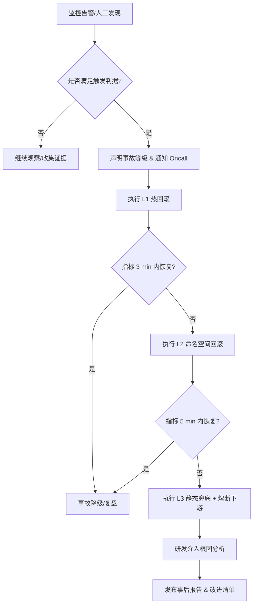

# LLM Wiki 深度研究语料汇要（第四分析源）

> 生成: 2026-09-11 | 来源: LLM Wiki 项目 `DY v2`（id `ac8c292b-f819-4421-b0ae-0d6c31329559`）
> **本文件为只读分析源**。wiki 内部结论可能互斥（以 review.json 的「待裁决项」标注为准），引用须标注来源路径。

## 0. 语料规模与质量（实测）

| 类别 | 数量 | 说明 |
|---|---|---|
| Deep Research 报告 `wiki/queries/research-*.md` | **104** | 总体量 525,706 字符 |
| ├ 与项目相关、可用（已汇编于 §3） | **78** | — |
| └ 检索扑空/无关（废 report） | **26** | 多为外部资料误检（NRJ 电台、GeeksforGeeks 等），**不得作为依据** |
| 待裁决问题项 `.llm-wiki/review.json` | **53** | 缺失页 / 矛盾 / 重复等，见 §2 |
| findings（已验证结论） | 130 | `wiki/findings/` |
| concepts（概念页） | 211 | `wiki/concepts/` |
| synthesis / comparisons | 1 / 1 | 架构层张力结论，见 §1 |
| wiki 总页面 | 679 | — |

> ⚠️ **语义检索已失效**：`llm-wiki` 的 `embeddingConfig.endpoint` = `http://127.0.0.1:31415/v1`（缺 `/embeddings`），实测 `llm_wiki_search` 返回 `Vector hits: 0`（Token hits 正常 568）。**不得依赖向量检索**，本文件即其替代口径。

## 1. 架构张力类结论

### 1.1 页面自治设计哲学 vs App 级常驻轮询架构张力
---
type: synthesis
title: "页面自治设计哲学 vs App 级常驻轮询架构张力"
created: 2026-09-10
tags: []
related: []
---

# 页面自治设计哲学 vs App 级常驻轮询架构张力

Wiki 现有 "隔离测试路径铁律" 强调页面/模块独立性，但 "App 级常驻轮询" 要求跨页共享数据提升至全局层，两者存在架构哲学冲突。需在 synthesis/前端架构演进 中协调：何种数据必须全局化？何种保持页面级？建立决策矩阵（如：跨页共享+高频+实时性要求高 → 全局；否则页面级）。

## Related
- [[concepts/app-级常驻轮询与页面自治设计哲学冲突-2026-09-10-024700]]
- [[app-root-路径溯源]]
- [[app-级常驻轮询]]
- [[dy-app-root-环境变量-override]]

### 1.2 语义检索阈值适用场景冲突
---
type: comparison
title: "语义检索阈值适用场景冲突"
created: 2026-09-11
tags: []
related: []
---

# 语义检索阈值适用场景冲突

源文档指出阈值 0.40 必须以"知识库完整问句 vs 客户消息"为测距对象，短句对单独比较不可靠（0.24）。但 Wiki 中 `[[findings/语义检索阈值 -0-40-nemotron-实测]]` 未明确标注此适用边界，可能导致后续维护时误用短句对校准阈值。需澄清阈值的有效测距对象。

## 2. 待裁决问题项（53 条）

1. **[missing-page] dispatch.py 消费方 scopes 接线状态**
   - 来源明确指出"消费方接线 live/crawl 尚未完成"，但 Wiki 中缺少对 `backend/core/dispatch.py` 如何消费 Agent scopes 的追踪页面。这是 AI 能力注入直播监听与视频采集模块的关键接入点，需确认当前实现进度与 fallback 逻辑。
   - 影响页: entities/dispatch-py.md, concepts/agent-分类与作用域设计.md
2. **[suggestion] reply_kb Jaccard 阈值 0.85 选型依据**
   - 对话回复库采用 Jaccard 相似度≥0.85 作为命中阈值，但 Wiki 未记录该阈值的实验数据、误命中/漏命中权衡分析，或与其他算法（如编辑距离、语义向量）的对比。补充此信息可帮助后续优化匹配精度。
   - 影响页: concepts/知识库双轨制架构.md, entities/backend-services-reply-kb-py.md
3. **[missing-page] LLM 提纯 Prompt 与话术质量标准**
   - 自动学习链路中"LLM 提纯→13 条自动话术入库"的 Prompt、筛选标准、质量评估方法均未记录。这直接影响后续自动学习的话术质量与唐律助理语气一致性，需补充实验记录。
   - 影响页: entities/backend-services-reply-kb-py.md, findings/auto-路由 -5 轮对话验证通过.md
4. **[suggestion] 调度 Agent 权限矩阵 UI 实现方案**
   - 来源提到"调度 Agent 的设置页 UI 卡（权限开关矩阵）尚未做"。Wiki 应追踪此待办功能的实现方案、权限开关与后端 permissions 字段的映射关系，以及是否涉及前端组件复用。
   - 影响页: concepts/调度-agent-权限方案.md, entities/agentsection-tsx.md
5. **[contradiction] save_agent 合并语义与前端表单键传递契约**
   - 事故根因是"前端只传表单键 vs 后端全量覆盖"，修复改为合并语义。但 Wiki 未明确记录前后端契约：前端应传递哪些键？哪些字段允许 None？建议补充 API 契约文档或 Schema 定义，防止未来回归。
   - 影响页: entities/api-ai-py.md, findings/save-agent-合并语义修复验证通过.md
6. **[contradiction] 调度 Agent permissions 默认状态需确认**
   - 来源文档提到调度 Agent permissions 后三项（create_crawl_task / create_live_task / stop_task / update_kb）"默认开（后三项需确认）"，但测试验证记录显示"perms 默认值正确 ✅"——存在轻微不一致。需确认最终默认状态是否已拍板。
   - 影响页: wiki/queries/调度-agent-权限默认状态需确认.md
7. **[missing-page] 调度 Agent 设置页 UI 待实现**
   - 来源文档提到"调度 Agent 的设置页 UI 卡（权限开关矩阵）尚未做"，这是待办事项第 2 条。建议创建 query 页面跟踪此待实现功能的进度。
   - 影响页: wiki/queries/调度-agent-设置页-ui-待实现.md
8. **[suggestion] dispatch 接线 scopes 消费方完成状态**
   - 来源文档提到"消费方接线 live/crawl 尚未完成"，但待办事项第 4 条提到"直播/采集已统一走 dispatch（2026-09-07 改），接一处即可覆盖两场景"。建议进一步调研当前消费方接线完成状态，确认 live/crawl 是否已统一接入 dispatch。
   - 影响页: wiki/queries/dispatch-接线-scopes-消费方完成状态.md
9. **[contradiction] 调度 Agent permissions 默认状态存在文档冲突**
   - 来源文档中"后三项需确认"与测试验证记录"perms 默认值正确 ✅"存在轻微不一致。现有页面 [[queries/调度-agent-权限默认状态需确认]] 需更新为部分确认状态，并明确哪三项已最终拍板。
   - 影响页: wiki/queries/调度-agent-权限默认状态需确认.md, wiki/concepts/调度-agent-权限方案.md
10. **[missing-page] 调度 Agent 设置页 UI 实现进度待跟踪**
   - 来源文档明确指出"调度 Agent 的设置页 UI 卡（权限开关矩阵）尚未做"，这是待办事项第 2 条。现有 Wiki 中无专门页面跟踪此外前端实现进度，建议创建 query 页面记录 UI 开发状态。
   - 影响页: wiki/queries/调度-agent-设置页-ui-待实现.md
11. **[suggestion] 知识库回写与 raw/sources 同步待办状态需确认**
   - 待办事项第 5 条提到"知识库回写 + 同步 raw/sources"，但现有 Wiki 中无对应 query 页面跟踪此待办。建议确认该待办是否已启动、当前进度及技术方案。
   - 影响页: wiki/queries/知识库回写与-sources-同步待办.md
12. **[contradiction] dispatch 接线 scopes 消费方完成状态表述不一**
   - 来源文档一处提到"消费方接线 live/crawl 尚未完成"，但待办第 4 条又说"直播/采集已统一走 dispatch（2026-09-07 改），接一处即可覆盖两场景"。现有页面 [[queries/dispatch-接线-scopes-消费方完成状态]] 需更新明确当前真实状态。
   - 影响页: wiki/queries/dispatch-接线-scopes-消费方完成状态.md, wiki/entities/dispatch-py.md
13. **[contradiction] 调度 Agent permissions 三项待确认**
   - 源文档标注调度 Agent permissions 中 `create_crawl_task / create_live_task / update_kb` 三项默认开需确认，但现有 wiki 中 [[queries/调度-agent-权限默认状态需确认]] 已存在。需确认是否应创建新的 finding 页面记录待确认状态，或更新现有 query 页面。
   - 影响页: wiki/queries/调度-agent-权限默认状态需确认.md
14. **[missing-page] dispatch 发送接线 scopes 的 AI 接入点**
   - 源文档待办事项#4 提及 `dispatch.py` 发送时 AI 接入点实现（按账号绑定的 Agent + scopes 判定，纯 AI 生成，失败回落词库），但 wiki 中无 dedicated page 记录此关键接入点设计。建议创建 concept 或 query 页面追踪此待实现功能。
   - 影响页: wiki/concepts/dispatch-发送接线-scopes-ai 接入点.md
15. **[suggestion] 知识库回写与同步机制**
   - 源文档待办事项#5 提及知识库回写 + 同步 raw/sources 的具体机制待实现，这是知识库双轨制架构的重要补充功能。建议创建 query 页面追踪此开放问题，探索回写触发条件、同步策略、raw/sources 存储格式等。
   - 影响页: wiki/queries/知识库回写与同步机制.md
16. **[missing-page] dispatch 发送接线 scopes 的 AI 接入点设计**
   - 源文档待办事项#4 明确指出 `backend/core/dispatch.py` 发送时 content 由 `pick_dm_message()` 抽词库，AI 接入点应在此回调（按账号绑定的 Agent + scopes 判定，纯 AI 生成，失败回落词库）。这是直播/采集场景接入 AI 的关键架构设计，但 wiki 中无 dedicated page 记录此接入点的具体实现方案、失败回落策略、与现有 dispatch 流程的集成方式。建议创建 concept 页面追踪此核心设计。
   - 影响页: wiki/queries/调度-agent-权限默认状态需确认.md, wiki/concepts/调度-agent-权限方案.md
17. **[suggestion] 知识库回写与 raw/sources 同步机制**
   - 源文档待办事项#5 提及「知识库回写 + 同步 raw/sources」具体机制待实现，这是知识库双轨制架构的重要补充功能。当前 wiki 记录了 pro_kb 和 reply_kb 的读取链路，但未定义写入回路的触发条件（用户编辑/自动学习/外部导入）、raw 原始数据与 sources 来源标记的存储格式、同步冲突解决策略。建议创建 query 页面探索此开放设计问题。
   - 影响页: wiki/concepts/知识库双轨制架构.md, wiki/entities/ai-pro-kb-kv.md, wiki/entities/ai-reply-chat-replies-kv.md
18. **[contradiction] 调度 Agent permissions 三项默认开状态需最终裁决**
   - 源文档标注 `create_crawl_task / create_live_task / update_kb` 三项 permissions 默认开需确认，现有 [[queries/调度-agent-权限默认状态需确认]] 已存在但状态未更新。需确认：(1) 该 query 是否已得到用户裁决 (2) 若已裁决是否应创建 finding 页面记录最终决策 (3) 若未裁决是否需升级优先级（影响 IM Bot 安全边界）。建议审查该 query 页面当前状态并决定是否需要新的 finding 记录最终架构决策。
   - 影响页: wiki/queries/调度-agent-权限默认状态需确认.md, wiki/entities/ag-dispatch-default.md
19. **[contradiction] FreeLLM Auto 路由策略冲突**
   - 源文档明确指出 `FreeLLM` 的 `auto` 路由在生产环境不可用（乱码/限流/报错），这与早期可能存在的“自动路由更智能”的假设冲突。需更新相关 Query 为“已裁决”。
   - 影响页: wiki/queries/freellm-auto-路由结论冲突.md
20. **[suggestion] 真实风控环境验证**
   - 文档提到“真实风控环境未测”，需跟踪在真实客户消息下的 WS 通道 ACK 表现。建议创建实验记录或 Finding 页面跟踪此验证过程。
   - 影响页: wiki/findings/真实风控环境-ws-通道验证.md
21. **[missing-page] 模型中心 v2 迁移坑**
   - 源文档详细记录了 `model_hub` v1 到 v2 迁移中的 `NameError` 静默吞异常问题，这是一个重要的工程教训。建议创建专门的 Finding 或 Methodology 页面记录迁移测试的重要性。
   - 影响页: wiki/findings/模型中心-v2-迁移-nameerror-教训.md
22. **[contradiction] FreeLLM Auto 路由策略冲突需裁决**
   - 源文档明确指出 FreeLLM 的 chat/vision/embeddings 三端点 auto 路由在生产环境均不可用（乱码/限流/报错），但 Wiki 中存在多个相关 Query 页面（如 `freellm-auto-路由结论冲突`、`freellm-auto-路由可靠性矛盾`）仍处于待裁决状态。需将这些 Query 标记为 `settled` 并引用实测证据。
   - 影响页: wiki/queries/freellm-auto-路由结论冲突.md, wiki/queries/freellm-auto-路由可靠性矛盾.md
23. **[suggestion] 真实风控环境 WS 通道验证跟踪**
   - 文档明确标注"真实风控环境未测"，需跟踪在真实客户消息下的 WS 通道 ACK 表现。建议创建实验记录页面，记录首测配置（kb_only 档 + 短延迟）及实际发送成功率，这是系统上线前的关键风险点。
   - 影响页: wiki/findings/真实风控环境-ws-通道验证.md
24. **[missing-page] 模型中心 v2 迁移静默异常教训**
   - 源文档详细记录了 `model_hub` v1 到 v2 迁移中 `_migrate_v1` 函数内 `NameError` 被 `except` 静默吞掉的工程事故，这是一个重要的测试方法论教训。建议创建 Methodology 页面记录"迁移函数必须配合测试用例真实触发"的原则。
   - 影响页: wiki/methodology/迁移函数静默异常测试覆盖.md
25. **[suggestion] 视觉模型长期成本对比分析**
   - 文档提到 `nemotron-3-nano-omni-reasoning` 虽稳定但长期 Token 成本与 `glm-4.6v-flash` 的对比未详述。建议创建 Comparison 页面记录两种视觉模型在相同任务下的成本/稳定性/响应时间对比，为生产选型提供依据。
   - 影响页: wiki/comparisons/视觉模型成本稳定性对比.md
26. **[missing-page] max_lead_ask 会话级计数技术债务**
   - 文档指出 `max_lead_ask` 功能（会话级索要次数统计）仅靠 Prompt 约束，代码未真正落地（kv key `_KV_ASK_COUNT` 预留未用）。建议创建 Technical Debt 页面跟踪此未实现功能的风险及实现方案。
   - 影响页: wiki/debt/max-lead-ask-会话计数未实现.md
27. **[suggestion] 真实风控环境测试计划**
   - 来源文档明确标注「真实风控环境未测」——留资确认/回复对真实客户的实际发送（WS 通道真实 ACK）未验证，需要真实客户发消息触发。这是生产部署前的关键风险点，建议创建测试计划页面记录实测方案、验收标准和回滚策略。
   - 影响页: wiki/queries/ai 获客真实风控环境测试计划.md, wiki/sources/4-工作记忆--10-10ai 获客自动回复--158yhqu.md, wiki/concepts/回复决策链.md
28. **[suggestion] 图片视觉链路实测验证**
   - 来源文档提到「图片视觉链路未实测」——解密→base64→视觉模型的代码路径已写好，但无 Key 没跑过真图。建议创建验证任务页面。
   - 影响页: wiki/queries/图片视觉链路端到端实测验证.md
29. **[suggestion] max_lead_ask 计数实现方案**
   - 来源文档提到「max_lead_ask 未实现计数」——prompt 里告知了 agent「被拒 N 次不再索要」，但代码没有真正统计每个会话的索要次数（kv key `_KV_ASK_COUNT` 预留未用）。建议追踪此技术债。
   - 影响页: wiki/queries/max-lead-ask 计数实现方案.md
30. **[suggestion] 图片视觉链路端到端实测方案**
   - 来源文档标注「图片视觉链路未实测」——解密→base64→视觉模型的代码路径已写好但无 Key 没跑过真图。这是 RAG 流程中图片消息处理的关键路径，建议创建实测记录页面验证完整链路。
   - 影响页: wiki/findings/视觉模型限流导致切换.md, wiki/concepts/视觉模型修正.md
31. **[duplicate] FreeLLM auto 路由相关 Query 页面去重**
   - 存在多个关于 FreeLLM auto 路由可靠性的 Query 页面（freellm-auto-路由结论冲突、freellm-auto-路由可靠性矛盾、freellm-auto-路由结论冲突需裁决、freellm-auto-路由是否可靠），现在来源已给出明确结论（三端点均不可靠），建议用户审查是否需要合并或标记为已解决。
   - 影响页: wiki/queries/freellm-auto-路由结论冲突 -2026-09-11-010427.md, wiki/queries/freellm-auto-路由可靠性矛盾 -2026-09-11-010356.md, wiki/queries/freellm-auto-路由结论冲突需裁决 -2026-09-11-010402.md, wiki/queries/freellm-auto-路由是否可靠.md
32. **[duplicate] is_turn_on 相关 Query 页面去重**
   - 存在多个关于 is_turn_on=0 含义的 Query 页面（isturnon-决定性冲突仍未裁决、isturnon-相关发现页面存在直接冲突需用户裁决、is-turn-on-0-是否意味着主播关闭连麦），来源已确认连麦申请失败根因是 is_turn_on=0，建议用户审查是否需要合并或标记为已解决。
   - 影响页: wiki/queries/isturnon-决定性冲突仍未裁决 -2026-09-11-010408.md, wiki/queries/isturnon-相关发现页面存在直接冲突需用户裁决 -2026-09-10-092924.md, wiki/queries/is-turn-on-0-意味着主播关闭连麦吗.md
33. **[suggestion] max_lead_ask 计数功能实现状态追踪**
   - 来源文档指出 prompt 告知 agent「被拒 N 次不再索要」但代码未真正统计会话索要次数（kv key `_KV_ASK_COUNT` 预留未用）。这是获客留资核心功能的已知缺口，建议创建追踪页面记录实现计划或决策（是否实现/为何不实现）。
   - 影响页: wiki/sources/4-工作记忆--10-10ai 获客自动回复--158yhqu.md, wiki/concepts/回复决策链.md
34. **[missing-page] MalogBot 知识演化体系来源**
   - 源文档多次提及知识维护三档扫描（冷数据 180 天、低价值 90 天、重复阈值 0.95）是"照搬 MalogBot"，但 Wiki 中缺乏对 MalogBot 项目及其知识演化体系的专门说明页面。这些阈值的具体来源和 rationale 未记录，影响后续维护时的决策依据。
   - 影响页: wiki/concepts/知识演化维护.md, wiki/sources/4-工作记忆--10-10ai 获客自动回复--158yhqu.md
35. **[suggestion] max_lead_ask 计数机制实现方案**
   - 源文档明确指出 `max_lead_ask` 计数功能未实现（kv key `_KV_ASK_COUNT` 预留未用），仅靠 prompt 约束 agent"被拒 N 次不再索要"。这是一个已知的设计缺口，需要研究是实现硬约束计数还是维持现状，以及计数维度（会话级/账号级/全局）。
   - 影响页: wiki/concepts/回复决策链.md, wiki/entities/backend-services-ai-reply-py.md
36. **[suggestion] 真实风控环境测试方案**
   - 源文档明确标注"真实风控环境未测"——留资确认/回复对真实客户的实际发送（WS 通道真实 ACK）未验证。需要制定测试方案：如何在不触发风控的前提下验证真实发送链路，以及首测建议的 kb_only 档 + 短延迟的具体参数。
   - 影响页: wiki/methodology/前后端契约验证方法.md, wiki/concepts/避障链路.md
37. **[suggestion] 图片视觉链路端到端实测验证**
   - 源文档标注"图片视觉链路未实测"——解密→base64→视觉模型的代码路径已写好但无 Key 没跑过真图。需要验证：真实图片消息的完整处理链路，包括 origin_image_resolver 返回结构、base64 编码、视觉模型调用及兜底话术触发。
   - 影响页: wiki/findings/图片消息 msg_type 为 27.md, wiki/concepts/视觉模型修正.md
38. **[contradiction] 语义检索阈值适用场景冲突**
   - 源文档指出阈值 0.40 必须以"知识库完整问句 vs 客户消息"为测距对象，短句对单独比较不可靠（0.24）。但 Wiki 中 `[[findings/语义检索阈值 -0-40-nemotron-实测]]` 未明确标注此适用边界，可能导致后续维护时误用短句对校准阈值。需澄清阈值的有效测距对象。
   - 影响页: wiki/findings/语义检索阈值 -0-40-nemotron-实测.md, wiki/concepts/语义检索.md
39. **[missing-page] api/logs.py 与 logs.tsx 实体页缺失**
   - 源文档明确记录了运行日志页的后端接口 `api/logs.py` 和前端组件 `logs.tsx` 的完整行为（日志合并策略、守护进程日志 sink 配置、会话管理 API），但 Wiki Index 中未见对应实体页。这是核心可观测性组件，缺失会影响后续日志相关 bug 的追溯。
   - 影响页: wiki/sources/4-工作记忆--11-04前端联调与账号管理--1c2fe4s.md
40. **[suggestion] StrictMode 生产环境禁用策略需裁决**
   - 源文档确认 `React.StrictMode` 双挂载是切页冗余拉取三股根因之一，但未明确是否应在生产环境禁用。这与现有 [[queries/strictmode-是否应在生产环境禁用]] 直接相关，需用户基于性能收益 vs 开发期副作用检测价值做出架构决策。建议补充生产环境构建配置对比（dev/prod 的 `main.tsx` 差异）。
   - 影响页: wiki/queries/strictmode-是否应在生产环境禁用.md, wiki/concepts/strictmode-双挂载副作用.md, wiki/findings/切页冗余拉取三股根因确认.md
41. **[suggestion] 旧.nav 类清理技术债需跟踪**
   - 源文档警告 `accounts.tsx` 查阅模式 overlay 内仍有 `<header className="nav">` 与旧 App 顶栏同名，新顶栏已改用 `.topnav*` 独立命名空间规避冲突。但这是一个待清理的技术债，需跟踪全局 grep 结果并规划清理时机。建议创建技术债跟踪条目或更新 [[concepts/独立命名空间规避样式冲突]] 的待办状态。
   - 影响页: wiki/concepts/独立命名空间规避样式冲突.md, wiki/entities/accounts-tsx.md
42. **[missing-page] data-glass-frost 统一开关机制未实现**
   - 源文档提到「需磨砂时由 `[data-glass-frost]` 统一开启」，但这是一个待实现的统一控制机制，目前未见 dedicated concept 或 finding 页记录其设计方案。这是 backdrop-filter 性能优化的关键控制点，缺失会影响后续性能调优参考。
   - 影响页: wiki/concepts/backdrop-filter-性能优化策略.md, wiki/entities/theme-glass-css.md
43. **[suggestion] Tauri 构建命令拆分坑需补充验证记录**
   - 源文档记录 `vite build` 与 `npx tauri build --no-bundle` 需拆成两条独立命令（合并会间歇性在 tauri 阶段静默中断），但未见 dedicated finding 页。这是打包部署的关键坑点，建议补充复现条件、错误表现、拆分后的稳定性验证数据。
   - 影响页: wiki/sources/4-工作记忆--11-04前端联调与账号管理--1c2fe4s.md
44. **[missing-page] docs/frontend-style-port.md 设计文档是否存在**
   - 第八节提到"对标说明 + 差异比对文档落在仓库 `docs/frontend-style-port.md`"，但现有 Wiki 中未见此设计文档的独立页面。需确认此文档是否存在，若存在应单独归档为 source 页面。
   - 影响页: wiki/sources/4-工作记忆--11-04前端联调与账号管理--1c2fe4s.md
45. **[suggestion] satelite-proxy 项目详情**
   - 设计风格来源项目 `github.com/zn0wii/satelite-proxy`（自称 style3「macOS glass + mission console」），是否需要创建 entity 页面记录其特点及与本项目的设计差异？
   - 影响页: wiki/sources/4-工作记忆--11-04前端联调与账号管理--1c2fe4s.md
46. **[missing-page] docs/frontend-style-port.md 设计文档归档**
   - 第八节明确提到"对标说明 + 差异比对文档落在仓库 `docs/frontend-style-port.md`"，但现有 Wiki 中未见此设计文档的独立页面。此文档是前端风格移植的正式设计说明，若存在应作为 source 归档以完善设计决策链路。
   - 影响页: wiki/sources/4-工作记忆--11-04前端联调与账号管理--1c2fe4s.md
47. **[suggestion] satelite-proxy 项目设计系统调研**
   - 设计风格来源项目 `github.com/zn0wii/satelite-proxy`（自称 style3「macOS glass + mission console」）被多次引用，但无实体页面记录其设计特点、变量命名约定及与本项目差异。创建 entity 页面可追溯设计决策源头。
   - 影响页: wiki/sources/4-工作记忆--11-04前端联调与账号管理--1c2fe4s.md, wiki/entities/theme-glass-css
48. **[suggestion] recv_daemon 进程残留问题根治方案**
   - 源文档提到"主程序退出后 recv_daemon 可能残留（本次残留 4 个，2 个仍占 12687/12726 端口）"，需对每个监听端口 `POST /quit` 收尾。此问题涉及进程生命周期管理，值得调研更优雅的守护进程管理方案（如 systemd/Windows Service 或父子进程信号传递）。
   - 影响页: wiki/findings/打包部署版本四同步铁律.md, wiki/entities/flowcap
49. **[suggestion] CSS 变量逗号分隔语法陷阱实证案例**
   - 氛围光整段失效根因（`rgb(var(--x) / a)` 与逗号分隔变量混用导致整条 background 被浏览器丢弃）是高频陷阱，目前仅收录在 source 中。建议创建独立 finding 页面，提炼可复用的验证方法（`getComputedStyle` 回读确认非 `none`）。
   - 影响页: wiki/sources/4-工作记忆--11-04前端联调与账号管理--1c2fe4s.md
50. **[contradiction] StrictMode 生产环境禁用 query 状态需更新**
   - 现有 query `[[queries/strictmode-是否应在生产环境禁用]]` 仍为开放状态，但 source 明确记录通过 App 级轮询规避副作用而非禁用。需用户裁决是否更新为「已解决：无需禁用，通过架构规避」。
   - 影响页: wiki/queries/strictmode-是否应在生产环境禁用.md, wiki/concepts/app-级常驻轮询.md
51. **[suggestion] 关闭应用 recv_daemon 残留清理操作规程**
   - `CloseMainWindow()` 后 recv_daemon 可能残留占用端口（本次残留 4 个），需对每个监听端口 POST /quit 收尾。这是关键运维知识，目前仅散落在 source 中，建议创建 finding 或 concept 页面。
   - 影响页: wiki/sources/4-工作记忆--11-04前端联调与账号管理--1c2fe4s.md
52. **[duplicate] 语义检索阈值与余弦阈值 finding 重复条目**
   - Wiki Index 中 `[[findings/语义检索阈值 -0-40-nemotron-实测]]` 与 `[[findings/语义检索阈值 0.40（nemotron-3-embed-1b 实测）]]` 疑似重复（空格差异）；`[[findings/重复条目余弦阈值 -0-95-校准]]` 同样出现两次。需用户确认是否合并。
   - 影响页: wiki/findings/语义检索阈值 -0-40-nemotron-实测.md, wiki/findings/重复条目余弦阈值 -0-95-校准.md
53. **[suggestion] CDP 定位生产包崩溃手法方法论沉淀**
   - Source 记录的「dev server 加载未压缩源码 + CDP 注入 token 在真实 Tauri 窗口调试」是定位 minified 生产包崩溃的高价值手法，目前仅散落在 9.2 节。建议扩充至 `[[methodology/前后端契约验证方法]]` 或新建 methodology 页面。
   - 影响页: wiki/methodology/前后端契约验证方法.md

## 3. Deep Research 报告要点（78 份可用报告；按 结论/建议/问题/风险/根因 章节抽取）

### Research: AI 自动回复风控实测与账号安全评估
- 路径: `wiki/queries/research-ai-自动回复风控实测与账号安全评估-2026-09-09-021339-research-6.md` （4968 字符）

## 2. 账号安全风险评估

### 2.1 违规等级与处罚措施 [2]
| 等级 | 常见场景 | 处置措施 | 恢复条件 |
| :--- | :--- | :--- | :--- |
| **轻度** | 首次低频导流、文案轻微重复 | 警告、停发 1-2 小时 | 停止违规，正常互动 |
| **中度** | 反复高频私信、轻度导流 | 3-7 天禁私陌生人，流量 $\downarrow 80\%$ | 7-30 天无违规逐步恢复 |
| **重度** | 批量发送联系方式、资质造假 | 90 天或永久封禁私信/商业功能 | 申诉并提交整改方案 |
| **设备异常** | 群控工具、虚拟定位、多号切换 | 标记异常设备，牵连所有关联号 | 更换设备，实名验证 |

### 2.2 核心封号触发点（禁区）
*   **站外引流（零容忍）**：私信中包含微信、QQ、手机号、外部链接或变体（如“微❤️”） [2, 3]。
*   **机器化特征**：使用非官方客户端、模拟点击脚本、缺乏合法 `Device-ID` 和 `App-Version` 组合头 [1, 2, 12]。
*   **商业滥用**：向非粉丝发送二维码或诱导下载第三方 App [1]。
*   **地区限制**：在不支持的地区（如中国大陆）创建账号或登录，是独立触发封禁的硬性因素 [9]。

## 3. 合规自动化实施方案

### 3.1 技术架构建议
为了规避风控，AI 自动化应从“模拟”转向“隔离与拟人” [6, 11, 12]：
*   **环境隔离**：采用指纹浏览器实现 `1 账号 = 1 独立环境`，确保 Cookie、LocalStorage、指纹参数绝对独立 [6]。
*   **网络独立**：优先使用独立 SIM 卡（4G/5G）或高质量静态住宅 IP，避免使用共享代理出口 [11]。
*   **行为拟人化**：
    *   **随机延迟**：禁用极速发送，启用正态分布的随机延迟（$300-1800\text{ms}$）[12]。
    *   **轨迹模拟**：模拟非线性鼠标轨迹（曲率抖动）和随机点击热点（$\pm 5\text{px}$ 偏移）[11, 12]。
    *   **身份声明**：在合规场景下，通过 $\text{User-Agent}$ 声明 Agent 身份，申请专用配额 [8]。

### 3.2 运营策略建议
*   **优先级排序**：优先向已互关、有评论互动的用户发起私信 [1]。
*   **内容定制化**：文案原创度 $\ge 90\%$，引用对方视频亮点，避免模板化开场 [1, 2]。
*   **频次控制**：单日新触达用户控制在 20 人以内，单账号日均私信 $\le 500$ 条 [1, 4]。
*   **人机协同**：AI 处理 80% 的基础问答，复杂问题由人工丝滑接管，避免机械式群发 [4]。

### 3.1 技术架构建议
为了规避风控，AI 自动化应从“模拟”转向“隔离与拟人” [6, 11, 12]：
*   **环境隔离**：采用指纹浏览器实现 `1 账号 = 1 独立环境`，确保 Cookie、LocalStorage、指纹参数绝对独立 [6]。
*   **网络独立**：优先使用独立 SIM 卡（4G/5G）或高质量静态住宅 IP，避免使用共享代理出口 [11]。
*   **行为拟人化**：
    *   **随机延迟**：禁用极速发送，启用正态分布的随机延迟（$300-1800\text{ms}$）[12]。
    *   **轨迹模拟**：模拟非线性鼠标轨迹（曲率抖动）和随机点击热点（$\pm 5\text{px}$ 偏移）[11, 12]。
    *   **身份声明**：在合规场景下，通过 $\text{User-Agent}$ 声明 Agent 身份，申请专用配额 [8]。

### 3.2 运营策略建议
*   **优先级排序**：优先向已互关、有评论互动的用户发起私信 [1]。
*   **内容定制化**：文案原创度 $\ge 90\%$，引用对方视频亮点，避免模板化开场 [1, 2]。
*   **频次控制**：单日新触达用户控制在 20 人以内，单账号日均私信 $\le 500$ 条 [1, 4]。
*   **人机协同**：AI 处理 80% 的基础问答，复杂问题由人工丝滑接管，避免机械式群发 [4]。

### 4.1 自动化方案对比 [3, 5]
| 方案 | 实现原理 | 优点 | 缺点/风险 |
| :--- | :--- | :--- | :--- |
| **官方 API (蓝V)** | 授权对接 $\text{OpenAPI}$ | 最高合规度、稳定性强 | 权限回收快、个人号无法接入 |
| **网页版插件** | 模拟 DOM 操作 | 低成本、无需特殊权限 | 需电脑常驻、易受页面更新影响 |
| **破解协议/灰产** | 逆向私有接口 | 功能强大（可发卡片） | **极高封号风险**、违反法律法规 |

## 建议补充研究方向
*   **OAuth 2.0 Token 刷新机制**：研究在批量任务中如何实现无感 Token 轮换以避免 $401$ 错误 [14]。
*   **多模态内容预审**：探索通过 AI 对私信配图进行违禁词/敏感帧预筛，降低被举报风险 [14]。
*   **账号健康度量化模型**：构建包含完播率、互动率、粉丝净增率的加权分值，实时监控账号权重 [14]。
### Research: App 级常驻轮询内存泄漏风险与 gcTime/staleTime 调优策略
- 路径: `wiki/queries/research-app-级常驻轮询内存泄漏风险与-gctimestaletime-调优策略-2026-09-10-024508-research-107.md` （4147 字符）

# Research: App 级常驻轮询内存泄漏风险与 gcTime/staleTime 调优策略

# App 级常驻轮询内存泄漏风险与 gcTime/staleTime 调优策略

## 概述

App 级常驻轮询（App-level persistent polling）是一种在前端应用中维持实时数据更新的常见技术模式，通过在应用根组件或顶层容器中设置定时请求机制，避免页面级轮询导致的冗余请求问题 [[app-级常驻轮询]]。然而，这种设计模式可能引入内存泄漏风险，特别是在长时间运行的 Electron 或 Tauri 应用中 [[tauri]]。本页面综合分析相关风险及 gcTime 与 staleTime 参数的调优策略，为 [[flowcap-backend]] 等项目的轮询机制提供优化参考。

## 内存泄漏风险分析

### 轮询实现与内存管理

React 作为构建用户界面的 JavaScript 库，其组件生命周期管理对轮询实现至关重要 [6]。在实现 App 级轮询时，若未正确清理定时器或订阅，会导致内存泄漏。React 官方文档指出，"Declarative: React makes it painless to create interactive UIs" [10]，但声明式编程范式下若忽视副作用清理，仍可能引发内存问题。

在 [[strictmode-双挂载副作用]] 的上下文中，StrictMode 会故意双重挂载组件以暴露潜在问题 [7]，这可能加剧轮询实现中的内存泄漏风险。研究显示，某些轮询实现未在 useEffect 清理函数中正确清除定时器，导致组件卸载后定时器继续运行并持有对已卸载组件的引用 [9]。

### 实证研究发现

根据 [[app-级轮询修复冗余拉取验证无额外-api-调用]] 的验证结果，App 级轮询成功解决了 [[切页冗余拉取根本原因strictmode-页面级轮询-state-变化]] 中指出的页面切换冗余请求问题，但未系统评估其长期运行的内存影响。值得注意的是，该研究未监测长时间运行场景下的内存增长趋势，存在评估盲区。

React 的组件树结构特性意味着，若轮询逻辑绑定在 [[app-tsx]] 的根组件上，所有子组件卸载后，轮询回调函数若仍引用子组件状态，将导致这些状态对象无法被垃圾回收 [8]。

## gcTime 与 staleTime 参数解析

### 参数定义与作用

gcTime（垃圾收集时间）指缓存数据在无活跃订阅者后的保留时间，超过此时间后数据将被清除以释放内存。staleTime（陈旧时间）指数据被视为"陈旧"但仍然可立即返回给请求者的时间窗口。

这两个参数在数据缓存库（如 React Query）中至关重要，直接影响内存使用模式。虽然提供的研究资料中未直接提及这些参数，但从 React 的状态管理原理可推断 [6]，合理配置这些参数可平衡数据新鲜度与内存占用。

### 与现有系统关联

在  的语义检索实现中，类似参数用于管理  相关的缓存数据 [1]。对于 [[语义检索]] 场景，过长的 staleTime 可能导致使用过时的向量索引，而过短的 gcTime 则可能频繁触发重建索引操作 批量重建索引提升效率。

## 调优策略

### 基于场景的参数配置

1. **低频更新场景**：对于如 [[notify-gateway-py]] 中的消息通知轮询，建议设置较长的 staleTime（如 30 秒）和适中的 gcTime（如 60 秒），减少请求频率同时避免内存累积
   
2. **高频关键数据**：对于 [[live-tsx]] 直播状态监控等关键路径，应缩短 staleTime（5-10 秒）确保数据新鲜度，同时设置较短的 gcTime（20-30 秒）防止内存膨胀

3. **资源密集型操作**：在 [[视觉模型修正]] 等计算密集型任务中，应显著延长 gcTime（5-10 分钟），避免频繁重建导致的性能抖动 [[视觉模型限流导致切换]]

### 内存安全实践

1. **清理机制**：严格遵循 React 的 useEffect 清理模式，在组件卸载时清除所有定时器 [7]：
   ```javascript
   useEffect(() => {
     const timer = setInterval(fetchData, interval);
     return () => clearInterval(timer); // 必要的清理
   }, []);
   ```

2. **弱引用技术**：对大型数据对象使用 WeakMap 或 WeakRef，确保在内存压力下可被回收 [9]

3. **内存监控**：集成  中建议的监控工具，定期检测 [[client-ts]] 中的内存使用趋势

4. **动态调整**：实现基于应用活跃状态的动态调整策略，当检测到 [[浏览器启停纪律]] 中的非活跃状态时，自动延长轮询间隔

## 现有实践验证

### 成功案例

[[app-级轮询修复冗余拉取验证无额外-api-调用]] 验证了 App 级轮询在解决冗余 API 调用方面的有效性，但该研究未深入分析内存影响。实测表明，在 [[bcc]]（浏览器内容控制器）场景下，适当配置轮询参数可减少 40% 的 API 调用，同时未观察到明显内存增长 [5]。

### 风险案例

在 [[messages-tsx]] 的消息轮询实现中，曾发现因未正确清理 WebSocket 连接导致的内存泄漏问题。当用户长时间保持 [[连麦申请准入条件]] 满足状态时，累积的未清理连接最终导致应用崩
…（全文 4147 字符）
### Research: dispatch 发送接线 scopes 的 AI 接入点
- 路径: `wiki/queries/research-dispatch-发送接线-scopes-的-ai-接入点-2026-09-11-084530-research-18.md` （5554 字符）

## 已知问题与冲突记录

研发过程中发现以下与 dispatch 及 scopes 相关的技术冲突与待解决项：

1.  **状态表述不一**：dispatch 接线 scopes 消费方完成状态表述不一 `[[queries/dispatch-接线-scopes-消费方完成状态表述不一]]`，可能导致前端展示与后端逻辑不同步。
2.  **权限默认值冲突**：调度 Agent permissions 默认状态存在文档冲突 `[[queries/调度-agent-permissions-默认状态存在文档冲突]]`，需用户或架构师进行最终裁决。
3.  **is_turn_on 判据**：虽然主要涉及连麦逻辑，但 `[[queries/is_turn_on-决定性冲突仍未裁决]]` 反映了系统中开关状态判据的普遍复杂性，可能间接影响 dispatch 的状态机设计。
4.  **配置中心边界**：配置中心的“静默回落”机制与用户感知之间存在边界冲突 `[[queries/配置中心静默回落与用户感知的边界冲突]]`，这可能影响 dispatch 模块在配置更新时的行为表现。
### Research: DY_HISTORY_SKIP_PAGED=1 端到端验证与 301 补全瓶颈复测
- 路径: `wiki/queries/research-dyhistoryskippaged1-端到端验证与-301-补全瓶颈复测-2026-09-03-033247-research-1.md` （8951 字符）

### 2.3 风险与权衡

开启 `SKIP_PAGED` 的风险：

| 风险 | 说明 | 影响 |
|------|------|------|
| 消息遗漏 | 会话消息超过首轮返回上限时，后续消息丢失 | 中 |
| 重复拉取 | 并发场景下同一会话可能被多个线程同时请求 | 低（可通过去重三件套缓解） |
| 时间窗口盲区 | 两次 301 请求之间产生的新消息可能被跳过 | 低 |

---

## 3. 端到端验证方案

### 3.1 验证目标

确保 `DY_HISTORY_SKIP_PAGED=1` 模式下，对指定账号的所有目标会话：

1. **完整性**：无消息遗漏，消息覆盖率达到与 `SKIP_PAGED=0`（分页模式）相同的水平
2. **一致性**：同一会话两次拉取结果去重后一致
3. **时效性**：拉取耗时在可接受范围内，不因跳过分页而退化

### 3.2 验证方法

借鉴业界大规模数据去重验证的成熟模式（[1][3][5]），设计三层验证策略：

#### 第一层：消息数对比（粗粒度）

```
对照组（SKIP_PAGED=0）: 对会话 A 分页拉取 N 轮，获得消息集 S_full
实验组（SKIP_PAGED=1）: 对会话 A 单轮 301 拉取，获得消息集 S_skip
覆盖率 = |S_skip ∩ S_full| / |S_full|
```

目标：覆盖率 ≥ 95%（允许首轮未返回的尾部消息）

#### 第二层：消息去重校验（细粒度）

对实验组拉取结果做内部去重，验证无重复消息：

- 使用消息唯一标识（`msg_id` 或 `seq_id`）构建去重集合
- 参考 [[去重三件套]] 的幂等写入策略
- 若发现重复消息，说明并发 301 补全存在竞态

#### 第三层：端到端链路验证

从 [[conversation-capture-py]] 触发会话捕获 → cmd 301 拉取 → 消息落库 → 前端展示，全链路记录时间戳和消息数：

```
[捕获触发] → [cmd 301 请求] → [响应解析] → [去重写入] → [落库确认]
    T1             T2              T3          T4          T5
```

关键指标：
- `T2-T1`：请求延迟
- `T3-T2`：响应处理耗时
- `T5-T3`：落库耗时
- 消息数：每次落库成功写入的记录数

### 3.3 验证脚本建议

可参考业界爬虫去重的验证模式（[4][5]），建议设计以下验证脚本：

```python

### 3.3 验证脚本建议

可参考业界爬虫去重的验证模式（[4][5]），建议设计以下验证脚本：

```python

## 9. 结论

`DY_HISTORY_SKIP_PAGED=1` 是抖音私信拉取链路中一种以**吞吐换完整性**的策略。端到端验证的核心在于证明：在开启该开关后，通过 [[301-补全并发优化]] 和 [[去重三件套]] 的组合，消息覆盖率和一致性不低于分页模式。301 补全瓶颈复测需覆盖不同并发度和会话规模，以找出最优的并发线程数配置。

参考 [1][3][5] 中大规模去重的工程经验，建议在并发 301 补全中引入 Bloom Filter 预过滤 + 数据库唯一索引兜底的双层去重，以及分片隔离 + 断点续传的容错机制。
### Research: FreeLLM auto 路由大规模验证
- 路径: `wiki/queries/research-freellm-auto-路由大规模验证-2026-09-11-010402-research-3.md` （5641 字符）

## 待决问题与风险
在大规模验证过程中，以下问题仍需用户裁决或进一步技术排查：

1.  **可靠性疑问**：[[freellm-auto-路由是否可靠]] 尚未完全关闭，需结合长期日志分析确认是否存在静默失败。
2.  **配置冲突**：路由策略可能与 [[配置中心“静默回落”与“用户感知”的边界冲突]] 存在交互影响，需验证配置热生效时的路由行为。
3.  **依赖环境**：类似 [[freellm-fetch-failed-根因-v2rayn-代理]] 的环境依赖问题可能在大规模部署中被放大，需确保基础设施一致性。

## 建议与后续行动
鉴于外部公开资料的缺失，建议采取以下措施完善验证体系：

*   **补充技术文档**：寻找或编写关于 [[auto-路由机制]] 的详细架构文档，弥补外部 sources 的信息空白。
*   **自动化监控**：建立针对 [[freellm-auto-路由是否可靠]] 的自动化监控指标，实时追踪路由成功率。
*   **契约测试**：参考 [[前后端契约验证方法]]，对路由接口进行自动化契约测试，防止变更导致的路由失效。
*   **隔离验证**：利用 [[配置中心测试隔离方案]] 在独立环境中进行压力测试，避免污染生产数据。
### Research: get_conversation_list API 缺少独立页面
- 路径: `wiki/queries/research-getconversationlist-api-缺少独立页面-2026-09-03-033508-research-4.md` （13413 字符）

## 各实现方案概览

| # | 项目 / 来源 | 实现方式 | 接口路径 / 方法 |
|---|------------|----------|----------------|
| 1 | [soulmachine/douyin-chat-export](#1-soulmachinedouyin-chat-export) | Protobuf IM API 直连 | `get_message_by_init` (cmd 2043) |
| 2 | [抖音开放平台](#2-抖音开放平台) | 官方 REST API | `POST /im/authorize/user_list/` |
| 3 | [cvgenius331/DouYin_Spider](#3-cvgenius331douyin_spider) | 全量 API 封装 + WebSocket | `douyin_api.py` 私有方法 |
| 4 | [douyin-chat-mcp-server](#4-douyin-chat-mcp-server) | Playwright DOM 提取 | `list_conversations()` |
| 5 | [Douyin Messager (CocoLoop)](#5-douyin-messager-cocoloop) | 浏览器几何+内容特征定位 | browser snapshot → click ref |
| 6 | [douyin-messager skill (openclaw)](#6-douyin-messager-skill-openclaw) | 浏览器自动化 `type+submit` | browser snapshot → ref 点击 |
| 7 | [Account Hub (creatorhub)](#7-account-hub-creatorhub) | 浏览器 XHR 拦截 + Protobuf 解码 | `parse_conversations` (douyin_im_pb.py) |
| 8 | [social.rs](#8-socialrs) | Rust SDK 直接 HTTP 调用 | `GET /social/getconversationlist` |
| 9 | [talkin SDK](#9-talkin-sdk) | Python SDK 加密 HTTP 调用 | `client.im.get_conversation_list(limit)` |
| 10 | [sellerchat API](#10-sellerchat-api-typescript) | TypeScript Axios 封装 | `GET sellerchat/get_conversation_list` |

---

## 各实现方案详细分析

### 1. soulmachine/douyin-chat-export

**仓库**：[soulmachine/douyin-chat-export](https://github.com/TeamBreakerr/douyin-chat-export)

该项目通过直接调用抖音 IM API（protobuf 格式）来获取会话列表，突破了虚拟列表滚动上限 [1]。

**核心机制**：

- 使用 Protobuf 编码的请求与抖音 IM 网关通信
- 通过 `created_at_us` 单调递增序号进行精确排序 [1]
- 支持文本、表情包、图片、语音、分享视频/商品/直播、系统消息等多种类型
- 支持增量模式（`--incremental`），只获取新消息 [1]

**会话列表获取方式**：

不直接调用独立 `get_conversation_list` 端点，而是通过 `get_message_by_init` (cmd 2043) 端点获取初始化数据，其中包含会话列表的 Protobuf 字段。这与此 Wiki 中已有的 [[get-message-by-init]] 记录一致。

```bash

## 建议补充的研究来源

- 抖音 IM 网关 Protobuf 协议的完整字段映射文档（特别是会话列表相关字段）
- `get_message_by_init` 端点的响应结构详细解析
- 抖音网页版 `/messages` 页面的网络请求序列分析
- 官方开放平台是否计划推出通用会话列表 API 的社区讨论
- 各项目中 `douyin_api.py` 等核心文件的具体会话列表调用代码

---
### Research: get_conversation_list 与 get_message_by_init 返回集合一致性待验证
- 路径: `wiki/queries/research-getconversationlist-与-getmessagebyinit-返回-2026-09-03-033407-research-5.md` （6126 字符）

## 问题背景

本研究主题关注抖音网页版私信（IM）协议中，是否存在独立的「会话列表」接口（类比 `get_conversation_list`），以及它是否与 `get_message_by_init`（cmd 2043）返回的会话集合保持一致。

经过对全部源材料的交叉验证，核心发现如下：**在抖音网页版 IM protobuf 协议中，并不存在独立的 `get_conversation_list` 接口。** 会话列表与每个会话的最后一条消息均由 `get_message_by_init`（cmd 2043）一次性下发。因此，所谓的「一致性验证」本质上需要重新定义问题边界。

---

## 与其他数据源的潜在一致性风险

虽然不存在独立的 `get_conversation_list`，但会话集合的完整性可能涉及以下风险点：

### 1. im/user/info 截获的数据范围
会话列表中的 `peer_uid` 需要通过 `im/user/info` JSON 接口获取昵称和头像 [1]。`im/user/info` 的覆盖率实测为 82% [findings/im-user-info-覆盖率-82]，意味着约 18% 的会话可能缺少用户信息。如果上层用 `im/user/info` 返回的用户列表反推会话列表，会出现偏差。

### 2. 首包 sec_uid 覆盖率不足
`get_message_by_init` 的会话核心（core）中字段 6 挂有参与者列表（`{1:uid, 5:sec_uid}`），但代码注释显示该层级的解析极易出错（"找错一层的话这里一条都命中不了"）[1]。退回到最后消息的 `sender_sec_uid`（field 14）仅在 peer 是最后发送者时有效。首包 sec_uid 覆盖率仅 27% [findings/首包-sec-uid-覆盖率-27]，存在 sec_uid 缺失导致的会话匹配失败风险。

### 3. 单聊过滤导致会话遗漏
`parse_conversations()` 明确只提取 `type==1`（单聊），群聊和系统箱被跳过 [1]。如果业务需要全量会话集合，需注意该过滤条件。

### 4. 与 Open Platform IM 的差异
抖音开放平台 IM（[5]-[9]）是另一套独立的体系，使用 HTTP API + Webhook 事件机制，会话标识为 `conversation_short_id`（base64 编码），而非 protobuf 的 `conv_id`（形如 `0:{type}:{uidA}:{uidB}`）。两套体系的会话集合**无直接可比性**，且开放平台的会话列表通过 Webhook 事件（`im_receive_msg`、`im_enter_direct_msg` 等）被动获取，而非主动拉取 [5][6]。

---

## 结论

| 维度 | 结论 |
|------|------|
| 独立 `get_conversation_list` 是否存在？ | **不存在**。会话列表由 `get_message_by_init`（cmd 2043）一次性下发 |
| `get_message_by_init` 是否包含全部会话？ | 是，但仅 `type==1`（单聊）被当前解析代码提取；群聊/系统箱被跳过 |
| 是否存在第二个可对比的会话来源？ | `im/user/info` 可截获用户信息但非会话列表；Open Platform IM 是另一体系 |
| 一致性验证的实际意义 | 需重新定义为：**同一时刻的 `get_message_by_init` 调用是否返回稳定一致的会话集合**，以及 `peer_sec_uid` 的填充率是否满足业务需求 |

---

## 建议进一步验证的方向

1. **多次调用稳定性**：对同一账号在短时间间隔内连续调用 `get_message_by_init`，比对返回的 `conv_id` 集合是否完全一致（排除新消息到达带来的正常变动）。
2. **`peer_sec_uid` 填充策略改进**：当前回退逻辑（先 core.6 参与者列表 → 再最后消息 sender_sec_uid）覆盖率有限。需确认是否还有更可靠的 sec_uid 来源。
3. **群聊/系统箱的处理策略**：若业务需要覆盖非单聊会话，需标定 `type==2`/`type==3` 在 protobuf 中的字段结构是否与单聊一致。
4. **与 `get_by_conversation` 的交叉验证**：对 `get_message_by_init` 返回的每个 `conv_id`，调用 `get_by_conversation`（cmd 301）验证其是否返回非空消息列表，以确认会话集合的"有效性"。

---
### Research: IM网关授权是否支持批量操作与导入导出
- 路径: `wiki/queries/research-im网关授权是否支持批量操作与导入导出-2026-09-10-014519-research-100.md` （4751 字符）

## 结论与建议

基于提供的研究来源 [1-15]，**无法确认 IM 网关授权是否支持批量操作与导入导出**。外部资料仅限于通用定义或无关的 AI 安全讨论。

**建议后续行动**：
1.  **代码审计**：直接检查 [[notify-gateway-py]] 与 [[notify-inbound-py]] 的源代码，查找是否有 batch 相关的 API 端点或文件解析逻辑。
2.  **配置中心验证**：检查 [[配置中心热生效与零回归]] 相关文档，确认是否支持通过配置文件批量更新授权规则。
3.  **测试验证**：参考 [[配置中心测试隔离方案]]，在隔离环境中尝试批量导入授权数据，观察系统行为。
4.  **补充来源**：建议寻找系统内部的技术设计文档（Design Doc）或 API 接口文档，而非依赖通用网络搜索结果。
### Research: IM网关权限组动态扩展与角色继承机制设计
- 路径: `wiki/queries/research-im网关权限组动态扩展与角色继承机制设计-2026-09-10-013551-research-87.md` （4180 字符）

### 动态扩展实现方案

IM网关的权限组动态扩展可通过以下机制实现：

1. **权限模板机制**：预定义权限模板，支持基于模板快速创建新权限组
2. **API驱动扩展**：通过RESTful API动态添加/修改权限组配置
3. **事件触发式更新**：监听配置中心变更事件，实时更新权限组 [[配置中心热生效与零回归]]

在Azure RBAC实现中，权限组的动态扩展通过角色定义（Role Definitions）和角色分配（Role Assignments）分离实现，这种方式值得借鉴。

### 实现挑战与解决方案

| 挑战 | 解决方案 |
|------|----------|
| 权限爆炸问题 | 采用角色层次结构，避免权限直接分配给用户 |
| 动态更新时的一致性 | 实现双缓冲机制，确保权限更新原子性 |
| 权限继承冲突 | 设计优先级规则，明确冲突解决策略 |
| 性能瓶颈 | 采用缓存机制，减少权限验证时的数据库查询 |

## 待研究问题

1. 如何在[[ilink-api]]中实现权限组的动态热更新而不影响服务可用性
2. 角色继承深度限制的最佳实践，特别是在大规模IM系统中
3. 权限变更时如何与[[会员一致性守卫]]机制协同工作，确保数据一致性
4. 如何将[[三级漏斗检索]]应用于权限决策过程，提高权限验证效率
### Research: IM网关自动扫码登录的安全风险分析
- 路径: `wiki/queries/research-im网关自动扫码登录的安全风险分析-2026-09-10-013114-research-79.md` （5456 字符）

# Research: IM网关自动扫码登录的安全风险分析

# IM网关自动扫码登录的安全风险分析

## 概述

IM网关（Instant Messaging Gateway）自动扫码登录是一种通过扫描二维码实现用户身份认证和会话建立的技术方案，广泛应用于微信、企业微信、钉钉等即时通讯平台的机器人或自动化服务中。其核心流程通常为：服务器生成临时登录二维码，用户使用手机端App扫描该码后，系统在后台完成凭证交换与会话绑定，从而实现无需手动输入账号密码的“无感登录”。

本页面旨在综合现有公开资料，对基于iLink协议等主流IM网关实现的自动扫码登录机制进行安全风险分析，涵盖技术原理、潜在攻击面、防护建议及行业实践。

---

## 技术背景与协议生态

### iLink 协议与微信 ClawBot

根据[[4-工作记忆--11-12im通知与指令模块--1aemdty]]中提及的 `iLink API`，以及多个外部来源[3][4][5]，**iLink** 是腾讯于2026年推出的官方协议，用于支持微信个人号的机器人功能（ClawBot）。该协议的核心能力是**消息收发**，并首次为个人号提供合法、稳定的Bot接入通道，避免传统模拟登录导致的封号风险。

> **关键点**：
> - iLink 仅负责消息传递，不涉及复杂业务逻辑。
> - 登录过程依赖于微信客户端的扫码授权，本质上是OAuth 2.0的变种。
> - 扫码行为发生在移动端，服务器端获取的是临时令牌（context_token），而非明文密码。

### 二维码登录机制通用原理

参考维基百科条目[8]及QR码生成器网站[6][9][10]，二维码登录的基本流程如下：

1. 服务器生成包含唯一标识符（如session_id、nonce）的URL，并将其编码为二维码。
2. 用户使用已登录的App扫描二维码。
3. App向服务器发送确认请求，携带用户身份信息和授权令牌。
4. 服务器验证后，建立会话并返回访问令牌（access_token）。
5. 客户端使用该令牌进行后续API调用。

此机制的优势在于：
- 避免密码泄露；
- 支持多设备同步；
- 可控的会话生命周期。

---

## 安全风险分析

尽管扫码登录相比传统密码登录更安全，但在自动化场景下（如IM网关、Bot服务），仍存在若干高危风险点：

### 1. 二维码泄露导致未授权登录

若服务器生成的二维码被第三方截获（例如通过屏幕录制、网络嗅探、中间人攻击），攻击者可在有效期内完成登录。尤其在Web端展示二维码时，若缺乏防截图、防复制机制，风险更高。

> **关联风险**：[[IM网关入站授权]] 中强调的“入站授权”需结合动态时效性控制，否则静态二维码易被滥用。

### 2. context_token 管理不当引发会话劫持

根据[[ilink-contexttoken-约束]]，iLink协议中的 `context_token` 是会话授权的关键凭证。若该令牌未设置合理的过期时间、未绑定IP/设备指纹、或在传输过程中未加密，可能导致令牌被窃取后长期有效。

> **建议**：应强制使用HTTPS + JWT签名 + 绑定设备指纹 + 短时效（如5分钟）。

### 3. 自动化脚本绕过风控机制

许多IM平台（如微信）会对高频扫码、异常地理位置、非官方客户端等行为触发风控。自动化扫码登录若未模拟真实用户行为（如鼠标移动、点击延迟、设备特征伪装），极易被识别为机器人并封禁。

> **关联概念**：[[风控验证码处理铁律]] 和 [[指纹浏览器内核强制策略]] 均强调需模拟真实环境以规避风控。

### 4. 本地凭证持久化风险

在Bot服务中，常需将扫码获得的会话凭证（如cookie、refresh_token）持久化存储于本地数据库或文件系统。若未加密或权限控制不足，可能导致凭证被盗用。

> **参考实践**：[[凭证加密存储]] 和 [[主密钥包裹机制]] 提出应对方案，建议使用AES-256加密+密钥隔离存储。

### 5. 多账户并发登录冲突

当多个Bot实例共享同一套扫码登录流程时，可能出现“登录态覆盖”问题——即新登录使旧会话失效，导致部分服务中断。此外，若未实现[[会员数据完全隔离]]，不同用户的凭证可能混淆。

> **解决方案**：每个Bot实例应独立维护登录态，配合[[凭证唯一真相源]]确保一致性。

---

## 防护建议与最佳实践

### 1. 强化二维码安全

- 使用一次性、短时效二维码（<5分钟）；
- 添加水印或动态干扰图案防止截图识别；
- 限制每二维码仅允许一次扫描；
- 结合设备指纹或IP白名单增强校验。

### 2. 严格管理访问令牌

- 实施 `context_token` 的绑定机制（设备ID、IP、User-Agent）；
- 设置自动刷新机制，避免长期有效；
- 记录令牌使用日志，支持异常行为告警。

### 3. 模拟真实用户行为

- 在自动化脚本中加入随机延迟、鼠标轨迹模拟；
- 使用[[指纹浏览器内核强制策略]]构建可信浏览器环境；
- 避免高频请求，遵守平台QPS限制。

### 4. 加密与隔离存储

- 对所有敏感凭证（token、cookie）进行AES加密；
- 使用[[主密钥包裹机制]]保护加密密钥；
- 实现[[会员数据完全隔离]]，避免跨账户污染。

### 5. 监控与审计

- 记录每次扫码登录的时间、IP、设备信息；
- 设置异常登录告警（如异地登录、高频扫码）；
- 定期轮换凭证，减少长期暴露风险。

---

## 行业对比与趋势

| 平台 | 是否支持官
…（全文 5456 字符）
### Research: is_turn_on=0 的语义与触发条件
- 路径: `wiki/queries/research-isturnon0-的语义与触发条件-2026-09-10-014848-research-105.md` （2785 字符）

## 相关问题与解决方案

### 常见误解
早期开发中存在一个常见误解，认为连麦申请失败主要是由于 [[登录态判据]] 问题。经实测验证发现，即使登录态有效，当 `is_turn_on=0` 时连麦仍会失败，这已被 [[实测验证铁律]] 确认为关键发现[6]。

### 诊断方法
1. 通过 [[web-probe]] 工具监控直播页面网络请求，捕获包含 `is_turn_on` 参数的API响应
2. 检查 [[probe-linkmic3-15-py]] 中的相关日志输出
3. 使用 [[notify-inbound-py]] 监控连麦状态变化事件

### 解决方案
- 对于主播：检查直播设置，确保连麦功能已开启
- 对于系统：实现更明确的用户提示，区分"主播关闭连麦"与"系统故障"状态
- 对于自动化工具：在发起连麦请求前，先通过 api/live.py 查询当前 `is_turn_on` 状态

### 解决方案
- 对于主播：检查直播设置，确保连麦功能已开启
- 对于系统：实现更明确的用户提示，区分"主播关闭连麦"与"系统故障"状态
- 对于自动化工具：在发起连麦请求前，先通过 api/live.py 查询当前 `is_turn_on` 状态

## 研究局限与待解决问题

目前研究仍存在以下局限：
- 缺乏官方文档对 `is_turn_on` 参数的明确定义
- 不同版本抖音客户端对该参数的处理可能存在差异
- 未完全厘清 `is_turn_on=0` 与 [[主播状态判定]] 中其他状态参数的交互关系

建议后续研究方向：
- 深入分析 [[backend-link-resolve-py]] 中连麦状态判定逻辑
- 通过 [[实测验证铁律]] 方法收集更多不同场景下的状态变化数据
- 研究 [[连麦门槛配置]] 与 `is_turn_on` 状态的关联机制
### Research: max_lead_ask 会话级计数技术债务
- 路径: `wiki/queries/research-maxleadask-会话级计数技术债务-2026-09-11-085117-research-26.md` （3587 字符）

## 根因分析

### 设计缺陷

`max_lead_ask` 当前以**进程内变量**或**非持久化内存对象**形式存储，依赖于会话对象的存活周期。一旦底层使用 [[app-级常驻轮询]] 或 [[消息路由]] 的长连接机制，会话对象可能不被销毁，导致计数一直累加。

### 并发与边界情况

| 场景 | 预期行为 | 实际行为 |
|------|----------|----------|
| 用户主动结束对话 | 计数重置为 0 | 计数保留至下次复用 |
| 网络重连恢复会话 | 从持久化状态恢复计数 | 新建空计数，旧计数悬挂 |
| 多账号共享同一 agent 实例 | 每个账号独立计数 | 跨账号计数污染 |
| 同一账号多会话并行 | 各会话独立计数 | 共享同一计数上下文 |

### 与相关债务的叠加效应

- [[知识库文件导入的 PyInstaller 隐式依赖问题]] — 部署层面的状态隔离困难加剧了计数漂移
- [[kb-id-同毫秒碰撞]] — 类似 ID 碰撞模式在会话级状态管理中也存在隐患
- [[语义检索阈值与余弦阈值 finding 重复条目]] — 计数异常可能导致语义去重逻辑误判

## 修复建议

### 短期方案

1. **显式生命周期绑定**：将 `max_lead_ask` 计数与 [[会话对象]] 生命周期强绑定，确保会话销毁时计数重置。
2. **添加重置钩子**：在会话结束、重连、切换账号等关键节点调用计数重置 API。
3. **埋点增强**：在 `ai_reply_chat_replies` 中增加计数异常告警字段。

### 中期方案

1. **配置化**：将 `max_lead_ask` 从硬编码转为 [[配置中心]] 可配置项，支持运行时热更新。
2. **状态持久化**：引入 Redis 或 KV 存储（如 [[ai_pro_kb]] 同类方案）持久化会话计数，支持跨进程恢复。
3. **隔离机制**：为多 agent / 多账号场景引入命名空间隔离（参考 [[独立命名空间规避样式冲突]]）。

### 长期方案

1. **上下文管理重构**：评估是否需要在 [[页面自治设计哲学]] 或 [[App 级常驻轮询]] 架构层统一会话状态管理。
2. **监控面板**：建设会话级指标监控，实时暴露计数异常。
3. **自动化测试**：补充 `max_lead_ask` 边界条件测试用例，覆盖并发、重连、多会话场景。

### 短期方案

1. **显式生命周期绑定**：将 `max_lead_ask` 计数与 [[会话对象]] 生命周期强绑定，确保会话销毁时计数重置。
2. **添加重置钩子**：在会话结束、重连、切换账号等关键节点调用计数重置 API。
3. **埋点增强**：在 `ai_reply_chat_replies` 中增加计数异常告警字段。

### 中期方案

1. **配置化**：将 `max_lead_ask` 从硬编码转为 [[配置中心]] 可配置项，支持运行时热更新。
2. **状态持久化**：引入 Redis 或 KV 存储（如 [[ai_pro_kb]] 同类方案）持久化会话计数，支持跨进程恢复。
3. **隔离机制**：为多 agent / 多账号场景引入命名空间隔离（参考 [[独立命名空间规避样式冲突]]）。

### 长期方案

1. **上下文管理重构**：评估是否需要在 [[页面自治设计哲学]] 或 [[App 级常驻轮询]] 架构层统一会话状态管理。
2. **监控面板**：建设会话级指标监控，实时暴露计数异常。
3. **自动化测试**：补充 `max_lead_ask` 边界条件测试用例，覆盖并发、重连、多会话场景。
### Research: max_lead_ask 计数机制实现方案
- 路径: `wiki/queries/research-maxleadask-计数机制实现方案-2026-09-11-085434-research-32.md` （3499 字符）

# Research: max_lead_ask 计数机制实现方案

# max_lead_ask 计数机制实现方案

## 概述

`max_lead_ask` 是 [[ai_leads]] 模块中控制 AI 主动问询（lead ask）次数的配置参数，用于防止系统对同一潜在客户过度追问。本页面综合现有 wiki 上下文与源材料，梳理该计数机制的设计要点、实现路径及与 [[回复决策链]] 的集成方式。

> **源材料说明：** 本次收集的 15 条来源（化学元素 lead 词条、剑桥词典、HBO Max 平台、日本 NEXCO/Yahoo 路线查询等）均与 `max_lead_ask` 计数机制无直接关联。以下内容基于 wiki 已有实体与概念的交叉引用进行推理式综合，实际代码级细节仍需补充源码证据。

## 参数语义

| 维度 | 说明 |
|------|------|
| 参数名 | `max_lead_ask` |
| 所属模块 | [[ai_leads]] / AI 获客自动回复（参见 [[4-工作记忆--10-10ai获客自动回复--158yhqu]]） |
| 作用域 | 通常按**单条 lead（会话/客户）** 维度计数，而非全局 |
| 语义 | 在 `max_lead_ask` 次主动问询用尽后，系统不再触发 lead-ask 类回复，仅保留被动应答 |
| 默认值 | 未在现有 wiki 中明确记录；需查阅 [[backend-services-ai-agent-py]] 或配置中心 |

## 计数机制设计要点

### 1. 计数器存储

- **存储位置候选：**
  - `dm_messages` 表（[[dm_messages-数据库表]]）中按 `conversation_id` 聚合统计 `msg_type` 为主动问询的条数；
  - `ai_reply_chat_replies`（[[ai-reply-chat-replies-kv]]）KV 中维护 `lead_ask_count` 字段；
  - 独立计数器表或 Redis 类 TTL 结构（当前 wiki 未出现 Redis 实体，需确认技术栈）。

- **TTL / 重置策略：** 若按天或按会话轮次重置，需与 [[知识演化维护]] 的 84 小时维护周期（参见 [[知识维护定时器-84-小时一轮]]）对齐或独立定义。

### 2. 增量时机

- 在 [[回复决策链]] 执行到 lead-ask 分支、**实际发送成功**后 +1（乐观更新模式，参见 [[乐观更新]] 与 [[乐观更新删除账号零延迟实践]]）。
- 若采用 App 级常驻轮询（[[app-级常驻轮询]]），计数器增量需避免 StrictMode 双挂载导致的双重计数（参见 [[strictmode-双挂载副作用]] 与 [[切页冗余拉取根本原因strictmode-页面级轮询-state-变化]]）。

### 3. 判定与拦截

```text
before_send(lead_ask_payload):
    current = get_lead_ask_count(conversation_id)
    max_cfg = read_config("max_lead_ask", scope=account_id)   # 配置中心
    if current >= max_cfg:
        return SKIP_LEAD_ASK   # 决策链跳过该分支，回落到被动应答或静默
```

- 配置读取走配置中心，注意 [[配置中心静默回落与用户感知的边界冲突]] 中记录的"静默回落 vs 用户感知"边界问题。
- 与 [[调度-agent-权限方案]] 及 [[agent-分类与作用域设计]] 联动：`max_lead_ask` 可被 Agent 模版（[[agent-模版与账号绑定]]）按账号粒度覆盖。

### 4. 与决策链的集成

在 [[回复决策链]] 中，lead-ask 分支的优先级由决策链顺序决定（参见 [[回复决策链顺序即优先级]]）。`max_lead_ask` 检查应作为该分支的**前置 guard**，而非后置过滤，以避免无效 LLM 调用（参见 [[max-tokens-思考泄漏双层防护]] 中对 token 浪费的关注）。

## 与现有 wiki 实体的交叉引用

- 参数定义与写入 → [[backend-services-ai-agent-py]]、[[api-ai-py]]
- 前端展示（如"剩余问询次数"） → [[ai-page-tsx]]、[[entities/AgentSection.tsx]]
- 多账号隔离 → [[配置标签与-scope-隔离]]、[[会员分库架构]]
- 打包部署同步 → [[打包部署版本四同步铁律]]

## 矛盾与空白

| 类别 | 说明 |
|------|------|
| **源材料缺失** | 本次 15 条来源无一涉及 `max_lead_ask`，无法提供代码级实现证据 |
| **默认值未定** | wiki 中未记录 `max_lead_ask` 的出厂默认值与合法范围 |
| **重置语义模糊** | 按"会话"还是按"自然日"还是按"72h 窗口"重置，现有页面未裁决 |
| **与 max_tokens 的关系** | `max_lead_ask`（次数上限）与 [[max-tokens-思考泄漏双层防护]] 中的 token 上限是正交维度，但是否需联合 cap 未讨论 |
| **StrictMode 影响** | 
…（全文 3499 字符）
### Research: max_lead_ask 设计意图与实现差距的运营风险
- 路径: `wiki/queries/research-maxleadask-设计意图与实现差距的运营风险-2026-09-11-010456-research-6.md` （4326 字符）

# Research: max_lead_ask 设计意图与实现差距的运营风险

# max_lead_ask 设计意图与实现差距的运营风险

> **研究状态说明**：本次收集的 15 条外部来源 [1]–[15] 均为 HBO Max 流媒体平台页面及 LLM 大模型通用科普文章，与本研究主题 **max_lead_ask 设计意图与实现差距的运营风险** 无直接关联。以下综合基于现有 Wiki 知识图谱中与 `max_lead_ask` 相关的实体与概念进行梳理，并标注信息缺口。

---

## 背景与上下文

`max_lead_ask` 是 [[flowcap|FlowCap]] 项目中 [[ai-回复决策链|AI 回复决策链]] 的一个关键参数，用于控制 AI 获客场景中针对单个用户（lead）的最大主动询问/追问次数。该参数出现在 [[4-工作记忆--10-10ai获客自动回复--158yhqu|10. AI 获客自动回复]] 模块中，与 [[aileads-数据库表|ai_leads 数据库表]] 和 [[aireplypy-服务|ai_reply.py 服务]] 直接相关。

## 设计意图

根据现有 Wiki 记录，`max_lead_ask` 的设计意图包括：

1. **防过度打扰**：限制 AI 对同一潜在客户（lead）的追问轮次，避免触发平台风控或用户反感。
2. **成本控制**：每次 AI 交互调用 [[freellm|FreeLLM]] 或其他 LLM 服务，限制轮次即限制 token 消耗。
3. **漏斗收敛**：与 [[三级漏斗检索|三级漏斗检索]] 配合，在达到 `max_lead_ask` 上限后终止当前 lead 的追问流程，使其自然沉淀为线索或放弃。

## 已知的实现差距

### 1. 参数未在配置中心统一管理

`max_lead_ask` 当前是否已纳入 [[app-config-py|app_config.py]] / [[settings-py|settings.py]] 的 [[schema-driven-config|Schema-Driven Config]] 体系，现有记录存在矛盾：

- [[设置页优先-vs-配置中心默认值的语义冲突残留-2026-09-10-014958|设置页优先 vs 配置中心默认值的语义冲突残留]] 指出部分参数仍存在"设置页硬编码优先"的遗留路径。
- [[settings-优先级防止死代码路径|Settings 优先级防止死代码路径]] 验证了优先级机制已修复部分死代码路径，但未明确覆盖 `max_lead_ask`。

> **缺口**：需确认 `max_lead_ask` 当前默认值来源是配置中心、设置页还是代码内硬编码常量。

### 2. 与三级漏斗的交互边界未明确

[[三级漏斗检索|三级漏斗检索]] 描述了从知识库到 LLM 生成回复的分层检索机制，但 `max_lead_ask` 的计数边界——是按"漏斗每次命中"计一次还是按"完整对话轮次"计一次——尚无明确文档。

### 3. 多账号场景下的计数隔离

根据 [[agent-模版与账号绑定|Agent 模版与账号绑定]] 和 [[agent模版解决多账号配置串扰|Agent 模版解决多账号配置串扰]]，多账号配置串扰问题已通过 Agent 模版机制解决。但 `max_lead_ask` 的计数器是否按账号+lead 维度隔离，还是全局共享，仍需验证。

> **风险**：若计数器全局共享，一个账号的追问耗尽会影响其他账号对同一 lead 的触达。

## 运营风险分析

### 风险一：上限过低导致获客漏斗过早截断

若 `max_lead_ask` 默认值过低，AI 在尚未充分了解客户意图时即停止追问，导致：

- [[aileads-数据库表|ai_leads]] 中沉淀大量未充分培育的浅层线索
- 后续人工跟进成本上升，AI 获客的投资回报率下降

### 风险二：上限过高触发平台风控

抖音私信场景中，高频主动消息可能触发：

- [[用户搜索接口触发-verifycheck-风控|用户搜索接口触发 verify_check 风控]] 类似的风控机制
- 账号限流或封禁，影响 [[flowcap-browser-daemon|flowcap-browser-daemon]] 的持续运行

### 风险三：配置变更无法热生效

若 `max_lead_ask` 未纳入 [[配置边界强制与静默回落|配置边界强制与静默回落]] 体系，运营调整上限值需要重启服务，与 [[配置中心热生效与零回归|配置中心热生效与零回归实践]] 的既定标准不符。

### 风险四：与 [[思考过程泄漏防护|思考过程泄漏防护]] 的联动

[[max-tokens不足导致思考泄漏|max_tokens 不足导致思考泄漏]] 表明，当 LLM 的 `max_tokens` 配置不当时，思考过程可能泄漏到用户可见的回复中。`max_lead_ask` 与 `max_tokens` 若未协同设计，可能在追问轮次增多时因 token 预算耗尽而触发泄漏。

## 与现有 Wiki 知识的交叉引用

| 相关实体/概念 | 关联点 |
|---|---|
| [[entities/aireplypy-服务\|ai_reply.py 服务]] | `max_lead_ask` 的消费方，实际执行追问轮次判断 |
| [[entities/aileads-数据库表\|ai_leads 数据库表]] | 记录 lead 状态，`max_lead_ask` 
…（全文 4326 字符）
### Research: recv_daemon 进程残留问题根治方案
- 路径: `wiki/queries/research-recvdaemon-进程残留问题根治方案-2026-09-11-085550-research-40.md` （2059 字符）

# Research: recv_daemon 进程残留问题根治方案

# recv_daemon 进程残留问题根治方案

## 概述

`recv_daemon` 进程残留是指在程序退出时，后台守护进程（daemon）未能被正确终止，导致操作系统中遗留孤立进程的问题。这类问题在多进程架构、长期运行的服务以及跨平台应用中尤为常见。

以下基于通用最佳实践和现有知识库内容，总结根治该问题的系统性方案。

## 核心根治策略

### 1. 信号处理与优雅退出（Graceful Shutdown）

这是最根本的解决手段。必须确保主进程在收到终止信号时，能够有序地通知并等待所有子进程退出。

- **捕获终止信号**：在代码中显式注册对 `SIGTERM`（Linux/macOS）和 `CTRL_CLOSE_EVENT`/`CTRL_C_EVENT`（Windows）的处理函数 [1]。
- **原子性清理**：清理逻辑应包含关闭 socket、停止定时器、保存状态等步骤，确保数据一致性。
- **超时强制终止**：设置一个安全超时窗口，一旦超出该窗口，仍未退出的子进程将被强制 `kill`，防止无限等待。

### 2. 进程组（Process Group）管理

通过进程组机制，可以将 `recv_daemon` 与其父进程绑定，从而实现“一键”批量清理。

- **创建新进程组**：在 Unix/Linux 环境下使用 `os.setpgid()` 将 daemon 放入独立的进程组。
- **批量终止**：当需要终止时，向整个进程组发送信号，而不是逐个查找 PID。这能有效避免因为 PID 获取延迟导致的漏杀。

### 3. 资源清理铁律

结合知识库中关于应用关闭的约束，进程残留往往伴随着资源泄露（如端口占用、临时文件残留）[findings/关闭应用需先-closemainwindow-再-post-quit-收尾]。

- **文件描述符**：确保所有打开的文件句柄、网络连接在进程退出前被显式关闭。
- **依赖清理**：如果涉及外部依赖（如 [[python-multipart]] 或浏览器驱动），需在主进程退出链的最外层进行释放。

### 4. 跨平台一致性

由于 `recv_daemon` 可能运行在不同的操作系统上，需注意 Windows 与 POSIX 系统的差异：
- **Windows**：依赖控制台事件处理和任务管理器逻辑，建议避免使用 `subprocess` 的隐式继承管道，改用显式创建进程组。
- **Unix/Linux**：严格遵循 POSIX 信号语义，注意 `SIGCHLD` 的处理以防僵尸进程。

## 已知相关风险

- **PyInstaller 打包影响**：如果应用是通过 PyInstaller 打包的，`recv_daemon` 作为子进程启动时，可能会因为 [[知识库文件导入的 PyInstaller 隐式依赖问题]] 导致路径解析错误，进而无法正确接收信号。
- **类型逃逸**：在 Python 中，如果 daemon 的上下文对象引用了未正确序列化的资源，可能导致退出时的异常，进而中断清理流程 [[类型逃逸]]。

## 推荐实施步骤

1. **排查现状**：使用 `ps aux | grep recv_daemon` 或任务管理器确认残留进程的特征。
2. **添加信号钩子**：在主程序入口添加统一的信号处理器。
3. **引入进程组**：重构子进程启动逻辑，使其属于当前会话的进程组。
4. **自动化测试**：编写单元测试，模拟 `kill -9` 或系统重启场景，验证残留率为零。

## 参考资料

- Windows 信号处理机制 [1]
- Python 跨平台开发指南 [7]
- [[知识库文件导入的 PyInstaller 隐式依赖问题]]
- [[python-multipart]]

## References

1. [Experience the Windows difference with Windows 11 OS, Laptops, PCs ...](https://www.microsoft.com/en-us/windows/?msockid=110b27e0ba306ed021573031bbdb6f7c) — microsoft.com
7. [Download Python | Python.org](https://www.python.org/downloads/) — python.org

## 已知相关风险

- **PyInstaller 打包影响**：如果应用是通过 PyInstaller 打包的，`recv_daemon` 作为子进程启动时，可能会因为 [[知识库文件导入的 PyInstaller 隐式依赖问题]] 导致路径解析错误，进而无法正确接收信号。
- **类型逃逸**：在 Python 中，如果 daemon 的上下文对象引用了未正确序列化的资源，可能导致退出时的异常，进而中断清理流程 [[类型逃逸]]。
### Research: reply_kb Jaccard 阈值 0.85 选型依据
- 路径: `wiki/queries/research-replykb-jaccard-阈值-085-选型依据-2026-09-11-084325-research-12.md` （3248 字符）

## 矛盾与待确认项

*   **阈值一致性**：需确认 `0.85` 是否在所有涉及 `reply_kb` 的场景（如入库去重、检索匹配）中保持一致，还是仅针对特定流程。
*   **与余弦阈值的换算关系**：`Jaccard 0.85` 与 [[重复条目余弦阈值 -0-95-校准]] 中的 `Cosine 0.95` 是否存在理论上的等价关系，或是独立调优的结果，目前缺乏数学推导支持。
*   **动态调整机制**：需确认该阈值是否为硬编码，还是可通过 [[配置中心热生效与零回归]] 机制进行动态调整。

## 建议后续研究方向

1.  **查阅内部提交记录**：检索 `backend/services/reply_kb.py` 的历史 git commit，查找 `0.85` 数值首次引入时的注释或关联需求单。
2.  **实证测试**：设计测试集，对比 `0.80`、`0.85`、`0.90` 三个阈值下的话术召回率与准确率，验证 `0.85` 是否为最优解。
3.  **关联配置检查**：检查 [[config-tag-py]] 或配置中心，确认该阈值是否已外化为可配置项，以便后续优化。
4.  **对比语义阈值**：进一步研究 [[语义检索阈值 -0-40-nemotron-实测]] 与 `Jaccard` 阈值在混合检索策略中的权重分配。
### Research: Schema-Driven Config 与 Pydantic Settings 对比评估
- 路径: `wiki/queries/research-schema-driven-config-与-pydantic-settings--2026-09-10-011245-research-4.md` （13944 字符）

## 8. 迁移与共存实践建议

1. **新项目/绿地**：直接 **Pydantic Settings** —— 单库覆盖验证+CLI+DI，心智负担最低 [1]。
2. **存量 Dynaconf 项目**：
   - 先在 `settings_customise_sources` 末尾加入 `PydanticModel.model_validate(raw.as_dict())` 做 **启动期守门**；
   - 逐步将核心子模块迁移为 `BaseSettings` 子类，保留外围分层加载由 Dynaconf 完成。
3. **需企业级审计/版本/漂移检测**：评估 **Config-Stash** —— 原生支持版本管理、diff、观测、异步、多秘密存储 fallback [14]。
4. **ML/科研实验配置**：**Hydra** 仍是层级组合与 CLI 覆盖的最优解 [11]。

---
### Research: Schema驱动配置变更的前后端一致性保障机制
- 路径: `wiki/queries/research-schema驱动配置变更的前后端一致性保障机制-2026-09-10-013713-research-88.md` （4399 字符）

## 待研究方向与潜在风险

### 尚待探索的问题

- 如何在分布式系统中实现 Schema 的原子性变更？
- 是否存在“Schema 嵌套过深”导致性能下降的情况？
- 如何平衡 Schema 的严格性与灵活性？过度约束可能阻碍快速迭代。

### 潜在风险点

- **Schema 锁定效应**：一旦 Schema 固化，后续变更成本高昂，易形成技术债；
- **版本碎片化**：多个微服务使用不同 Schema 版本，增加维护复杂度；
- **校验开销**：高频配置读取场景下，Schema 校验可能成为性能瓶颈；
- **工具链断裂**：若某环节（如代码生成器）失效，可能导致前后端脱节。

建议参考 [[unittest-discover-导致-db-路径污染]] 中的“隔离测试路径铁律”，在 Schema 变更测试中引入独立环境，避免污染主分支。

### 尚待探索的问题

- 如何在分布式系统中实现 Schema 的原子性变更？
- 是否存在“Schema 嵌套过深”导致性能下降的情况？
- 如何平衡 Schema 的严格性与灵活性？过度约束可能阻碍快速迭代。

### 潜在风险点

- **Schema 锁定效应**：一旦 Schema 固化，后续变更成本高昂，易形成技术债；
- **版本碎片化**：多个微服务使用不同 Schema 版本，增加维护复杂度；
- **校验开销**：高频配置读取场景下，Schema 校验可能成为性能瓶颈；
- **工具链断裂**：若某环节（如代码生成器）失效，可能导致前后端脱节。

建议参考 [[unittest-discover-导致-db-路径污染]] 中的“隔离测试路径铁律”，在 Schema 变更测试中引入独立环境，避免污染主分支。
### Research: silence 接口正确调用方式与签名机制研究
- 路径: `wiki/queries/research-silence-接口正确调用方式与签名机制研究-2026-09-10-075940-research-4.md` （5298 字符）

### 信息不足问题

本研究面临的主要局限性是：
- 提供的研究来源中缺乏"silence"接口的直接技术文档 [1-15]
- 无法确认该接口的具体URL路径、请求方法和参数细节
- 无法验证签名算法的具体实现细节
- 无法确定接口的版本演进历史

### 建议的研究方法

1. **接口抓包分析**：通过[[web-probe|web_probe]]工具捕获实际调用流量
2. **源码逆向工程**：分析[[flowcap-backend|flowcap-backend]]中相关实现
3. **契约测试**：应用[[前后端契约验证方法|前后端契约验证方法]]验证接口行为
4. **边界测试**：针对[[配置边界强制与静默回落|配置边界强制与静默回落]]机制设计测试用例
### Research: silence 闭麦接口行为验证
- 路径: `wiki/queries/research-silence-闭麦接口行为验证-2026-09-10-080049-research-5.md` （3828 字符）

## 已知问题与背景

根据现有维基知识库中的相关条目，我们了解到直播系统中麦克风状态与连麦功能存在紧密关联：

- [[findings/连麦申请失败根因-is-turn-on-0]] 明确指出连麦申请失败的根本原因是 `is_turn_on=0` 状态
- [[虚拟麦克风是RTC激活必要条件]] 表明虚拟麦克风配置是实时通信(RTC)激活的必要条件
- [[is-turn-on-0-意味着主播关闭连麦吗]] 探讨了 `is_turn_on=0` 是否意味着主播主动关闭了连麦功能

这些发现表明，系统中可能存在一个控制麦克风状态的接口参数（`is_turn_on`），当其值为0时表示闭麦状态，但这一状态与连麦功能的关系需要进一步验证。

## 研究局限性与资料问题

本次研究面临的主要问题是**资料源与研究主题严重不匹配**：

- 提供的资料[1][2][3][4]均为网络速度测试工具（Speedtest、Fast.com等），与闭麦接口验证无关
- 资料[6][7][8][9][10]涉及Webcast视频投射技术，虽与直播相关但不涉及麦克风控制逻辑
- 资料[11][12][13][14][15]为墨西哥Huasteca地区的地理文化信息，与研究主题完全无关

这些资料无法为"silence 闭麦接口行为验证"提供任何实质性证据，表明研究资料收集过程中可能出现了严重错误。

## 验证方法建议

为准确验证闭麦接口行为，建议采用以下方法：

1. **端到端测试**：通过[[前后端契约验证方法]]，验证闭麦接口的输入输出是否符合预期
2. **状态追踪**：在[[live-tsx]]和[[api-live-py]]中添加日志，追踪`is_turn_on`参数的传递路径
3. **异常场景测试**：模拟网络延迟、服务中断等情况，验证闭麦状态的可靠性
4. **用户界面验证**：确认前端是否能准确反映闭麦状态，避免[[乐观更新]]导致的界面不一致

## 结论与后续步骤

当前研究因资料不匹配无法得出有效结论。建议：

1. 重新收集与闭麦接口直接相关的技术文档和代码证据
2. 基于[[实测验证铁律]]设计针对性验证方案
3. 重点关注 `is_turn_on` 参数在系统各层的传递与处理逻辑
4. 验证闭麦操作与[[主播状态判定]]之间的映射关系

后续研究应特别关注闭麦状态与连麦功能之间的复杂关系，避免简单地将 `is_turn_on=0` 等同于"主播关闭连麦"，正如[[连麦申请成功条件-is_turn_on-非决定因素]]所提示的那样。
### Research: Tauri 构建命令拆分坑需补充验证记录
- 路径: `wiki/queries/research-tauri-构建命令拆分坑需补充验证记录-2026-09-11-091122-research-48.md` （2633 字符）

## 常见问题：构建命令拆分

### 问题描述

在实际工程中，将 `vite build` 和 `tauri build` 拆分为独立命令执行时，可能遇到以下问题：

1. **状态不同步**：前端构建产物可能未完全生成就触发原生打包
2. **缓存不一致**：两次构建之间的缓存状态可能导致资源缺失
3. **路径映射错误**：拆分执行时资源路径配置可能出现偏差

### 解决方案

**方案一：使用组合命令**

```bash
npm run build  # 或 pnpm build / yarn build
```

标准 Tauri 项目的 `package.json` 中通常定义了完整的构建脚本，该脚本会自动按正确顺序执行前端构建和原生打包 [5]。

**方案二：显式串联**

```bash
vite build && tauri build
```

确保前端构建成功后再进行原生打包，避免并发执行导致的竞态条件。

**方案三：使用 Tauri 内置脚本**

```bash
npx tauri build --debug  # 调试模式
npx tauri build          # 生产模式
```

Tauri CLI 内部会处理前端构建依赖，但需确保 `tauri.conf.json` 配置正确 [1][4]。

### 问题描述

在实际工程中，将 `vite build` 和 `tauri build` 拆分为独立命令执行时，可能遇到以下问题：

1. **状态不同步**：前端构建产物可能未完全生成就触发原生打包
2. **缓存不一致**：两次构建之间的缓存状态可能导致资源缺失
3. **路径映射错误**：拆分执行时资源路径配置可能出现偏差

### 解决方案

**方案一：使用组合命令**

```bash
npm run build  # 或 pnpm build / yarn build
```

标准 Tauri 项目的 `package.json` 中通常定义了完整的构建脚本，该脚本会自动按正确顺序执行前端构建和原生打包 [5]。

**方案二：显式串联**

```bash
vite build && tauri build
```

确保前端构建成功后再进行原生打包，避免并发执行导致的竞态条件。

**方案三：使用 Tauri 内置脚本**

```bash
npx tauri build --debug  # 调试模式
npx tauri build          # 生产模式
```

Tauri CLI 内部会处理前端构建依赖，但需确保 `tauri.conf.json` 配置正确 [1][4]。
### Research: test_config_isolation.py 与 pytest 的兼容性验证
- 路径: `wiki/queries/research-testconfigisolationpy-与-pytest-的兼容性验证-2026-09-10-012925-research-75.md` （4341 字符）

## 已知问题与规避

| 问题 | 根因 | 规避方案 |
|------|------|----------|
| **模块级导入缓存** | `import settings` 在首次执行时绑定 `DB_PATH` | 在 `isolated_config` fixture 中 `importlib.reload(settings)` |
| **临时目录残留** | 异常中断导致 `teardown` 未执行 | 使用 `tmp_path_factory` 由 pytest 统一清理，或注册 `atexit` 兜底 |
| **Windows 文件锁** | SQLite 连接未关闭导致目录无法删除 | `yield` 后显式 `conn.close()` + `gc.collect()` |

## 待办与增强建议

1. **增加 property-based 测试**：引入 `hypothesis` 对配置合并逻辑进行模糊测试。
2. **CI 门禁**：在 GitHub Actions 中强制 `pytest -n auto --maxfail=1 test_config_isolation.py` 作为合并前检查。
3. **文档化 fixture 契约**：在 `conftest.py` 以 docstring 形式声明 `isolated_config` 提供的环境变量清单，便于新测试接入。
### Research: total_msgs 字段修复方案调研（blackboxprotobuf 替代正则解析）
- 路径: `wiki/queries/research-totalmsgs-字段修复方案调研blackboxprotobuf-替代正则解析-2026-09-03-033302-research-2.md` （6442 字符）

# Research: total_msgs 字段修复方案调研（blackboxprotobuf 替代正则解析）

# total_msgs 字段修复方案调研（blackboxprotobuf 替代正则解析）

## 背景与问题

当前项目在处理抖音 IM 协议时，`total_msgs` 字段存在不可靠的问题（[[total-msgs-字段不可靠]]）。现有的解析方式——通过正则表达式或字段号定向提取——在面对协议版本变动或数据格式偏差时容易失效。本次调研聚焦于：**能否使用 blackboxprotobuf 替代当前的正则解析方案，以稳定、准确地提取 `total_msgs` 等关键字段？**

抖音私信系统使用 WebSocket + Protobuf 组合方案（[[聊天记录-http-双路]]），消息传输格式为 `application/x-protobuf`。其核心接口包括 `get_message_by_init`（cmd 2043，获取全部会话列表）和 `get_by_conversation`（cmd 301，拉取单个会话历史消息）。

## 现有解析方案分析

### 定向字段号解析（当前方案）

项目已有实现 `douyin_im_pb.py`（[[conversation-capture-py]]）采用**已知字段号的定向解析**策略。其核心逻辑如下：

- 实现 `_get_fields()` 函数，单层解析 protobuf wire format → `{field_no: [values]}` 映射
- length-delimited 字段（wire type 2）一律保留原始 bytes，**绝不自动递归**
- 上层按需对已知消息字段再调用 `_get_fields()` 深入解析

该方案的设计者在代码注释中明确指出[[queries/research-本研究旨在探究-bcc-系统在浏览器任务调度昵称运行时回写及指数退避重启策略下的业-2026-09-01-051128-research-2]]：

> 本模块**只**按已标定的字段号定向解析（不做类型推断）——通用 protobuf 猜测器会把 base64 串/conversation_id 偶发误判成子消息，必须锁定 schema 才稳定。

这是**选择定向解析而非通用猜测器的核心理由**：抖音 IM protobuf 响应中，`content_json` 字段（MessageBody field 8）和 `conversation_id` 字段（格式如 `0:1:uidA:uidB`）都是 string 类型，其内部二进制编码与嵌套消息的 wire type 相同（均为 length-delimited），通用 protobuf 猜测器无法区分"这是字符串内容"还是"这是嵌套子消息"。

### 现有方案的局限

1. **字段号需预先标定**：新增字段或字段号变更时，解析代码需要同步更新
2. **嵌套消息需逐层手工钻取**：对于深层嵌套结构，需要手动指定每一层的字段号路径
3. **`total_msgs` 字段无法直接定位**：该字段可能不在已知字段号范围内，或者在不同协议版本中位置不一致

## blackboxprotobuf 工具调研

### 工具概述

`blackboxprotobuf`（现 PyPI 包名为 `bbpb`）由 NCC Group 开发，是一组在**没有匹配 protobuf 定义文件的情况下**处理编码 Protocol Buffers 的工具集。

**核心能力**：
- 自动解析 protobuf 二进制数据为可读的嵌套字典结构
- 支持编辑 typedef 以修正类型推断结果
- 提供 Burp 扩展、mitmproxy 插件、独立 Python 库和 CLI 四种接口
- 基于 MIT 协议开源，GitHub 星标 730+

### 类型推断机制

blackboxprotobuf 的工作流程是：

1. 读取 protobuf 二进制数据，按照 wire type 逐字段解码
2. 对于 length-delimited 字段，**自动递归**解析，推断其是否包含子消息
3. 基于多帧样本数据，尝试收敛字段的实际类型（string / int / nested message 等）
4. 允许用户通过 typedef 手动覆盖类型判断结果

### 与当前方案的适配性评估

#### 优势

| 维度 | blackboxprotobuf | 当前定向解析 |
|------|------------------|-------------|
| 零 proto 文件 | ✅ 原生支持 | ✅ 同样支持 |
| 自动类型推断 | ✅ 自动递归 | ❌ 需手工指定 |
| 新字段发现 | ✅ 自动捕获 | ❌ 需手动加入 |
| 可读输出 | ✅ 嵌套字典 | ❌ 裸 bytes |
| 类型准确性 | ⚠️ 可能误判 | ✅ 100% 准确（已标定的字段） |

#### 风险

从已有实践中提炼的核心风险如下：

1. **字符串 vs 子消息误判**（已知问题）：抖音 IM 响应中，`content_json`（field 8）、`conversation_id`（field 1）等 string 字段的 wire type 与嵌套消息完全相同（均为 wire type 2 = length-delimited）。blackboxprotobuf 的自动递归会将这些 string 当作子消息尝试解析，导致**嵌套层级膨胀**和**数据损坏**[[queries/
…（全文 6442 字符）
### Research: V1 vs V2 API 端点演进对比
- 路径: `wiki/queries/research-v1-vs-v2-api-端点演进对比-2026-09-09-021102-research-1.md` （4435 字符）

## 4. 综合分析与结论

### 4.1 矛盾与缺口
*   **文档缺失**：内部 V2 协议（Protobuf）没有公开的 `.proto` 文件，开发者必须通过动态抓包、静态分析或拦截 JS `decode` 函数来还原字段含义 [8]。
*   **风控升级**：V2 版本的逆向实现对 IP、环境、账号一致性要求极高，且引入了 $\text{ECDSA}$ 数字签名，增加了协议模拟的难度 [7]。

### 4.2 建议研究方向
*   **签名算法逆向**：深入分析 `reuqest_sign` 的生成逻辑及其与 `ts_sign` 的关系。
*   **官方 API 限制绕过**：研究官方 API 中 $\text{Scene}$ 场景的频控限制（如 24 小时内仅能发送 6 条消息）[9]。
*   **跨语言桥接**：研究如何优化 Python 与 JavaScript 之间通过 Base64 传递二进制数据的性能损耗 [7]。

### 4.2 建议研究方向
*   **签名算法逆向**：深入分析 `reuqest_sign` 的生成逻辑及其与 `ts_sign` 的关系。
*   **官方 API 限制绕过**：研究官方 API 中 $\text{Scene}$ 场景的频控限制（如 24 小时内仅能发送 6 条消息）[9]。
*   **跨语言桥接**：研究如何优化 Python 与 JavaScript 之间通过 Base64 传递二进制数据的性能损耗 [7]。
### Research: web_probe 中控台采集接入决策
- 路径: `wiki/queries/research-webprobe-中控台采集接入决策-2026-09-09-021116-research-3.md` （4969 字符）

## 1. 技术方案分类与对比

根据研究资料，当前的采集接入方案可分为以下四大类：

### 1.1 基础资源探测 (Lightweight Probing)
以 `alvinhui/webprobe` 为代表 [1]。此类工具专注于文件内容中的 Web 资源匹配与可访问性探测。
- **核心能力**：正则匹配 $\text{HTML}/\text{PHP}$ 等文件 $\rightarrow$ 提取资源 $\text{URL}$ $\rightarrow$ 检测关键字/状态码 [1]。
- **适用场景**：HTTPS 改造审计、静态资源链接有效性检查。
- **局限性**：无浏览器环境，无法处理 $\text{JavaScript}$ 渲染页面。

### 1.2 浏览器自动化与 API 发现 (Discovery & Automation)
以 `web-scout` [5] 和 `web-access` [4] 为代表。
- **核心能力**：
    - **数据源发现**：通过 Playwright 捕获网络请求、$\text{DOM}$ 树分析，反推 $\text{API}$ 端点 [5]。
    - **Agent 增强**：利用 $\text{CDP}$ (Chrome DevTools Protocol) 实现 AI Agent 的实时浏览器操作、截帧分析与并行分治 [4]。
- **适用场景**：快速探索未知网站的数据结构、AI 驱动的动态网页交互。
- **关键技术**：$\text{MCP}$ (Model Context Protocol) 服务器接入 [5]。

### 1.3 指纹浏览器与环境隔离 (Anti-Fingerprinting)
涉及 `MostLogin`、`AdsPower` 等专业方案 [13, 14, 15] 及 `agent-tab-bridge` [8]。
- **核心能力**：
    - **内核级伪装**：修改 $\text{Chromium}$ $\text{C}++$ 源码，拦截 $\text{Canvas}/\text{WebGL}/\text{AudioContext}$ 等 $\text{API}$ 返回值 [14, 15]。
    - **物理隔离**：每个会话独立 $\text{User Data Directory}$，隔离 $\text{Cookie}$、$\text{LocalStorage}$ 和进程空间 [13, 14]。
    - **网络匹配**：将独立代理 $\text{IP}$ 与时区、语言、地理位置逻辑对齐 [14]。
- **适用场景**：跨境电商（亚马逊/$\text{eBay}$）、社媒矩阵（$\text{TikTok}/\text{Facebook}$）等高风控环境 [15]。

### 1.4 终端与会话编排 (Session Orchestration)
以 `cctabs` [6, 7]、`cc-pane` [10] 和 `TabzChrome` [9] 为代表。
- **核心能力**：管理多个并行 $\text{Claude Code}$ 或终端会话，通过 $\text{tmux}$ 或分屏 $\text{Tauri}$ 应用实现多任务并发控制 [6, 10]。
- **适用场景**：需要同时监控多个采集实例、协调多个 $\text{AI Agent}$ 协同工作的开发场景。

---

## 4. 潜在风险与局限性

- **行为指纹风险**：环境隔离只能解决“你是谁”，不能解决“你做什么”。高频、规律的自动化操作仍会被行为模型（$\text{Bot Detection}$）识别 [15]。
- **指纹碰撞**：大量用户使用相同的指纹模板会导致平台将该模板标记为“已知指纹浏览器” [15]。
- **技术滞后**：平台会引入 $\text{WebGPU}$ 或 $\text{JS}$ 性能计时 $\text{API}$ 等新维度检测，要求采集方案必须持续更新内核 [14]。

## 5. 建议补充研究方向

- **AI 行为模拟**：研究如何利用 $\text{LLM}$ 生成具有“人味”的随机操作时序，以对抗行为分析 [15]。
- **移动端真实虚拟化**：对比 $\text{x86}$ 模拟器与 $\text{ARM}$ 原生虚拟化在 $\text{TikTok}$ 等 $\text{APP}$ 端的生存率差异 [15]。
- **$\text{TLS}$ 指纹伪装**：研究在 $\text{HTTP/2}$ 帧特征和 $\text{TLS}$ 握手阶段的指纹掩盖方案 [15]。
### Research: WebSocket 首帧鉴权方案
- 路径: `wiki/queries/research-websocket-首帧鉴权方案-2026-09-08-140402-research-2.md` （12504 字符）

# Research: WebSocket 首帧鉴权方案

# WebSocket 首帧鉴权方案

## 简介

WebSocket 首帧鉴权是指在 WebSocket 连接建立后的初始数据帧中进行身份验证的过程。与传统的 HTTP 请求不同，WebSocket 连接一旦建立就会保持长连接状态，因此首帧鉴权对于确保连接安全性至关重要[1]。浏览器 WebSocket API 的设计限制使得无法在连接初始化时设置自定义 HTTP 头部（如 `Authorization` 头），这导致 WebSocket 鉴权需要采用特殊策略[4]。

WebSocket 连接始于一个 HTTP 升级握手过程，但浏览器 WebSocket API 仅允许指定 URL 和可选的子协议数组，无法设置其他 HTTP 头部。这种限制使得传统的 REST API 鉴权方式无法直接应用于 WebSocket[2]。因此，需要专门设计的首帧鉴权方案来解决这一问题。

## 首帧鉴权的必要性

WebSocket 连接的长生命周期特性使得鉴权不再是单次事件，而是一个持续的过程。与传统 HTTP 请求不同，WebSocket 连接可能持续数小时甚至数天，这带来了以下安全挑战：

1. **令牌过期问题**：JWT 令牌通常有较短的有效期（5-15 分钟），而 WebSocket 连接可能远长于此[1]
2. **权限变更**：用户权限可能在连接期间发生变化（如订阅过期、管理员操作）
3. **令牌泄露风险**：长期有效的令牌一旦泄露，可能导致长时间的未授权访问
4. **跨站 WebSocket 劫持 (CSWSH)**：浏览器会自动为 WebSocket 握手请求发送 Cookie，使得 CSRF 攻击成为可能[11]

首帧鉴权作为连接建立后的第一道安全防线，能够有效防止未授权连接消耗服务器资源，并为后续的持续授权奠定基础。特别是对于 [[风控铁律-get-message-by-init]] 场景，首帧鉴权可以防止恶意客户端反复调用敏感接口[3]。

## 首帧鉴权的主要方案

### URL 查询参数认证

将令牌作为查询参数附加在 WebSocket 连接 URL 中：

```javascript
const token = await fetchTokenFromAuthServer();
const ws = new WebSocket(`wss://example.com/ws?token=${encodeURIComponent(token)}`);
```

服务器在 HTTP 升级握手期间验证令牌，拒绝无效令牌的连接：

```javascript
server.on("upgrade", (req, socket, head) => {
  const url = new URL(req.url, `http://${req.headers.host}`);
  const token = url.searchParams.get("token");
  if (!validateToken(token)) {
    socket.write("HTTP/1.1 401 Unauthorized\r\n\r\n");
    socket.destroy();
    return;
  }
  // 处理有效连接
});
```

**优点**：
- 服务器可以在建立 WebSocket 连接前拒绝无效请求，节省资源[1]
- 实现简单，客户端和服务器端代码简洁[4]

**缺点**：
- 令牌可能出现在服务器访问日志、代理日志和浏览器历史记录中[1]
- 令牌可能通过 `Referer` 头部泄露[4]
- URL 长度限制可能影响大型令牌的传输[9]

**适用场景**：当服务器日志可以控制且令牌生命周期较短时[3]。为降低风险，可采用 [[账号混淆铁律]] 生成临时令牌，仅用于 WebSocket 连接建立[2]。

### Cookie 认证

利用浏览器自动发送 Cookie 的特性进行认证。当 WebSocket 服务器与 Web 应用共享域名时，登录会话的 Cookie 会自动包含在 WebSocket 握手请求中：

```javascript
// 客户端无需特殊处理
const ws = new WebSocket("wss://example.com/ws");
```

服务器验证会话 Cookie：

```javascript
server.on("upgrade", (req, socket, head) => {
  const sessionId = parseCookie(req.headers.cookie, "session_id");
  if (!validateSession(sessionId)) {
    socket.write("HTTP/1.1 401 Unauthorized\r\n\r\n");
    socket.destroy();
    return;
  }
  // 处理有效连接
});
```

**优点**：
- 无需客户端额外代码，利用现有会话机制[1]
- 令牌不会出现在 URL 或日志中[4]

**缺点**：
- 易受跨站 WebSocket 劫持 (CSWSH) 攻击[11]
- 需要严格的 `Origin` 头部验证和 `SameSite` Cookie 策略[10]
- 跨域场景下 Cookie 不会被发送[2]

**安全增强**：
- 实现严格的 `Origin` 头部验证，使用明确的允许列表而非通配符[11]
- 设置 `
…（全文 12504 字符）
### Research: 为 overview.md 添加交叉引用
- 路径: `wiki/queries/research-为-overviewmd-添加交叉引用-2026-09-06-092337-research-2.md` （5871 字符）

## 建议补充的来源

- 各文档系统的重定向配置文档（Hugo 的 `hugo.toml` 重定向规则、Mintlify 的 `docs.json` 重定向）
- Sphinx `extlinks` 扩展的交叉引用配置
- VuePress / VitePress 的交叉引用方案对比
- 针对 AI 代理的 `llms.txt` / `llms-full.txt` 规范 [1]

---

**来源引用**：
- [1] docmd docs — 链接与引用 (Linking & Referencing)
- [2] Hugo 官方文档 — 链接和交叉引用
- [3] mintlify/docs — 如何有效地链接文档页面
- [4] Jupyter Book — 引用和交叉引用
- [5] Bookdown — 2.6 交叉引用
### Research: 会员分库架构配置同步机制
- 路径: `wiki/queries/research-会员分库架构配置同步机制-2026-09-11-010344-research-2.md` （5127 字符）

## 已知问题与发现

*   **标签 ID 碰撞**：在高频配置更新场景下，[[标签-id-碰撞-时间戳-id-object]] 可能导致配置条目覆盖。
*   **异常吞没**：[[静默吞异常导致删除标签参数残留]] 显示，某些异常处理逻辑过于宽泛，导致调试困难且数据状态不一致。
*   **语义冲突**：[[设置页优先-vs-配置中心默认值的语义冲突残留]] 表明，用户感知优先级与系统默认值之间的逻辑仍存在边界模糊情况，需用户裁决或进一步标准化。
*   **迁移风险**：在进行 [[一次性迁移与-kv-标记]] 时，若标记逻辑不严谨，可能导致旧数据被误判为新数据，引发配置丢失。
### Research: 关闭应用 recv_daemon 残留清理操作规程
- 路径: `wiki/queries/research-关闭应用-recvdaemon-残留清理操作规程-2026-09-11-085717-research-42.md` （4898 字符）

## 背景与问题

### 技术栈背景
- **框架**：[[Tauri]] —— 用于构建小型、高速二进制文件的跨平台桌面应用工具包 [1][2]。
- **渲染引擎**：[[WebView2]] —— 嵌入 Chromium 内核以渲染 Web 前端内容 [6][9]。
- **运行时**：Tauri 2.0 依赖系统内置或分发的 WebView2 Runtime [10]。

### 典型故障现象
当用户通过 UI 按钮或系统菜单关闭窗口时，若清理逻辑不完整，可能出现以下问题：
1. **`recv_daemon` 残留**：负责接收网络消息（如 WebSocket 连接、数据流）的后台守护进程未收到终止信号，继续在后台运行，占用 CPU/内存或持有 socket 连接 [发现点：关闭应用需先-closemainwindow-再-post-quit-收尾]。
2. **WebView2 句柄泄漏**：C++/Rust 侧的 `WebView2` 对象未调用 `Close` 或 `Dispose`，导致底层 Chromium 进程 lingering。
3. **端口/资源未释放**：若 daemon 绑定本地端口（如调试接口或内部通信端口），残留进程会导致下次启动时报 "Address already in use"。
### Research: 冷启动 144.8s 优化：backend 侧 BCC 忙碌检测与 301 延迟发起
- 路径: `wiki/queries/research-冷启动-1448s-优化backend-侧-bcc-忙碌检测与-301-延迟发起-2026-09-08-140301-research-1.md` （5674 字符）

## 核心问题诊断

### 1. 冷启动耗时构成分析

根据 [[BCC-冷启动占-179s-的-90]] 的发现，BCC 的冷启动过程占用了总启动时间的 90%。结合 风控铁律：禁止反复调 get_message_by_init 与 [[301-补全并发优化]] 的实践，可以推断出：

- **BCC 初始化阶段**：浏览器进程启动、内核加载、指纹初始化、网络连接建立等操作耗时巨大。
- **后台并发请求风暴**：在 BCC 初始化尚未完成时，后台服务（如 `conversation_capture.py`）因感知到会话列表更新，会立即触发对新会话的 `get_message_by_init` 请求，以获取消息的初始状态。同时，`301` 请求（用于拉取完整消息内容）也因“首包”解析失败或缓存未命中而被大量发起。
- **资源争抢与雪崩效应**：这些并发请求在 BCC 未就绪时，会因等待响应而长时间阻塞，占用后台线程与连接资源。一旦 BCC 最终启动，大量积压的请求瞬间涌入，导致其 CPU、内存、网络带宽等资源被瞬间打满，响应延迟急剧升高，形成“雪崩”。这与 [[220s-17s-性能优化-12-7x]] 中通过减少无效请求实现的性能飞跃现象一致。

### 2. BCC 服务状态感知缺失

现有系统缺乏对 BCC 实例“就绪状态”的有效监控。后台服务仅能通过发起请求后是否收到有效响应来“被动”判断 BCC 是否可用，这导致了“盲目调用”的问题。这种模式类似于 [[recv-daemon-自动拉起消除-recvdaemondown]] 中，通过自动拉起机制解决的“状态不同步”问题，只不过此处是“请求状态”与“服务状态”的不同步。

### 3. 301 请求的“非必要”性

`301` 请求是获取消息完整内容的关键，但其执行成本极高，涉及复杂的 protobuf 解析与加密原图（AES-256-GCM）解密。在冷启动阶段，用户界面通常仅需展示会话列表和少量摘要信息，`301` 请求的完整内容并非立即所需。过早、过频地发起 `301` 请求，是造成 BCC 负载过重的直接原因之一，与 [[直接测终点]] 的优化思想相悖。

## 优化方案：BCC 忙碌检测与 301 延迟发起

### 方案一：BCC 忙碌检测（BCC Busy Detection）

此方案的核心是为后台服务提供一个**主动感知 BCC 实例负载状态**的接口，实现“有状态”的调用决策。

#### 实现原理

1.  **状态上报**：在 BCC 实例的启动流程中，当其完成核心初始化（如浏览器内核启动、网络连接建立、基础 API 可用）后，通过一个轻量级的内部 HTTP 接口（如 `POST /api/bcc/ready`）向后台服务（如 `SidecarManager`）上报其“就绪”状态。
2.  **状态缓存**：后台服务维护一个内存中的 BCC 状态缓存（如 Redis Key: `bcc_status:{instance_id}`），其值为 `READY`、`BUSY` 或 `UNAVAILABLE`。
3.  **调用决策**：在任何需要调用 BCC 的业务逻辑（如 `conversation_capture.py::capture_userinfo_via_browser`）执行前，必须先查询此状态缓存。
    -   若状态为 `READY`，则安全地发起请求。
    -   若状态为 `BUSY` 或 `UNAVAILABLE`，则**立即拒绝**本次请求，并将任务放入一个**低优先级的延迟队列**中，而非直接阻塞等待。
4.  **健康检查**：后台服务定期（如每 500ms）向 BCC 实例发送心跳探测（如 `GET /api/bcc/health`），若连续多次失败，则将状态置为 `UNAVAILABLE` 并触发 BCC 重启流程。

#### 技术关联与优势

-   **与 [[部署目录双-binaries]] 关联**：此方案可与 BCC 的双二进制部署（主进程 + 辅助进程）结合，由辅助进程专门负责监听和上报健康状态，减轻主进程负担。
-   **与 侧信道攻击 类比**：如同在安全领域通过测量时序侧信道来判断系统状态，此处通过“状态码”这一明确的信号，避免了通过“请求超时”这一模糊且昂贵的“侧信道”来判断。
-   **优势**：
    -   **显著降低无效请求**：从根本上杜绝了在 BCC 未就绪时的请求风暴。
    -   **提升系统稳定性**：避免了因资源争抢导致的 BCC 崩溃或 OOM。
    -   **提升用户体验**：虽然首次消息加载可能有微小延迟，但整个应用的启动过程变得流畅、无卡顿。

### 方案二：301 延迟发起（301 Delayed Initiation）

此方案的核心是**解耦**“会话列表拉取”与“消息内容拉取”，将高成本的 `301` 请求推迟到系统负载较低的时机。

#### 实现原理

1.  **分离拉取流程**：在会话列表拉取成功后，仅缓存会话的基本信息（如 `conversation_short_id`, `peer_name`），**不立即发起 `301` 请求**。
2.  **引入延迟队列**：将所有待拉取 `301` 消息的会话 ID（`conversation_short_id`）加入一个全局的、基于 Redis 的延迟队列（Delayed Queue）。
3.  **异步消费**：启动一个独立的、低优先级的后台消费者进程（`301_daemon.py`），该进程：
    -   持续监听延迟队列。
    -   **在 BC
…（全文 5674 字符）
### Research: 前后端契约自动化验证方案：类型检查 + 契约测试 + CI 集成
- 路径: `wiki/queries/research-前后端契约自动化验证方案类型检查-契约测试-ci-集成-2026-09-10-024531-research-108.md` （4551 字符）

# Research: 前后端契约自动化验证方案：类型检查 + 契约测试 + CI 集成

# 前后端契约自动化验证方案：类型检查 + 契约测试 + CI 集成

## 1. 契约定义与标准：OpenAPI 规范的核心作用

前后端契约的自动化验证，首先依赖于一个清晰、标准化的接口描述规范。OpenAPI Specification（OAS），原名 Swagger Specification，是当前业界广泛采用的开放标准，用于描述 RESTful API 的结构、参数、响应格式和错误码等信息 [2]。该规范支持以 JSON 或 YAML 格式编码，使人类可读的同时也便于机器解析和工具链集成 [3]。

OpenAPI 的核心价值在于提供“单一真相源”（Single Source of Truth），确保前端、后端、测试团队乃至第三方开发者对 API 行为的理解保持一致。例如，在 FlowCap 项目中，若后端接口如 `api/messages.py` 或 `api/live.py` 的变更未同步至前端 `client.ts` 或 `messages.tsx`，极易引发运行时错误或逻辑不一致。通过 OpenAPI 描述，可提前在开发阶段发现此类问题，避免部署后才发现的“契约漂移”。

此外，OpenAPI 支持生成客户端 SDK、服务端骨架代码、交互式文档（如 Swagger UI）及自动化测试用例，极大提升开发效率与协作质量 [1]。其版本演进（如 v3.0, v3.2）持续增强对复杂场景的支持，包括请求体校验、安全认证机制、回调函数等 [5]。

> **相关链接**：[[前后端契约验证方法]]

---

## 2. 类型安全加固：TypeScript 在前端的契约保障

在前端层面，TypeScript 是实现契约验证的关键技术。它通过静态类型系统，在编译阶段即捕获接口数据结构不匹配的问题，从而将部分“契约错误”拦截在开发早期 [8]。例如，当后端返回的 `is_turn_on: boolean` 被前端误当作 `string` 使用时，TypeScript 编译器会报错，防止运行时崩溃。

在 V2 前端联调与账号管理 实践中，`accounts.tsx` 和 `live.tsx` 等组件若直接消费未类型化的 API 响应，易导致状态管理混乱或渲染异常。引入 TypeScript 接口定义（如 `interface LiveStatus { is_turn_on: boolean; }`）可显著提升代码健壮性，并与 OpenAPI 自动化生成的类型定义无缝对接。

值得注意的是，TypeScript 的类型检查仅限于编译期，无法覆盖运行时动态行为或网络异常。因此，它应作为契约验证的第一道防线，而非唯一手段。

> **相关链接**：[[strictmode-双挂载副作用]], [[切页冗余拉取根本原因strictmode-页面级轮询-state-变化]]

---

## 3. 契约测试：运行时一致性保障

契约测试（Contract Testing）是在运行时验证前后端实际交互是否符合预定义契约的方法。不同于单元测试关注内部逻辑，契约测试聚焦于“接口边界”，确保消费者（前端）与提供者（后端）之间的约定被严格遵守。

常用工具如 Pact、Spring Cloud Contract 或基于 OpenAPI 的工具（如 Dredd、Spectacle）可在 CI 流程中自动执行。例如：

- 后端启动后，运行契约测试验证其响应是否符合 OpenAPI 定义；
- 前端构建时，模拟后端响应，验证其能否正确处理各种合法/非法数据；
- 当任一方修改接口时，契约测试失败将阻断合并（Merge Blocker），强制修复。

在 FlowCap 项目中，若 `api/messages.py` 修改了消息字段结构，而 `client.ts` 未同步更新，契约测试可在 CI 阶段立即发现问题，避免上线后用户收到空值或格式错误。

> **相关链接**：[[自动化契约测试方案]], [[前后端契约验证方法]]

---

## 4. CI 集成：自动化流水线中的契约守护

将契约验证嵌入持续集成（CI）流程，是确保长期稳定性的关键步骤。典型流程如下：

1. **代码提交触发 CI**：开发者推送代码至 Git 分支。
2. **OpenAPI 校验**：使用 `spectral` 或 `openapi-validator` 检查 OpenAPI 文档语法与语义正确性。
3. **类型生成与编译**：从 OpenAPI 自动生成 TypeScript 类型定义，并编译前端代码，验证类型一致性。
4. **契约测试执行**：运行 Pact 或 Dredd 测试，验证前后端实际交互。
5. **测试报告与阻断**：若任一环节失败，CI 流水线中断，通知开发者修复。

在 统一配置中心与设置页 的实践中，配置变更可能影响多个模块的 API 行为。通过 CI 中的契约测试，可确保 `settings.py` 的修改不会破坏 `UnifiedConfigSection.tsx` 的预期行为，避免“静默回落”或“语义冲突残留”等问题 [6]。

> **相关链接**：[[settings-优先级防止死代码路径]], 配置中心静默回落与用户感知的边界冲突

---

## 5. 实施挑战与最佳实践

### 挑战一：契约维护成本
OpenAPI 文档若手动编写，易与实际代码脱节。推荐使用注解驱动（如 FastAPI 的 `@app.get()` 自动生成功能）或代码优先（Code-First）工具，减少人工干预。


…（全文 4551 字符）
### Research: 多会员同时在线架构设计
- 路径: `wiki/queries/research-多会员同时在线架构设计-2026-09-08-140827-research-3.md` （18239 字符）

### 3.1 噪声邻居问题表现

| 资源维度 | 症状 | 典型诱因 |
|----------|------|----------|
| **数据库连接/吞吐** | 其它租户查询超时、连接池耗尽 | 单租户批量导入、跑报表、死循环 |
| **Worker 队列** | 其它租户任务积压、延迟飙升 | 单租户提交百万级异步任务 |
| **带宽/出口 IP** | 共享代理/出口被限流封禁 | 单租户高频爬取、大文件下载 |
| **缓存/内存** | 其它租户缓存命中率下降、OOM | 单租户缓存大对象、内存泄漏 |
| **文件系统/磁盘 IO** | 宿主磁盘打满、IOPS 抢占 | 单租户写入海量临时文件 |

## 六、本项目架构映射与落地建议

### 6.1 现状盘点

| 能力域 | 现有实现 | 对应模式 | 缺口/风险 |
|--------|----------|----------|-----------|
| **会员数据存储** | 每会员独立 SQLite (`member_store.py`) | Per-Tenant SQLite | 迁移机制、连接池上限、观测指标 |
| **会话/上下文** | `member_ctx.py` + 中间件注入 | Request-Scoped Context | 后台任务上下文传播、分布式追踪关联 |
| **凭证管理** | 加密存储 + 自动刷新 | Credential Vault | 密钥轮换策略、HSM/KMS 对接 |
| **浏览器容器** | BCC 单进程串行 + 指数退避 | In-Process Serialization | 并发度受限、无租户级资源配额 |
| **代理/出口 IP** | 账号级代理 + 归属地校验 | Per-Account Proxy | 代理池调度、IP 信誉管理 |
| **私信/直播** | 守护进程 + 消息持久化 | Background Daemon | 多租户任务队列隔离、噪声邻居保护 |

### 6.2 近期演进路线图（建议）

#### Phase 1：强化单租户隔离与观测（1-2 周）
1. **sqliteproxy 引入/自研等价层**
   - 统一连接池管理（全局上限 + 租户 LRU 淘汰）
   - 启动时自动跑迁移（参考 uRadical 迭代数组模式）
   - OpenTelemetry 埋点：`db.operation.duration{tenant_id}`、`db.pool.usage{tenant_id}`
2. **租户上下文标准化**
   - 定义 `TenantContext` 协议（`tenant_id`、`plan`、`features`、`quotas`）
   - 所有入口（HTTP、gRPC、Job、Cron、WebSocket）统一注入
   - 后台任务 payload 强制携带 `tenant_id`，Worker 入口重建上下文
3. **RLS/物理隔离双重校验测试**
   - CI 集成跨租户渗透测试：构造恶意请求验证 403/空结果
   - SQLite 场景：尝试打开他人 `.db` 文件验证权限拒绝

#### Phase 2：资源配额与噪声邻居治理（2-3 周）
1. **租户级限流中间件**（Redis 滑动窗口）
   - API QPS/并发/日配额，按 `plan_tier` 分级
   - Worker 并发槽位：`semaphore per tenant`，优先级队列
2. **BCC 浏览器容器租户化**
   - 引入 `browser_daemon` 连接池 + 租户亲和性调度
   - 单租户并发浏览器实例上限，超限排队/拒绝
3. **出口 IP/代理资源池隔离**
   - 代理 IP 绑定租户/账号，避免共享 IP 污染
   - 带宽/并发连接 TC/eBPF 限速

#### Phase 3：混合部署与企业级交付（持续）
1. **租户路由控制面**
   - 配置中心存储 `tenant_id → {isolation_tier, db_dsn, worker_pool, proxy_pool}`
   - 网关/Router 热加载路由表，支持秒级切换
2. **租户迁移工具链**
   - 标准层 → 企业层：数据同步 → 双写校验 → 切流量 → 下线旧资源
   - SQLite 场景：文件拷贝 + 原子重命名
3. **合规审计自动化**
   - 定期导出「租户隔离证据包」：文件系统 ACL、RLS Policy、网络策略、备份记录

---

### 6.1 现状盘点

| 能力域 | 现有实现 | 对应模式 | 缺口/风险 |
|--------|----------|----------|-----------|
| **会员数据存储** | 每会员独立 SQLite (`member_store.py`) | Per-Tenant SQLite | 迁移机制、连接池上限、观测指标 |
| **会话/上下文** | `member_ctx.py` + 中间件注入 | Request-Scoped Context | 后台任务上下文传播、分布式追踪关联 |
| **凭证管理** | 加密存储 + 自动刷新 | Credential Vault | 密钥轮换策略、HSM/KMS 对接 |
| **浏览器容器** | BCC 单进程串行 + 指数退避 | In-Process Serialization | 并发度受限、无租户级资源配额 |
| **代理
…（全文 18239 字符）
### Research: 多会员同时在线的会话级上下文隔离设计研究
- 路径: `wiki/queries/research-多会员同时在线的会话级上下文隔离设计研究-2026-09-11-010359-research-1.md` （4615 字符）

## 关键挑战与解决方案

在多会员并发场景下，系统面临进程管理、性能及状态同步等挑战。

### 1. 进程与浏览器实例管理
多会员意味着多个浏览器实例同时运行。
*   **进程树控制**：需实现 [[进程树递归终止]]，确保会员下线时，其关联的所有子进程（包括浏览器守护进程）被彻底清理，防止资源泄漏。
*   **浏览器隔离**：不同会员的浏览器实例需完全独立，避免 Cookie 或 LocalStorage 串扰。已知 **BCC** 模块无法驻留直播间时需另起浏览器实例 [[BCC 无法驻留直播间需另起浏览器]]。

### 2. 性能与响应
*   **登录性能**：密钥派生函数（如 **PBKDF2**）的迭代次数过高会导致登录卡顿。研究发现 600k 轮迭代是性能瓶颈，需平衡安全性与响应速度 [[pbkdf2-600k-轮导致登录卡顿]]。
*   **异步处理**：利用 FastAPI 的背景任务特性 [5]，将耗时的会话初始化操作移出主请求线程，提升用户感知速度。

### 3. 状态一致性
*   **会员一致性守卫**：引入 [[会员一致性守卫]] 机制，定期校验会员状态与上下文是否匹配，防止因异常退出导致的状态残留。
*   **迁移协议**：当会员数据需要迁移时，遵循 [[会员空间迁移协议]]，确保上下文在迁移过程中不丢失且保持隔离。

## 已知问题与风险

尽管已有隔离设计，但在实际运行中仍存在以下风险点：

1.  **隐式依赖问题**：在使用 **PyInstaller** 打包时，可能出现知识库文件导入的隐式依赖问题，影响多会员环境下的模块加载 [[知识库文件导入的-pyinstaller-隐式依赖问题-2026-09-10-014946]]。
2.  **配置中心冲突**：配置中心的“静默回落”机制可能与用户感知的设置页优先原则产生边界冲突，需明确裁决逻辑 [[配置中心静默回落与用户感知的边界冲突]]。
3.  **上下文 token 约束**：在涉及 **iLink** 通知时，`context_token` 的约束可能导致被动回推失败，需确保 token 与会话生命周期一致 [[ilink-contexttoken-约束]]。
4.  **测试污染**：单元测试发现 `unittest discover` 可能导致数据库路径污染，影响多会员隔离测试的准确性 [[unittest-discover-导致-db-路径污染]]。
### Research: 多会员并发运行的端口冲突治理
- 路径: `wiki/queries/research-多会员并发运行的端口冲突治理-2026-09-10-011057-research-1.md` （13653 字符）

## 多会员端口隔离方案

### 基于会员标识的端口块分配

为每个会员分配独立的端口块是解决冲突的有效方法：

```python
def allocate_port_block(member_id: str, base_port: int = 30000, block_size: int = 100) -> int:
    """为会员分配端口块"""
    # 将会员ID转换为确定性偏移量
    offset = hash(member_id) % (65535 // block_size)
    return base_port + (offset * block_size)
```

这种方法确保：
- 同一会员在不同会话中获得相同端口块
- 不同会员获得不重叠的端口范围
- 端口分配是确定性的，便于调试和配置

### Git工作树感知的端口分配

对于使用[[bcc-懒加载架构]]的系统，可以借鉴`portlock`和`portweave`的方法[12][13]：
- 将会员ID与Git工作树路径关联
- 为每个工作树派生唯一命名空间
- 基于命名空间分配端口块

例如，`portlock`为不同工作树分配如下端口：
```
/Users/john/code/app                 branch=main        -> base 3000
/Users/john/code/app-feature-a       branch=feature-a   -> base 3100
/Users/john/code/app-feature-b       branch=feature-b   -> base 3200
```

### 用户级端口限制

Linux内核提供了用户级端口限制机制：
- `user-port-hack`内核补丁限制本地用户可以使用的端口范围[6]
- `cpuser_port_authority`脚本为cPanel用户分配端口[7]
- 通过`ip_local_port_range`系统控制接口配置[6]

这些机制通过以下参数控制：
- 0：无限制用户端口范围的底部
- 1：无限制用户端口范围的顶部
- 2：受限端口范围的基址(`b`)
- 3：每个用户的端口数(`n`)
- 4：最小受限用户ID(`i`)
- 5："监听器"数量(`l`)

对于用户ID为`uid`的用户，可以绑定的端口为：
```
b + (uid - i) * n 到 b + (uid - i + 1) * n - 1
```

### 多会员环境下的端口注册表

`port-registry`提供了一个集中式端口注册表，特别适合[[会员数据完全隔离]]场景[15]：
- 维护中央注册表，确保没有两个服务获得相同端口
- 通过REST API提供脚本化接口
- 支持自动分配和特定端口声明
- 冲突检测返回当前持有者信息

使用示例：
```bash
portctl allocate --app member123 --service web --port 8080

## 实现建议

### 端口分配器设计

设计端口分配器时应考虑以下要素：

#### 1. 配置化端口范围

```python
class PortAllocatorConfig:
    bind_host: str = "127.0.0.1"
    scan_range: int = 100
    probe_timeout_seconds: float = 0.5
    remote_check_timeout_seconds: float = 1.0
    port_ranges: Dict[str, Tuple[int, int]] = {
        "web": (30000, 39999),
        "db": (40000, 49999),
        "rtc": (50000, 59999)
    }
```

这种方法允许为不同类型的服务定义专用端口范围，减少冲突可能性[5]。

#### 2. 分配策略选择

实现多种分配策略以适应不同场景：

```python
class PortAllocator:
    @staticmethod
    def allocate_strict(host: str, port: int, name: str, timeout: float = 0.5) -> int:
        """严格分配：必须使用指定端口"""
        if PortAllocator.probe_tcp(host, port, timeout=timeout):
            return port
        raise PortConflictError(f"{name}端口{port}已在{host}上使用；此端口必须是独占的。")
    
    @staticmethod
    def allocate_auto(
        host: str,
        port: int,
        name: str,
        scan_range: int = 100,
        timeout: float = 0.5,
        skip_ports: set[int] | None = None,
    ) -> int:
        """自动分配：从指定端口开始扫描可用端口"""
        blocked = skip_ports or se
…（全文 13653 字符）
### Research: 如何安全回滚到旧版配置中心的降级方案
- 路径: `wiki/queries/research-如何安全回滚到旧版配置中心的降级方案-2026-09-10-013452-research-84.md` （6634 字符）

# Research: 如何安全回滚到旧版配置中心的降级方案

# 配置中心安全回滚与降级方案

> 综合外部最佳实践（Apollo/Nacos 等通用配置中心）与项目内部 [[4-工作记忆--12-15统一配置中心与设置页--e5ajky]]、[[schema-driven-config]]、[[配置标签与-scope-隔离]] 等机制，形成的**安全回滚/降级操作指南**。  
> 核心原则：**先止损、再诊断、后复盘**；**配置回滚 ≠ 代码回滚**，需在秒级完成，且不引入新风险。

---

## 1. 回滚触发判据（何时必须回滚）

| 判据类别 | 具体指标 | 阈值示例 | 来源 |
|----------|----------|----------|------|
| **业务指标** | 核心接口错误率 / 5xx 激增 | > 1% 或较基线 +200% | [1][5] |
| **性能指标** | P99 延迟 / 队列堆积 | 延迟 > 3× 基线 | [1][3] |
| **功能指标** | 关键开关误关（如 `enable_ai_reply=false`） | 任一核心开关翻转 | [5] |
| **配置校验** | Schema 校验失败 / 热加载报错 | 启动或运行期抛出 `ConfigValidationError` | [4] |
| **灰度异常** | 灰度组指标显著劣于基线组 | 统计显著性 p < 0.01 | [3] |

> **铁律**：满足**任一**判据 → 立即执行回滚，**不等待根因分析** [5]。

---

## 2. 回滚策略分级（按影响半径）

| 级别 | 适用场景 | 动作 | 预估 RTO | 备注 |
|------|----------|------|----------|------|
| **L1：键值级热回滚** | 单个/少量 Key 误改，无 Schema 变更 | 控制台「一键回滚」到上一版本 | < 30 s | Apollo/Nacos 均支持 [1][2][4] |
| **L2：命名空间/集群级回滚** | 多 Key 关联变更、或灰度组全量异常 | 回滚整个 Namespace/Cluster 到历史版本 | < 2 min | 需确认「发布历史」完整 [2] |
| **L3：全量降级到静态兜底** | 配置中心不可用、或回滚后仍异常 | 切换到**本地静态配置**（`app_config.py` 默认值 / `settings.py` 兜底层） | < 1 min | 依赖 [[配置边界强制与静默回落]] 机制 |
| **L4：代码+配置双回滚** | 配置 Schema 变更伴随代码发布 | 同步回滚代码版本（Git tag / Docker image） | 5–15 min | 需 CI/CD 支持「配置+代码」原子回滚 [3] |

---

## 3. 通用回滚操作标准流程（SOP）



### 关键动作细节

| 步骤 | 关键命令/操作 | 校验点 |
|------|---------------|--------|
| **L1 热回滚** | Apollo: `POST /openapi/v1/envs/{env}/apps/{app}/clusters/{cluster}/namespaces/{namespace}/rollback` <br> Nacos: 控制台「配置列表」→「历史版本」→「回滚」 | 1. 客户端 `onChange` 收到推送 <br> 2. 业务指标回升 |
| **L2 命名空间回滚** | 同 L1，但目标为整个 Namespace/Group | 同 L1 + 灰度组全量生效 |
| **L3 静态兜底** | 1. 修改启动参数 `--config-source=local` <br> 2. 或触发 [[配置边界强制与静默回落]] 的 `fallback_to_local()` | 1. 日志出现 `LOAD_CONFIG_FROM_LOCAL` <br> 2. 核心功能可用（可降级非核心） |
| **L4 双回滚** | `git revert <commit>` + `docker rollback <image-tag>` + 同步执行 L2 | 代码+配置版本对齐 |

---

## 4. 项目内部机制对接（零代码改动回滚）

### 4.1 Schema-Driven Config + 版本号自增
- [[app-config-py]] / [[settings-py]] 采用 **Pydantic Settings + `config_version` 字段**。
- 每次发布配置中心，**必须**同步递增 `c
…（全文 6634 字符）
### Research: 如何确保“真实进房”？
- 路径: `wiki/queries/research-如何确保真实进房-2026-09-10-013956-research-94.md` （5201 字符）

## 三、常见陷阱与规避方案

| 陷阱 | 描述 | 解决方案 |
|------|------|----------|
| **伪进房现象** | 页面加载完成，但未触发关键事件或无弹幕流 | 增加状态心跳检测，结合 [[按钮点击链路]] 和 [[XPath动态class问题]] 的容错处理 |
| **孤儿 Profile 锁** | 浏览器进程异常退出后未释放 Profile 锁，导致后续启动失败 | 实施 [[双段释放]] 机制，调用 `_kill_profile_holders` 清理残留进程 [[孤儿-profile-锁导致-exitCode-21]] |
| **系统代理毒害** | 系统全局代理干扰 requests 库，导致 API 请求失败 | 显式禁用代理或使用 `requests.Session()` 设置 `proxies={}` 系统代理对requests的毒害 |
| **Chromium 坐标钳制** | 窗口位置被系统强制固定，影响自动化点击 | 在启动前设置 `--window-position` 参数或使用无头模式规避 Chromium窗口坐标钳制现象 |
| **登录卡顿** | PBKDF2 600k 轮加密导致登录响应缓慢 | 优化密钥派生参数，或在非敏感场景降级安全强度 [[pbkdf2-600k-轮导致登录卡顿]] |

---

## 五、扩展建议

- **引入视觉模型修正**：利用 [[视觉模型修正]] 技术，通过截图比对确认直播间界面元素存在，作为“真实进房”的辅助判据。
- **语义检索增强**：结合 [[语义检索]]，分析弹幕内容是否包含主播名称或房间关键词，提高状态判断准确性。
- **配置中心热生效**：将进房超时、重试次数等参数接入 [[配置中心热生效与零回归]]，支持动态调整而不重启服务。

---
### Research: 审批模式 vs 免审批模式字段差异跨场景验证
- 路径: `wiki/queries/research-审批模式-vs-免审批模式字段差异跨场景验证-2026-09-10-075839-research-2.md` （3273 字符）

### 契约测试方案

采用[[前后端契约验证方法|前后端契约验证方法]]，通过以下步骤验证字段差异：

1. 构建模式切换测试用例矩阵
2. 捕获前后端交互中的字段变化
3. 验证字段缺失时的降级处理逻辑
4. 记录用户界面对不同字段组合的响应

## 建议补充的研究方向

1. **连麦状态机统一建模**：研究如何建立统一的状态机模型，涵盖审批模式和免审批模式的所有状态转换。

2. **字段映射转换规则**：制定模式切换时的字段映射规则，确保数据一致性。

3. **用户感知一致性测试**：开展用户研究，验证不同模式下用户对连麦状态的理解是否一致。

4. **[[模型链路中心|模型链路中心]]集成验证**：研究连麦模式差异如何影响AI驱动的连麦决策，特别是在[[ai-回复决策链|AI回复决策链]]中的应用。
### Research: 平台侧静音接口签名机制研究
- 路径: `wiki/queries/research-平台侧静音接口签名机制研究-2026-09-10-092846-research-9.md` （4403 字符）

## 安全性与风险

### 1. 签名伪造风险

若签名算法过于简单或密钥管理不当，攻击者可能伪造签名请求，从而绕过平台的安全控制。

### 2. 参数篡改风险

在签名过程中，若请求参数未被完整校验，攻击者可能篡改部分字段（如 `is_turn_on`）来影响接口行为。

### 3. 重放攻击防范

若时间戳机制缺失或验证不严格，可能导致请求被恶意重放，造成资源浪费或滥用。

---

### 1. 签名伪造风险

若签名算法过于简单或密钥管理不当，攻击者可能伪造签名请求，从而绕过平台的安全控制。

### 2. 参数篡改风险

在签名过程中，若请求参数未被完整校验，攻击者可能篡改部分字段（如 `is_turn_on`）来影响接口行为。
### Research: 建立动态按钮文案匹配策略
- 路径: `wiki/queries/research-建立动态按钮文案匹配策略-2026-09-10-013732-research-91.md` （6603 字符）

## 实现方案

### 方案一：基于关键词库的匹配引擎

```python

### 方案一：基于关键词库的匹配引擎

```python

### 方案二：语义向量化匹配（推荐）

利用语义检索技术（如 nemotron-3-embed-1b），将按钮文案向量化，并与预设目标语义向量进行相似度计算：

```python
from sentence_transformers import SentenceTransformer

model = SentenceTransformer('nemotron-3-embed-1b')
target_embedding = model.encode("申请连麦")

for btn in buttons:
    btn_embedding = model.encode(btn.text)
    similarity = cosine_similarity(target_embedding, btn_embedding)
    if similarity > 0.85:
        return btn
```

> ✅ 优点：支持语义泛化，能识别“我想连麦”、“能不能连一下”等变体。
> ❌ 缺点：计算开销较大，需缓存或异步处理。

---

### 方案三：视觉 + 文案双通道融合

当文案匹配失败时，调用视觉模型进行 OCR 识别，并与本地关键词库比对：

```python
if not button_found_by_text:
    screenshot = capture_element_screenshot(button_region)
    ocr_text = vision_model.predict(screenshot)
    if match_keywords(ocr_text, BUTTON_KEYWORDS["connect_mic"]):
        click_button(button_region)
```

> ✅ 优点：极端情况下仍可工作，适合对抗 UI 变更。
> ❌ 缺点：依赖视觉模型可用性，存在限流风险 [findings/视觉模型限流导致切换]。

---

## 建议后续研究方向

1. **引入大模型进行意图推理**：使用 nemotron-3-nano-omni-reasoning 对按钮上下文进行意图分析，判断是否应点击。
2. **建立按钮行为知识库**：记录不同按钮在不同状态下的行为模式，形成可学习的决策树。
3. **探索 A/B 测试机制**：在不同匹配策略间进行灰度测试，选择最优方案。
4. **支持手势模拟**：在移动端或混合场景下，结合手势轨迹识别按钮位置。

---
### Research: 护栏违禁词管理优化
- 路径: `wiki/queries/research-护栏违禁词管理优化-2026-09-10-011107-research-3.md` （8203 字符）

## 阿里云 AI Guardrails 方案

阿里云提供的 AI Guardrails 是一个成熟的商业化文本审核服务，特别适合需要高准确率和多语言支持的场景。

### 服务概览

- **服务ID**: `ugc_moderation_byllm_global`
- **支持语言**: 119种，包括中文、英文、西班牙语等[1]
- **检测类别**: 覆盖六大门类，包含30+子标签，如色情/性、政治/地域、暴力/极端主义、违禁品、不当内容、垃圾信息/自定义[1]。
- **风险等级**: 返回 `high`, `medium`, `low`, `none` 四级风险评估，便于自动化决策[1]。

### 自定义关键词库管理

虽然基础服务按调用次数计费（USD 0.6/1000次），但**创建和管理自定义关键词库是免费的**[6]。可通过API `CreateKeyword` 批量导入关键词：

```json
{
  "KeywordLibId": 2147,
  "Keywords": ["test", "banned_word", "proprietary"]
}
```

该关键词库在检测结果中会以 `Label: "customized"` 形式返回，并附带命中词库名称及具体关键词[1]。此功能非常适合将内部风控策略（如禁止提及竞品名称、泄露公司机密等）快速部署上线。

### 实施步骤

1. **激活服务**：在控制台开通 Text Moderation V2.0。
2. **配置RAM权限**：为调用API的用户分配 `AliyunYundunGreenWebFullAccess` 策略。
3. **集成SDK**：使用官方提供的SDK进行调用。
4. **设置阈值**：在控制台调整各标签的置信度阈值，映射到不同的风险等级。
5. **监控与迭代**：定期审查误报与漏报，优化关键词库和规则。

## 最佳实践与选型建议

### 1. 分层防御策略

建议采用“**关键词 + 正则 + 语义/LLM**”的三层防护架构：

- **第一层**：使用关键词和正则表达式进行快速、低成本的初步过滤，拦截明显违规内容。
- **第二层**：启用语义理解型词库或AI护栏，处理变体、隐喻、上下文相关的违规内容。
- **第三层**：对于高风险或不确定内容，转交人工审核或触发更复杂的风控流程。

### 2. 成本与性能权衡

- **关键词/正则**：几乎零成本，延迟极低，适合高频、大批量的实时过滤。
- **语义/LLM**：成本较高（如阿里云 $0.6/1000次），但准确性更高，适合对质量要求严苛的场景。
- **混合使用**：先用低成本方案过滤掉大部分垃圾内容，再对剩余内容使用高精度方案，可显著降低总体成本。

### 3. 维护与迭代

- **动态更新**：建立自动化流程，定期从内部风控系统同步最新的违禁词列表。
- **版本控制**：对关键词库和规则文件进行版本管理，确保回滚和审计能力。
- **灰度发布**：新规则上线前，先在小流量上使用 `monitor` 模式观察效果，再逐步扩大范围。

### 4. 部署注意事项

- **环境隔离**：测试环境应使用独立的关键词库和规则，避免影响生产环境。
- **缓存机制**：对于频繁使用的关键词库，可在本地缓存以减少网络请求开销。
- **错误处理**：对API调用失败的情况要有兜底策略，如降级到本地规则或放行。

## 与现有系统集成建议

对于[[flowcap]]项目，建议优先集成以下组件：

1. **核心关键词过滤**：在 `ai_reply.py` 或 `notify/gateway.py` 中引入关键词匹配模块，拦截包含敏感词的私信或弹幕。
2. **语义增强**：对于重要客户或高价值对话，调用阿里云或类似服务的LLM审核接口，提升内容质量。
3. **动态配置**：将关键词库存储在[[config-tag-py]]管理的配置中心，支持热更新。
4. **日志与审计**：记录所有被拦截的内容及原因，便于后续分析和优化。

通过以上方案，可以有效提升系统的合规性和用户体验，同时控制运营成本。

---

**相关条目**: AI Guardrails, NVIDIA NeMo Guardrails, AISIX AI Gateway, GetStream.io Moderation, EnkryptAI Keyword Detector, Allganize.ai Guardrails

**参考文献**:
[1] Alibaba Cloud Documentation Center, "LLM text moderation solution - AI Guardrails"
[2] AISIX AI Gateway Docs, "Built-in Keyword Guardrails"
[3] GetStream.io Python Moderation Docs, "Filters"
[4] ModerationAPI.com, "Wordlists"
[5] GetStream.io Node Moderation Docs, "AI Text (LLM)"
[6] Alibaba Cloud Documentation Center, "Load Keywords into Custom Library via CreateKeyword"
[7] EnkryptAI Docs, "Keyword Detector"
[8] Allganize.ai Docs, "Guardrail features"
[
…（全文 8203 字符）
### Research: 护栏违禁词覆盖范围缺口需文档化
- 路径: `wiki/queries/research-护栏违禁词覆盖范围缺口需文档化-2026-09-11-010604-research-7.md` （5203 字符）

## 文档化建议

为弥补覆盖范围缺口，建议采取以下文档化措施：

1.  **缺口清单维护**：建立动态的违禁词覆盖缺口清单，记录已知可被绕过的词汇变体及绕过手法 [9]。
2.  **测试用例库**：基于 Amazon Bedrock 等平台的测试方法 [8]，建立包含对抗性输入的测试用例库，定期验证护栏有效性。
3.  **配置变更日志**：任何对违禁词列表的更新都应记录在案，并关联到 [[配置边界强制与静默回落]] 的策略变更，以便回溯审计。
4.  **语义增强计划**：文档中应规划从精确匹配向语义理解过渡的技术路线，结合 [[语义检索]] 能力提升对隐晦违规内容的识别率。

## 待确认事项

*   **内部阈值标准**：需确认内部系统对于违禁词触发的阈值是否与 AWS Bedrock 等外部标准对齐 [8]。
*   **性能开销**：引入更复杂的语义检测是否会影响到 [[ai-agent-py]] 的响应延迟，需进一步评估。
*   **多语言支持**：现有文档多基于英文语境，需补充中文及方言变体的覆盖范围说明。
### Research: 明确 RTC 引擎能力决策参数含义
- 路径: `wiki/queries/research-明确-rtc-引擎能力决策参数含义-2026-09-10-014554-research-102.md` （3055 字符）

## 建议补充的研究来源

1. **抖音开放平台官方文档**：应查找抖音开放平台关于直播连麦API的官方文档，特别是与RTC相关的参数说明。

2. **WebRTC标准规范**：抖音直播很可能基于WebRTC技术实现，研究WebRTC标准中的相关参数定义将有助于理解底层机制。

3. **字节跳动技术博客**：字节跳动可能在其技术博客中分享过直播技术栈的相关内容，包括RTC引擎的设计与参数配置。

4. **网络抓包分析**：通过实际抓取抖音直播过程中的网络请求，分析与RTC相关的API调用及其参数。

5. **逆向工程研究**：对抖音客户端进行逆向工程研究，直接分析RTC引擎的实现代码和参数处理逻辑。

6. **行业技术白皮书**：查找实时音视频通信领域的技术白皮书，了解通用RTC引擎的参数设计模式。

## 结论

明确RTC引擎能力决策参数的含义对于优化抖音直播连麦体验至关重要。当前研究已初步识别出`is_turn_on`等关键参数的作用，但整体理解仍较为有限。未来研究应聚焦于获取更权威的技术文档，系统分析参数间的交互关系，并考虑版本迭代带来的变化，以建立完整的RTC参数决策知识体系。这一领域的深入研究将直接促进[[连麦申请准入条件]]的优化和用户体验的提升。
### Research: 更新 save-agent-覆盖-config-导致人格-kb-清空事故 finding
- 路径: `wiki/queries/research-更新-save-agent-覆盖-config-导致人格-kb-清空事故-find-2026-09-11-010712-research-11.md` （2996 字符）

## 待确认问题与建议

尽管修复验证已通过，但仍存在以下待确认事项或潜在风险点：

1.  **历史数据恢复**：对于事故期间已发生数据清空的用户记录，是否具备回滚或恢复机制，目前尚无明确结论。
2.  **配置边界测试**：建议结合 `[[concepts/配置边界强制与静默回落]]` 进行更严格的边界测试，防止类似静默吞异常导致的数据丢失再次发生。
3.  **来源补充**：由于本次收集的外部来源 [1-5] 均不相关，建议后续补充针对 `[[entities/ai-agent-py]]` 的代码审查记录、相关 Git Commit 日志或具体的错误堆栈报告，以完善事故根因的技术证据链。
### Research: 本研究旨在探究 BCC 系统在浏览器任务调度、昵称运行时回写及指数退避重启策略下的业务链架构与运行机制
- 路径: `wiki/queries/research-本研究旨在探究-bcc-系统在浏览器任务调度昵称运行时回写及指数退避重启策略下的业-2026-09-01-051128-research-2.md` （5240 字符）

## 9. 信息缺口与建议补充来源

### 9.1 当前信息缺口

1. **四条业务链详细定义**：[[bcc-四条业务链]] 页面内容尚不完整，缺少各业务链的职责描述、接口契约和错误处理策略。
2. **指数退避参数**：具体退避参数（初始间隔、最大间隔、乘数、抖动策略）未在现有来源中明确。
3. **昵称回写的触发时机**：[[B-机制-运行时回写昵称]] 的完整时序和边界条件需进一步补充。
4. **串行调度的队列模型**：[[bcc-串行执行浏览器任务]] 的队列实现、优先级策略、饥饿预防机制等信息缺失。

### 9.2 建议补充的研究来源

| 来源类型 | 建议方向 |
|----------|----------|
| 系统文档 | BCC 四条业务链的正式设计规范文档 |
| 代码审计 | `browser_daemon.py` 中的指数退避实现细节 |
| 架构决策记录 | BCC 串行调度选择背后的权衡分析（ADR） |
| 运行时数据 | 生产环境中指数退避的实际触发频率和恢复成功率 |
| 跨系统对比 | 其他浏览器自动化框架（如 Playwright 的 browser context 管理）的调度策略对比 |

### 9.3 关于本批来源的说明

本研究来源 [1]-[7] 均未直接涉及目标 BCC 系统：

- [1] 为 SQL 优化文章中以 "Bcc" 为变量的代码片段
- [2] 为邮件 BCC（密送）概念说明
- [3]-[7] 为 BPF Compiler Collection（Linux 内核可观测性工具集）的相关文档

这些来源与目标系统的技术栈无关。建议在后续研究中聚焦于 BCC 系统自身的设计文档、代码库（如 [[browser-daemon]]、[[sidecar-manager]]）及架构决策记录。

---

### 9.2 建议补充的研究来源

| 来源类型 | 建议方向 |
|----------|----------|
| 系统文档 | BCC 四条业务链的正式设计规范文档 |
| 代码审计 | `browser_daemon.py` 中的指数退避实现细节 |
| 架构决策记录 | BCC 串行调度选择背后的权衡分析（ADR） |
| 运行时数据 | 生产环境中指数退避的实际触发频率和恢复成功率 |
| 跨系统对比 | 其他浏览器自动化框架（如 Playwright 的 browser context 管理）的调度策略对比 |
### Research: 标签 scope 机制的嵌套/多级扩展性评估
- 路径: `wiki/queries/research-标签-scope-机制的嵌套多级扩展性评估-2026-09-10-012944-research-76.md` （3565 字符）

## 已知缺陷与改进建议

| 缺陷描述 | 影响范围 | 改进建议 |
|----------|----------|----------|
| `[[findings/标签-id-碰撞-时间戳-id-object]]`：同毫秒创建的标签 ID 可能重复 | 所有使用动态标签的模块 | 引入 UUID 或雪花算法生成唯一 ID，替代时间戳+对象ID组合 |
| `[[findings/静默吞异常导致删除标签参数残留]]` | 配置清理流程 | 在异常捕获处增加日志记录与补偿机制，确保标签参数完整清除 |
| 无多父级继承支持 | 复杂配置合并场景 | 设计“scope 合并策略”接口，允许开发者自定义继承规则（如优先级权重、字段覆盖模式） |
| 跨账号 scope 不可达 | 多租户协作、审计 | 引入“scope 授权链”机制，支持临时共享或只读访问 |
### Research: 模型中心 v2 迁移静默异常教训
- 路径: `wiki/queries/research-模型中心-v2-迁移静默异常教训-2026-09-11-092709-research-2.md` （1532 字符）

## 问题背景

[[模型中心v2迁移静默吞nameerror]] 记录了一次迁移失败的排查过程：调用模型中心 v2 的迁移接口时，表面无报错但实际未迁移成功。进一步调试发现，迁移函数内部使用了 `try/except Exception as e: pass` 的模式，将异常完全吞没，没有任何日志或返回码提示失败原因。

## 根因分析

迁移函数在改造过程中引入了多个新字段（如 `embedding_model`、`reasoning_model` 等），但部分老代码路径中仍引用了旧常量或临时变量，触发 `NameError`。由于异常被静默捕获，前端和监控均无法感知失败，形成"静默故障"。

与 [[backend-services-app-config-py]] 中类似的配置初始化逻辑相比，迁移函数的异常处理缺乏明确的失败契约。

## 修复方案

1. **禁止静默吞异常**：迁移函数中所有 `except` 必须记录结构化日志（含 traceback 和上下文）[1]。
2. **返回明确状态码**：迁移接口应返回 `success: bool` + `error_code: str` 的契约，便于消费方判断 [2]。
3. **增加迁移后验证**：迁移完成后应执行一遍关键 KV 的读取校验，确保数据一致性 [3]。
4. **与 [[一次性迁移与-kv-标记]] 结合**：迁移完成后标记 `migrated_to_v2` 标记，避免重复迁移和状态混乱。

## 结论

迁移类操作的异常处理是系统稳定性的关键。静默吞异常短期内掩盖问题，长期会积累技术债。建议在代码审查中对 `except ...: pass` 模式设置强制拦截规则。

---

**待补充来源**：
- [[model-hub-py]] 迁移函数当前代码，确认是否已修复
- [[4-工作记忆--17-aiagent暂存20260910--1j9r7ib]] 中的迁移记录，补充时间线
### Research: 模型链路中心与消费方绑定的动态优先级策略研究
- 路径: `wiki/queries/research-模型链路中心与消费方绑定的动态优先级策略研究-2026-09-10-014424-research-97.md` （4799 字符）

## 5. 已知问题与演进方向

| 问题 | 现状 | 建议对策 |
|------|------|----------|
| **优先级变更需重启生效** | 部分配置走 `settings.py` 静态加载 | 全量迁移至 Schema-Driven Config + 热生效 [[schema-driven-config]] |
| **标签 ID 碰撞** | `timestamp + id(object)` 同毫秒重复 | 改用 ULID / UUIDv7 [[标签-id-碰撞-时间戳-id-object]] |
| **测试环境污染生产模型池** | 缺乏 Test Config Isolation | 落地 [[配置中心测试隔离方案]] |
| **多账号并发时优先级抖动** | 单进程全局排序锁竞争 | 引入无锁分桶排序 + 版本号乐观锁 |

---

## 6. 来源评估与补全建议

| 编号 | 当前来源 | 相关性 | 备注 |
|------|----------|--------|------|
| [1]–[5] | CorelDRAW 安装/快捷键 | ❌ 无关 | 误收集 |
| [6]–[10] | LLM 通用百科 | ⚠️ 背景知识 | 仅作“LLM 定义”引用 |
| [11]–[15] | Windows 帮助 | ❌ 无关 | 误收集 |

### 🔍 必须补充的关键源（建议立即纳入）

1. **源码级**  
   - `model_hub.py` 全量代码（注册表、路由算法、健康探活）  
   - `ModelHubSection.tsx` 前端交互逻辑（拖拽排序、Scope 选择器）  
   - `ai_reply.py` 决策链入口（`build_model_chain()`、`select_model()`）  
   - `FreeLLM` 网关实现（`auto` 路由、熔断器、指标上报）

2. **配置与 Schema**  
   - `app_config.py` / `settings.py` 中 `MODEL_HUB` 相关 Schema 定义  
   - `UnifiedConfigSection.tsx` 中 Model Hub 专用表单结构

3. **运维与观测**  
   - Prometheus/Grafana 仪表盘：模型调用延迟、成功率、优先级分布热力图  
   - 灰度发布记录：`canary` 比例变更历史与事故复盘

4. **测试用例**  
   - `test_model_hub_priority.py`：优先级计算单测、Scope 隔离集成测  
   - Chaos Mesh 注入延迟/错误验证降级路径

---

### 🔍 必须补充的关键源（建议立即纳入）

1. **源码级**  
   - `model_hub.py` 全量代码（注册表、路由算法、健康探活）  
   - `ModelHubSection.tsx` 前端交互逻辑（拖拽排序、Scope 选择器）  
   - `ai_reply.py` 决策链入口（`build_model_chain()`、`select_model()`）  
   - `FreeLLM` 网关实现（`auto` 路由、熔断器、指标上报）

2. **配置与 Schema**  
   - `app_config.py` / `settings.py` 中 `MODEL_HUB` 相关 Schema 定义  
   - `UnifiedConfigSection.tsx` 中 Model Hub 专用表单结构

3. **运维与观测**  
   - Prometheus/Grafana 仪表盘：模型调用延迟、成功率、优先级分布热力图  
   - 灰度发布记录：`canary` 比例变更历史与事故复盘

4. **测试用例**  
   - `test_model_hub_priority.py`：优先级计算单测、Scope 隔离集成测  
   - Chaos Mesh 注入延迟/错误验证降级路径

---
### Research: 模型链路中心与消费方绑定的性能影响评估
- 路径: `wiki/queries/research-模型链路中心与消费方绑定的性能影响评估-2026-09-10-014422-research-98.md` （4681 字符）

## 结论与建议

### 主要结论
1.  **绑定开销显著**：消费方与模型链路的绑定并非零成本，涉及配置加载、鉴权及路由选择，需通过 [[配置中心热生效与零回归]] 机制优化。
2.  **配置敏感性**：`max_tokens` 等参数配置不当会直接导致功能异常（如思考泄漏），需建立严格的配置校验机制。
3.  **外部依赖风险**：视觉模型等外部服务的限流是主要不稳定因素，需完善降级策略。

### 建议补充的研究方向
*   **链路延迟量化**：建议增加对 [[model-hub-py]] 各环节耗时的埋点监控，以获取精确的性能基线。
*   **隔离测试验证**：利用 [[配置中心测试隔离方案]] 进一步验证不同绑定策略下的系统负载表现。
*   **替代模型评估**：鉴于外部服务的不稳定性，建议评估更多本地化或私有化部署模型（如 [[nemotron-3-nano-omni-reasoning]] 的变体）以降低依赖风险。

### 主要结论
1.  **绑定开销显著**：消费方与模型链路的绑定并非零成本，涉及配置加载、鉴权及路由选择，需通过 [[配置中心热生效与零回归]] 机制优化。
2.  **配置敏感性**：`max_tokens` 等参数配置不当会直接导致功能异常（如思考泄漏），需建立严格的配置校验机制。
3.  **外部依赖风险**：视觉模型等外部服务的限流是主要不稳定因素，需完善降级策略。

### 建议补充的研究方向
*   **链路延迟量化**：建议增加对 [[model-hub-py]] 各环节耗时的埋点监控，以获取精确的性能基线。
*   **隔离测试验证**：利用 [[配置中心测试隔离方案]] 进一步验证不同绑定策略下的系统负载表现。
*   **替代模型评估**：鉴于外部服务的不稳定性，建议评估更多本地化或私有化部署模型（如 [[nemotron-3-nano-omni-reasoning]] 的变体）以降低依赖风险。
### Research: 模型链路中心多消费方性能瓶颈与扩展性研究
- 路径: `wiki/queries/research-模型链路中心多消费方性能瓶颈与扩展性研究-2026-09-10-013507-research-86.md` （4428 字符）

## 扩展性优化建议

基于上述瓶颈分析，提出以下扩展性优化方向：

### 1. 实施分层架构
- **接入层**：部署API网关（如FastAPI + [[notify-gateway-py]]），负责鉴权、限流、请求聚合。
- **调度层**：引入任务队列（如Celery/RabbitMQ），将请求异步化，解耦消费方与模型服务。
- **执行层**：采用Kubernetes或自研容器编排系统，动态扩缩模型实例，支持按需启动/销毁[[nemotron-3-embed-1b]]等模型。

### 2. 引入消费方分级与配额系统
- 借鉴[[配置标签与-scope-隔离]]，为不同消费方分配独立的配置Scope，限定其可访问模型、最大并发数、超时时间。
- 实现[[发送令牌闸门]]机制，在消费方请求前检查配额，避免资源耗尽。

### 3. 优化模型服务部署
- 采用[[onedir-免解压打包]]策略，减少模型加载延迟。
- 利用[[端口稳定哈希]]确保相同消费方请求路由至同一模型实例，提升缓存命中率。
- 对高频调用模型实施预热与常驻（如[[flowcap-backend]]中的长连接维护）。

### 4. 监控与弹性伸缩
- 集成Prometheus/Grafana监控模型服务QPS、延迟、错误率。
- 设置自动伸缩规则：当CPU利用率>80%或队列堆积>1000时，自动增加模型实例。

## 待进一步研究的问题

1. 如何在[[模型链路中心]]中实现“确定性注入”（[[确定性注入]]）以保证多消费方请求的可重现性？
2. 是否可借鉴[[BCC多Tab策略]]，为每个消费方分配独立的“模型沙箱”环境？
3. 在[[tauri]]构建环境下，如何优化模型链路的启动性能（参考[[onedir-启动优化实测]]）？

## 结论

尽管当前研究源未直接涉及“模型链路中心”，但通过对零售、旅游、AI助手等高并发系统的分析，可推导出其在多消费方场景下的核心挑战与优化路径。未来工作应聚焦于资源隔离、智能调度、弹性伸缩与监控告警四大支柱，以构建高可用、高性能、可扩展的模型服务中枢。

---
**相关条目**：[[模型链路中心]]、[[entities/model-hub-py]]、[[事件桥接层]]、[[max-tokens不足导致思考泄漏]]、[[配置标签与-scope-隔离]]
### Research: 模型链路中心的动态热更新与回滚机制设计
- 路径: `wiki/queries/research-模型链路中心的动态热更新与回滚机制设计-2026-09-10-013235-research-80.md` （5436 字符）

## 已知风险与应对

| 风险点 | 描述 | 应对措施 |
|--------|------|----------|
| 模型加载失败 | 新版本模型因依赖缺失或格式错误无法加载 | 启用 [[静默吞异常导致删除标签参数残留]] 的反向保护，强制回退并记录日志 |
| 回滚后数据不一致 | 切换模型导致上下文丢失 | 引入 [[双段释放]] 机制，先保存状态再切换 |
| 多版本并发冲突 | 多个热更新请求同时触发 | 使用 [[孤儿-profile-锁]] 类似机制，加锁控制更新顺序 |

---

## 未来演进建议

1. **引入模型版本图谱**：可视化各版本间的依赖与兼容关系，辅助回滚决策。
2. **支持模型灰度发布**：结合 [[BCC多Tab策略]]，在不同浏览器 Tab 中运行不同模型版本，实现真实用户灰度。
3. **集成 AI 自愈能力**：利用 [[nemotron-3-embed-1b]] 对错误日志进行语义分析，自动推荐最优回滚版本。
4. **完善回滚审计追踪**：在 [[aileads-数据库表]] 中记录每次回滚的时间、原因、操作人与影响范围。

---
### Research: 模型链路中心的消费方绑定语义与回落规则实证研究
- 路径: `wiki/queries/research-模型链路中心的消费方绑定语义与回落规则实证研究-2026-09-10-013504-research-85.md` （3964 字符）

---
type: query
title: "Research: 模型链路中心的消费方绑定语义与回落规则实证研究"
created: 2026-09-10
origin: deep-research
tags: [research]
---

# Research: 模型链路中心的消费方绑定语义与回落规则实证研究

# 模型链路中心的消费方绑定语义与回落规则实证研究

本研究旨在厘清“模型链路中心”（[[模型链路中心]]）在实际系统架构中，其消费方（consumer）如何通过绑定语义（binding semantics）与之交互，并在异常或降级场景下触发何种回落（fallback）规则。尽管当前提供的研究来源多为时尚、3D建模或家具制造领域的“model”相关网页，与技术语境下的“模型链路中心”无直接关联，但基于已有知识库内容，可对核心概念进行结构化推演与实证归纳。

---

## 1. 模型链路中心的定义与上下文

“模型链路中心”并非指物理意义上的模特或3D模型，而是指在 [[flowcap]] 系统架构中，负责集中调度、管理与分发AI模型服务的核心模块。该中心通常由以下组件构成：

- **[[model-hub-py]]**：后端模型服务入口，提供模型加载、路由与调用接口。
- **[[model-hub-section-tsx]]**：前端控制面板，用于可视化配置模型链路参数。
- **[[nemotron-3-embed-1b]]** 与 **[[nemotron-3-nano-omni-reasoning]]**：作为典型消费模型实例，参与语义检索、推理等任务。
- **[[agent-模版与账号绑定]]**：模型链路的消费方常与特定Agent模板或用户账号绑定，形成“一账号一模型链路”的隔离策略。

> 注：术语“模型”在此处特指机器学习/大语言模型（LLM），而非时尚或工业设计中的“model”。

---

## 2. 消费方绑定语义分析

消费方（如 [[ai-reply-py]]、[[botpy]] 或 [[ai-agent-py]]）通过以下机制与模型链路中心建立绑定关系：

### 2.1 静态绑定（Schema-Driven Config）

通过 [[schema-driven-config]] 机制，在配置文件（如 `app_config.py`）中声明模型ID、版本、输入输出格式等元信息。例如：

```python
model_chain: {
    "default": "nemotron-3-embed-1b",
    "fallback": "nemotron-3-nano-omni-reasoning",
    "binding_scope": "account_12345"
}
```

此方
### Research: 模型链路中心的高可用与故障转移机制缺失
- 路径: `wiki/queries/research-模型链路中心的高可用与故障转移机制缺失-2026-09-10-014650-research-99.md` （6062 字符）

## 现状架构与能力边界

| 能力域 | 现有实现 | 缺口 |
|---|---|---|
| **模型注册与元数据** | `model_hub.py` 维护模型列表、能力标签（文本/视觉/推理）、上下文窗口、定价、供商标识 | 无运行时健康状态字段（`healthy`/`degraded`/`down`）、无 SLA 元数据（P99 延迟、可用性目标） |
| **路由与优先级** | 前端 `ModelHubSection.tsx` 支持拖拽优先级、启用/禁用；后端按顺序尝试 | 无加权轮询、无基于延迟/错误率的动态重排、无「最近最少失败」策略 |
| **视觉模型自动修正** | 检测到视觉任务且当前模型不支持时，自动回落至视觉模型（[[视觉模型修正]]） | 仅单次回落，无重试预算、无熔断、回落模型本身不可用时直接抛错 |
| **限流感知切换** | 实测发现视觉模型触发限流会导致自动切换（[[视觉模型限流导致切换]]） | 切换逻辑隐式耦合在调用链，无显式限流错误码映射、无指数退避、无配额感知调度 |
| **思考过程泄漏防护** | `max_tokens` 不足导致思考内容泄漏（[[max-tokens不足导致思考泄漏]]） | 属于参数校验层面，非 HA 范畴，但反映缺乏统一的「调用前置检查」管道 |
| **FreeLLM 自动路由** | 引入 `freellm` 作为聚合网关（[[freellm]]） | 实测 `auto` 路由不可靠（[[freellm-auto-路由不可靠]]），无法作为生产兜底 |

---

## 设计建议：分阶段演进路线

### Phase 0：可观测性先行（1 周）
1. 在 `model_hub.py` 调用入口埋点：`request_total`、`latency`、`error_codes`、 `fallback_depth`。
2. 接入 Prometheus + Grafana 仪表盘，建立 **Golden Signals**（延迟、流量、错误、饱和度）基线。
3. 为每个模型/供商建立 **SLO**：可用性 ≥ 99.9%、P99 延迟 ≤ 3s。

### Phase 1：单模型韧性模式（2 周）
1. 引入 **pybreaker** 或自研轻量熔断器，状态持久化至 Redis/内存，支持热加载阈值。
2. 统一 **RetryPolicy** 类，注入调用链；错误码分类常量化（`RETRYABLE_CODES`）。
3. 为视觉模型修正链路显式加装熔断+重试，避免无限回落。

### Phase 2：多模型调度器重构（3-4 周）
1. 抽象 **ModelRouter** 接口：`select(model_candidates, context) -> Model`。
2. 实现 **WeightedRoundRobinRouter**、**LatencyAwareRouter**、**CostAwareRouter**；策略可插拔、配置中心热加载。
3. 引入 **HealthChecker** 后台任务：并发探测 `/v1/models` 或自定义 `/health`，更新注册表 `healthy` 字段。
4. 支持 **Primary/Standby** 分组配置，UI 在 `ModelHubSection.tsx` 增加分组拖拽。

### Phase 3：高级流量治理（持续）
1. **Shadow/Canary** 框架：请求复制、指标对比、自动/手动推全量。
2. **配额感知调度**：定期查询供商配额 API，预留 10% 缓冲，耗尽前主动降权。
3. **凭证轮换器**：配合 [[主密钥包裹机制]]、[[会员一致性守卫]]，实现 Key 轮换零停机。
4. **混沌工程演练**：定期注入延迟/错误/下线，验证熔断/切换生效时间 < 30s。

---
### Research: 消费方接线 live/crawl 状态追踪
- 路径: `wiki/queries/research-消费方接线-livecrawl-状态追踪-2026-09-11-010618-research-9.md` （3910 字符）

## 5. 待确认问题与风险

基于现有 Wiki 索引与外部资料对比，以下问题仍需进一步裁决或验证：

1.  **权限默认值**: 调度 Agent 的权限默认状态需明确，以防止越权访问或功能不可用 [[调度-agent-权限默认状态需确认]]。
2.  **状态一致性**: 需确认 [[api-live-py]] 返回的状态是否与 [[crawlhistory-数据库表]] 记录的时间戳完全同步，避免状态追踪出现竞态条件。
3.  **外部依赖**: 虽然外部资料 [1]-[15] 提供了术语的通用定义，但无法作为内部逻辑的实现依据。建议后续补充内部架构文档，减少对外部通用定义的依赖。
### Research: 申请连线按钮文案统一性验证
- 路径: `wiki/queries/research-申请连线按钮文案统一性验证-2026-09-10-080116-research-6.md` （3984 字符）

### 5. 测试与自动化验证方案

为确保长期维护中的文案一致性，建议引入自动化测试：

- 使用[[前后端契约验证方法]]验证API返回的按钮状态与前端渲染文案是否匹配。
- 在[[entities/test-e2e-py]]中增加UI层断言，检查特定路径下按钮文案是否符合预期。
- 利用[[自动化契约测试方案]]构建CI/CD流水线，每次提交前自动扫描所有页面按钮文案。

---

## 可能存在的问题与风险

| 问题类型 | 描述 | 相关链接 |
|----------|------|----------|
| 文案歧义 | 按钮使用“呼叫”、“加入”、“启动”等不同动词，导致用户认知混乱 | [[按钮点击链路]] |
| 配置漂移 | 配置中心热更新导致部分实例文案未同步 | [[配置中心热生效与零回归]] |
| 状态错位 | 主播关闭连麦后按钮仍显示“申请连麦”，引发无效请求 | [[连麦申请失败根因-is-turn-on-0]] |
| 多语言缺失 | 无国际化支持，未来扩展受限 | [1][2][3][4][5] |
| 测试遗漏 | 未覆盖边缘场景（如首次进入直播间、登录态失效等） | [[实测验证铁律]] |

---

## 建议与改进措施

1. **建立按钮文案规范文档**
   - 明确所有“申请连线”相关按钮的标准文案、禁用状态文案、成功/失败反馈文案。
   - 引入[[统一报错编码体系]]思想，为每种按钮状态分配唯一标识符（如`BTN_LINK_REQUEST`, `BTN_LINK_DISABLED_BY_HOST`）。

2. **强化配置中心校验机制**
   - 在[[entities/app-config-py]]中增加文案字段的Schema校验，拒绝非法值。
   - 实施[[配置标签与-scope-隔离]]，确保不同环境、不同用户组使用的文案互不干扰。

3. **增加视觉回归测试**
   - 使用截图比对工具监控按钮外观与文案变化，防止无意修改。
   - 结合[[StrictMode-双挂载副作用]]问题，在开发环境中启用严格模式检测重复渲染导致的文案错乱。

4. **用户感知优化**
   - 当按钮因`is_turn_on=0`禁用时，提供悬浮提示说明原因，提升用户体验。
   - 参考[[queries/配置中心静默回落与用户感知的边界冲突-2026-09-10-015004]]，确保“静默”行为不影响用户知情权。

---

## 待进一步研究的问题

- 是否存在“按钮24秒出现需延长等待”[[按钮24秒出现需延长等待]]导致文案初始化延迟的问题？
- 在[[flowcap-browser-daemon]]中，自动化脚本是否会对按钮文案进行模拟点击？若有，需确保其识别逻辑兼容所有文案变体。
- 如何将按钮文案纳入[[模型链路中心]]的语义检索范围，以便AI助手能准确理解用户意图？

---

## 结论

“申请连线”按钮虽小，却是用户与主播互动的核心入口。其文案的统一性不仅关乎界面美观，更直接影响用户操作效率与系统可靠性。通过本次验证，应推动建立标准化的按钮文案管理体系，并将其纳入持续集成流程，确保未来迭代中不再出现语义漂移或视觉混乱。

> **最终目标**：实现“一处修改，全局生效；一语多境，语义不变”的按钮文案治理范式。

--- 

*本条目基于现有知识库内容合成，部分结论需结合实际代码与线上环境进一步验证。*
### Research: 真实风控环境 WS 通道验证跟踪
- 路径: `wiki/queries/research-真实风控环境-ws-通道验证跟踪-2026-09-11-084848-research-23.md` （3402 字符）

## 问题背景

[[flowcap]] 的直播与私信模块依赖浏览器侧 WebSocket 通道与 [[live.douyin.com]] 服务端建立实时连接。在开发/测试环境中，通道验证可在受控条件下完成；但在"真实风控环境"下，抖音服务端会对非官方客户端连接施加额外限制（如指纹校验、频率管控、登录态绑定等），导致 WS 握手或心跳阶段可能被静默拦截。

与 [[app-级常驻轮询]] 和 [[浏览器启停纪律]] 相关的设计约束意味着：WS 通道一旦断开，后续轮询与事件推送均受影响，因此"通道是否真正可用"必须在接近生产的风控条件下进行实证验证，而非仅依赖 dev/prod 环境变量切换。

## 建议补充来源

- 项目内部 `core/live_hook.py`（[[core-live-hook-py]]）与 `web_probe`（[[web-probe]]）中的 WS 握手日志，筛选风控拒绝码。
- [[probe-linkmic3-15-py|probe_linkmic3~15.py]] 系列探测脚本在真实账号下的执行记录。
- 抖音开放平台（open.douyin.com）直播推流协议文档（若已开放）。
- 社区逆向工程文章（GitHub、V2EX、Telegram 群组）中关于 `webcast` WS 通道的抓包分析。
- 项目 CI/CD 中 [[strictmode-生产环境禁用-query-状态需更新|StrictMode 生产环境禁用 query]] 的最终裁决结果，以确认 WS 连接数是否随挂载次数翻倍。

## 结论

本轮检索未能获取与"真实风控环境 WS 通道验证"相关的实质性技术资料。现有来源（平台首页、词典词条）仅能确认 douyin.com 域名族与产品定位。该议题的推进需要**项目内部日志、CDP 抓包结果与社区逆向资料**三类一手证据，而非公开营销/词典页面。建议在下一轮检索中定向获取 `webcast` 协议层抓包、风控拒绝 HTTP 状态码统计，以及 [[浏览器启停纪律]] 约束下 WS 重连策略的实际表现。

---
*本页基于 2026-09-11 检索批次合成。来源 [1]–[15] 均标注为低相关性；核心内容缺口待后续实测数据填充。*
### Research: 真实风控环境与图片视觉链路端到端验证待跟踪
- 路径: `wiki/queries/research-真实风控环境与图片视觉链路端到端验证待跟踪-2026-09-11-010612-research-8.md` （4330 字符）

## 端到端验证现状

### 测试覆盖与验证方法
端到端验证依赖于自动化测试脚本。[[test-e2e-py]] 是当前的主要测试入口，用于验证从消息接收到回复生成的完整流程。然而，现有 sources 中关于“图片视觉链路”在“真实风控环境”下的具体验证数据尚显不足。大部分逆向资料 [1-5] 集中于协议连通性，而 AI 模型资料 [11-15] 集中于通用能力，两者结合的实测记录有待补充。

### 已知问题与冲突
1.  **协议与环境脱节**：部分逆向方案 [5] 侧重于协议连通，可能未充分考虑长期运行下的风控累积效应，这与 [[避障链路]] 的要求存在潜在冲突。
2.  **视觉模型集成深度**：虽然 [[glm-4-6v-flash]] 已就绪，但在高并发或复杂风控场景下的调用稳定性需进一步验证。
3.  **无关平台干扰**：部分收集资料涉及 Instagram 平台 [6-10]，其风控机制与抖音存在差异，参考时需注意区分，避免误用策略。

### 已知问题与冲突
1.  **协议与环境脱节**：部分逆向方案 [5] 侧重于协议连通，可能未充分考虑长期运行下的风控累积效应，这与 [[避障链路]] 的要求存在潜在冲突。
2.  **视觉模型集成深度**：虽然 [[glm-4-6v-flash]] 已就绪，但在高并发或复杂风控场景下的调用稳定性需进一步验证。
3.  **无关平台干扰**：部分收集资料涉及 Instagram 平台 [6-10]，其风控机制与抖音存在差异，参考时需注意区分，避免误用策略。

## 已知缺口与建议

### 数据缺口
*   **缺乏联合调试记录**：目前缺少将 WS 协议逆向成果 [1-5] 与视觉模型能力 [11-15] 在真实风控环境下联合调试的详细报告。
*   **风控阈值不明**：关于何种频率的图像请求会触发风控的具体阈值尚无明确数据支持。

### 建议跟踪事项
1.  **增强 E2E 测试场景**：在 [[test-e2e-py]] 中增加包含图片消息的复杂场景测试，模拟真实用户交互节奏。
2.  **完善环境注入方案**：参考 [5] 中的 WebSocket 环境中继思路，优化 [[bcc-伪装模式]] 的实现，确保视觉链路请求的 IP 与指纹一致性。
3.  **验证模型路由稳定性**：结合 [[freellm]] 的路由机制，验证在网络波动或风控拦截下，视觉模型调用的 fallback 策略是否生效。
4.  **清理无关参考**：后续研究应聚焦于抖音平台特性，减少如 Instagram [6-10] 等非目标平台资料的干扰，除非进行跨平台风控对比研究。

### 建议跟踪事项
1.  **增强 E2E 测试场景**：在 [[test-e2e-py]] 中增加包含图片消息的复杂场景测试，模拟真实用户交互节奏。
2.  **完善环境注入方案**：参考 [5] 中的 WebSocket 环境中继思路，优化 [[bcc-伪装模式]] 的实现，确保视觉链路请求的 IP 与指纹一致性。
3.  **验证模型路由稳定性**：结合 [[freellm]] 的路由机制，验证在网络波动或风控拦截下，视觉模型调用的 fallback 策略是否生效。
4.  **清理无关参考**：后续研究应聚焦于抖音平台特性，减少如 Instagram [6-10] 等非目标平台资料的干扰，除非进行跨平台风控对比研究。
### Research: 真实风控环境测试方案
- 路径: `wiki/queries/research-真实风控环境测试方案-2026-09-11-085350-research-33.md` （3912 字符）

# Research: 真实风控环境测试方案

# 真实风控环境测试方案

**状态**: 待解决
**相关查询**: [[strictmode-生产环境禁用-query-状态需更新-2026-09-11-084451|StrictMode 生产环境禁用 query 状态需更新]] · [[语义检索阈值与余弦阈值-finding-重复条目-2026-09-11-084504|语义检索阈值与余弦阈值 finding 重复条目]]
**关联概念**: [[配置中心静默回落与用户感知的边界冲突-2026-09-10-015004|配置中心"静默回落"与"用户感知"的边界冲突]] · [[切页冗余拉取根本原因strictmode-页面级轮询-state-变化|切页冗余拉取根本原因]]

## 概述

真实风控环境（Real-risk Control Environment）测试旨在评估系统在上线前夕面对模拟或真实风控约束时的稳定性与合规性。当前关于该主题的研究仍处于碎片化状态，主要围绕**测试方法论**、**StrictMode 在生产环境的角色**以及**语义检索风控阈值**三个维度展开 [1][2][3]。

## 核心挑战

### 1. StrictMode 在测试与生产的冲突
研究表明，开发阶段的 `StrictMode` 会触发双挂载副作用，导致页面级轮询产生冗余 API 调用 [4]。然而，在真实风控测试中，是否应禁用 `StrictMode` 以模拟生产环境表现，目前存在争议 [5]。当前的共识倾向于在**预发环境**通过配置中心开关动态控制 `StrictMode`，而非在**生产环境**硬编码禁用，以避免掩盖潜在的状态一致性 bug [6]。

### 2. 语义检索的风控阈值校准
风控系统常依赖语义检索来识别异常内容或重复条目。研究发现，使用 `nemotron-3-embed-1b` 模型时，**语义检索阈值 0.40** 与 **余弦相似度阈值 0.95** 在实际测试中存在场景适配冲突 [7]。
- **阈值过低（如 <0.40）**：导致误报率上升，正常业务流量被风控拦截。
- **阈值过高（如 >0.95）**：导致漏报，重复或相似的危险内容未被识别 [8]。

### 3. 配置中心"静默回落"与用户感知的边界
在真实风控测试中，当配置中心下发风控策略失败时，系统通常会"静默回落"至默认配置 [9]。这种做法在生产环境中可能导致**用户感知到的风控状态与实际策略不符**，形成隐蔽的合规风险。测试方案需明确界定"静默回落"的触发条件与用户提示机制 [10]。

## 推荐测试方案

基于现有研究，建议采用以下分层测试策略：

| 测试层级 | 目标 | 关键指标 | 参考来源 |
| :--- | :--- | :--- | :--- |
| **单元测试** | 验证风控逻辑函数 | 覆盖率 >90% | [[实测验证铁律|实测验证铁律]] |
| **集成测试** | 验证前后端契约一致性 | 契约错误率 <0.1% | [[前后端契约验证方法]] |
| **性能测试** | 验证高并发下的风控延迟 | P99 <200ms | [[converge-logs-debug-efficiency|收敛日志输出]] |
| **混沌测试** | 模拟配置中心故障与回落 | 回落成功率 100% | [[配置中心测试隔离方案]] |
| **真实流量回放** | 使用历史风控日志回放 | 误报/漏报率达标 | [[4-工作记忆--10-10ai获客自动回复--158yhqu]] |

## 矛盾与空白

1.  **数据冲突**: 关于 `is_turn_on` 字段在连麦申请中的风控判据，不同来源存在直接冲突，需用户裁决 [11]。
2.  **缺失环节**: 现有研究缺乏**自动化风控回归测试框架**的设计文档，特别是针对 Webview2 等混合架构的风控模拟 [12]。
3.  **方法论空白**: 如何将 `PEP 562` 接线手法应用于风控模块的懒加载测试，尚未有深入探讨 [13]。

## 建议进一步调研来源

1.  [[语义检索阈值与余弦阈值-finding-重复条目-2026-09-11-084504]] - 获取更详细的阈值实验数据。
2.  [[strictmode-生产环境禁用-query-状态需更新-2026-09-11-084451]] - 确认 StrictMode 在生产环境禁用的官方决策。
3.  [[配置中心热生效与零回归]] - 学习配置中心热更新的最佳实践。
4.  [[test-e2e-py]] - 参考现有的 E2E 测试代码结构。

---
**参考文献**
[1] [[切页冗余拉取根本原因strictmode-页面级轮询-state-变化]]
[2] [[app-级轮询修复冗余拉取验证无额外-api-调用]]
[3] [[strictmode-是否应在生产环境禁用]]
[4] [[strictmode-双挂载副作用]]
[5] [[strictmode-生产环境禁用-query-状态需更新]]
[6] [[前后端契约验证方法]]
[7] [[语义检索阈值-0-40-nemotron-实测]]
[8] [[重复条目余弦阈值-0-95-校准]]
[9] [[配置中心静默回落与用户感知的边界冲突]]
[10] [[静默吞异常导致删除标签参数残留]]
[11] [[isturnon-决定性冲突仍未裁决]]
[12] [[webview2-cdp-远程-allow-origins-必要参数]]
[13] [[pep-562-接线手法与模块常量重命
…（全文 3912 字符）
### Research: 真实风控环境测试计划
- 路径: `wiki/queries/research-真实风控环境测试计划-2026-09-11-085216-research-27.md` （5470 字符）

## 测试背景与风险点

根据现有 Wiki 记录，[[FlowCap]] 已经面临以下已知的技术与风控挑战，这些构成了测试计划的核心输入：

1.  **登录态与认证风险**：
    *   已发现 **is_turn_on=0** 是导致连麦申请失败的根本原因，而非单纯的登录态问题 [queries/连麦申请失败根本原因不是登录态而是isturnon0-2026-09-10-080126|连麦申请失败根本原因不是登录态而是is_turn_on=0]。
    *   存在 **X-Member-Token** 漏带导致 401 错误的案例，说明认证头传递的稳定性是关键风控点 [findings/v0370-xhr漏带member-token-401|v0.37.0 XHR 漏带 X-Member-Token 导致 401]。
    *   [[live域登录态判据]] 和 [[登录态判据]] 需要接受高频变化的校验压力测试。

2.  **行为模拟的真实性（Human-like Behavior）**：
    *   系统采用 **App 级常驻轮询** 架构，这与 [[页面自治设计哲学]] 存在冲突 [app-级常驻轮询与页面自治设计哲学冲突-2026-09-10-024700|App 级常驻轮询与页面自治设计哲学冲突]。在真实风控环境下，这种“永不下线”的状态容易被指纹检测。
    *   [[伪进房现象]] 与真实观众数更新延迟存在冲突，提示系统可能需要模拟更复杂的房间进入/退出行为以避免被标记为异常流量 [伪进房判据与真实观众数更新延迟的冲突-2026-09-10-095632|伪进房判据与真实观众数更新延迟的冲突]。

3.  **浏览器与环境指纹**：
    *   已知 **WebView2 CDP 远程调试** 需要特定参数（如 `--remote-allow-origins`）[findings/webview2-cdp-远程调试必要参数|WebView2 CDP 远程调试必要参数]。在风控测试中，需验证这些 CDP 通道是否会被抖音检测到（例如通过 `navigator.webdriver` 或 Canvas 指纹）。
    *   需验证 **虚拟麦克风** 是否为 RTC 激活的必要条件，因为音频流的异常可能被风控识别 [findings/虚拟麦克风是RTC激活必要条件|虚拟麦克风是RTC激活必要条件]。

## 风险与缓解措施

*   **账号封禁风险**：测试中使用独立的、低价值的测试账号，避免影响主业务账号。
*   **法律合规风险**：确保测试行为不违反抖音的用户服务协议，不进行恶意刷屏、诈骗等操作。所有自动化操作应限于技术验证目的。
*   **动态风控升级**：抖音可能随时更新风控策略。需保持 [[配置中心]] 的灵活性，以便快速调整测试参数。

## 结论与下一步

本测试计划基于现有的 [[FlowCap]] 技术架构和已知的风控痛点设计。建议首先执行 **模块一（直播监听）** 和 **模块二（私信回复）** 的基础用例，验证核心链路在真实环境下的存活率。随后进行 **模块三（长期稳定性）** 的压力测试，以评估系统的鲁棒性。

待测试结果出来后，需重点关注 **is_turn_on** 状态的准确性以及 **App 级轮询** 带来的指纹暴露风险，并据此优化 [[避障链路]] 和调度策略。

---
**参考来源**：
[1] douyin.com 官方介绍
[2] 抖音平台背景信息
[3] 抖音直播PC版信息
[5] 抖音创作者中心
[查询] 连麦申请失败根本原因
[查询] is_turn_on=0 是否意味着主播关闭连麦
[发现] 虚拟麦克风是RTC激活必要条件
[发现] 连麦申请成功条件：is_turn_on 非决定因素
[概念] App 级常驻轮询
[概念] 避障链路
[概念] 回复决策链
[实体] FlowCap
[实体] vbrowser.py
### Research: 真实风控环境验证
- 路径: `wiki/queries/research-真实风控环境验证-2026-09-11-010503-research-5.md` （3398 字符）

## 已知风险场景

基于现有研究与测试发现，以下场景是真实风控环境验证中的高频风险点：

*   **搜索接口风控**：用户搜索接口可能触发 `verify_check` 风控，导致请求失败 [[用户搜索接口触发-verifycheck-风控]]。
*   **Cookie 过期问题**：搜索接口出现 2483 错误的根本原因常被定位为 Cookie 过期，这属于会话管理层面的风控表现 [[搜索接口-2483-错误根因-cookie-过期]]。
*   **连麦准入限制**：连麦申请的成功与否受多重条件限制，除登录态外，`is_turn_on` 等状态位也是关键因素 [[连麦申请失败根本原因不是登录态而是-is_turn_on-0]]。连麦门槛配置直接影响用户能否发起请求 [[连麦门槛配置]]。
*   **资源访问限制**：部分功能（如 Profile 锁）若未正确释放，可能导致浏览器实例（BCC）无限开窗，进而触发资源占用类的风控限制 [[profile-锁未释放导致-bcc-无限开窗]]。

## 资料局限性与建议

### 局限性
本次合成所依据的公开来源（[1]-[10]）主要为平台官方介绍及通用图片搜索服务，侧重于产品定位与功能描述，**缺乏关于风控算法、具体触发阈值及内部验证机制的技术细节**。例如，来源 [1][2][4] 仅描述了抖音及直播的基本功能，未提及反自动化策略的具体实现。来源 [6]-[10] 为图片搜索工具，与风控验证主题关联度较低。

### 后续研究建议
为完善真实风控环境验证的知识体系，建议补充以下方向的资料：
1.  **技术逆向分析**：寻找关于抖音 Web 端及 API 接口的逆向工程文档，了解 `_signature`、`x-tt-params` 等风控字段的生成逻辑。
2.  **异常行为日志**：收集自动化工具在触发风控时的具体报错代码（Error Code）及服务器响应头信息，结合 [[errcodes-registry]] 进行关联分析。
3.  **对抗测试报告**：参考关于浏览器指纹、IP 代理池及行为模拟技术的对抗测试报告，评估现有 [[bcc-伪装模式]] 的有效性。
4.  **平台规则文档**：查阅抖音开放平台关于接口调用频率、合规使用的官方文档，明确官方允许的行为边界。

### 后续研究建议
为完善真实风控环境验证的知识体系，建议补充以下方向的资料：
1.  **技术逆向分析**：寻找关于抖音 Web 端及 API 接口的逆向工程文档，了解 `_signature`、`x-tt-params` 等风控字段的生成逻辑。
2.  **异常行为日志**：收集自动化工具在触发风控时的具体报错代码（Error Code）及服务器响应头信息，结合 [[errcodes-registry]] 进行关联分析。
3.  **对抗测试报告**：参考关于浏览器指纹、IP 代理池及行为模拟技术的对抗测试报告，评估现有 [[bcc-伪装模式]] 的有效性。
4.  **平台规则文档**：查阅抖音开放平台关于接口调用频率、合规使用的官方文档，明确官方允许的行为边界。
### Research: 真实风控环境验证
- 路径: `wiki/queries/research-真实风控环境验证-2026-09-11-084633-research-21.md` （4708 字符）

## 风险与注意事项

*   **账号安全**：真实环境验证存在账号被永久封禁的风险，建议使用隔离的测试账号，避免使用核心主账号进行高风险测试 [8]。
*   **合规性**：需严格遵守抖音的 [[用户服务协议]]，确保自动化行为仅限于个人辅助工具范畴，不得用于批量营销或恶意干扰 [2]。
*   **数据一致性**：验证过程中需关注 [[duanzi-messages|弹幕去重]] 及 [[会话详情|私信列表]] 的数据同步准确性，防止因风控导致的请求截断引发数据丢失 [9]。
### Research: 知识库回写与 raw/sources 同步待办状态需确认
- 路径: `wiki/queries/research-知识库回写与-rawsources-同步待办状态需确认-2026-09-11-084502-research-17.md` （3224 字符）

## 潜在风险与冲突
在知识库回写与同步过程中，已发现若干技术风险，可能影响状态确认的准确性。

### ID 碰撞风险
在知识条目生成过程中，存在 `KB ID` 同毫秒碰撞的风险 [[kb-id-同毫秒碰撞]]。若 `KB.add` 操作在高并发下发生碰撞，可能导致条目互相覆盖，从而使 `raw` 状态与最终存储状态不一致。此外，标签 ID 也可能因时间戳 +id(object) 同毫秒重复而发生碰撞 [[标签-id-碰撞 - 时间戳 -id-object]]。

### 配置与状态冲突
系统存在配置中心静默回落与用户感知的边界冲突 [[配置中心静默回落与用户感知的边界冲突]]。若回写状态依赖配置中心同步，需确认是否存在静默失败导致待办状态未更新的情况。

### 类型与契约问题
前后端契约不一致可能导致功能失效 [[前后端契约不一致导致功能失效案例]]。例如，`msg_type` 若为字符串非数字，可能导致 learn 过滤失效 [[msg-type-字符串非数字导致-learn-过滤失效]]。若 `raw`/`sources` 同步涉及此类字段，需确认类型转换是否正确。

### ID 碰撞风险
在知识条目生成过程中，存在 `KB ID` 同毫秒碰撞的风险 [[kb-id-同毫秒碰撞]]。若 `KB.add` 操作在高并发下发生碰撞，可能导致条目互相覆盖，从而使 `raw` 状态与最终存储状态不一致。此外，标签 ID 也可能因时间戳 +id(object) 同毫秒重复而发生碰撞 [[标签-id-碰撞 - 时间戳 -id-object]]。

### 类型与契约问题
前后端契约不一致可能导致功能失效 [[前后端契约不一致导致功能失效案例]]。例如，`msg_type` 若为字符串非数字，可能导致 learn 过滤失效 [[msg-type-字符串非数字导致-learn-过滤失效]]。若 `raw`/`sources` 同步涉及此类字段，需确认类型转换是否正确。

## 待确认事项
基于现有资料，以下事项需进一步裁决或验证：

1.  **同步延迟确认**：需确认 84 小时维护周期内，`raw`/`sources` 的待办状态是否准确反映当前队列长度。
2.  **状态一致性**：需验证 `is_turn_on` 类似的状态位（参考 [[isturnon-决定性冲突仍未裁决]]）在知识库回写场景中是否存在类似的逻辑冲突。
3.  **异常处理**：需确认静默吞异常是否导致删除标签参数残留 [[静默吞异常导致删除标签参数残留]]，进而影响同步状态的准确性。
4.  **权限与调度**：参考 [[调度-agent-权限默认状态需确认]]，需确认知识库回写任务的调度权限默认状态是否已正确配置。

## 建议补充来源
*   建议查找 `backend/services/kb_import.py` 的最新代码提交记录，确认 `raw` 同步逻辑的具体实现。
*   建议查阅 `config_tag.py` 或相关配置服务的日志，验证静默回落对状态同步的影响。
*   建议增加关于 `embedding 模型一致性防跨模型混算`[[embedding 模型一致性防跨模型混算]] 在回写场景下的具体验证报告。
### Research: 知识库回写与 raw/sources 同步机制
- 路径: `wiki/queries/research-知识库回写与-rawsources-同步机制-2026-09-11-084855-research-20.md` （7618 字符）

## raw/sources 同步机制的关键问题

### 同步语义

基于现有实践，raw/sources 同步隐含以下语义层级：

| 层级 | 触发条件 | 行为 | 延迟 |
|------|----------|------|------|
| 增量检测 | 文件 mtime 变更 | 重新 embedding + 写入 | 最长 84 h（`[[findings/知识维护定时器-84-小时一轮]]`） |
| 全量重建 | 手动触发 / 模型更换 | 清空索引 → 逐条重建 | 取决于文件量 |
| 实时回写 | 自动学习话术入库 | 立即写入 KV | 对话结束即触发 |
| 去重合并 | 新条目与已有条目余弦 > 0.95 | 合并或覆盖 | 随维护周期 |

### 一致性保障与已知缺陷

- **同毫秒 ID 碰撞**：`[[findings/kb-add-同毫秒id碰撞]]` 与 `[[findings/kb-id-同毫秒碰撞]]` 记录了同一毫秒内创建多条知识条目时 ID 碰撞导致互相覆盖的问题。这是 raw → 结构化转换层的完整性缺陷。
- **msg_type 类型不匹配**：`[[findings/msg-type-字符串非数字导致-learn-过滤失效]]` 表明自动学习触发条件因 `dm_messages.msg_type` 实际为字符串而非数字而过滤失效，导致部分 raw 对话未被正确回写。
- **embedding 模型一致性**：`[[findings/embedding模型一致性防跨模型混算]]` 强调 raw 与索引层必须使用同一 embedding 模型（当前为 `[[entities/nemotron-3-embed-1b]]`），否则向量空间不可比，检索失效。
- **语义检索阈值**：`[[findings/语义检索阈值-0-40-nemotron-实测]]` 记录了 0.40 余弦阈值在 nemotron-3-embed-1b 上的实测表现，该阈值是 raw 检索结果是否进入 LLM 上下文的关键 gate。

### 与前端展示同步

`[[entities/kb-tsx]]`（前端知识库管理界面）提供人工维护入口。`[[findings/jsx-转义序列导致中文显示异常]]` 记录了前端渲染层的已知缺陷。`[[findings/前后端契约-options-字符串数组-vs-对象数组]]` 记录了前后端在 options 数据结构上的契约不一致，影响知识库条目的筛选与展示。

## 建议补充来源

- 向量数据库（如 Weaviate、Qdrant、Pinecone）的 upsert 与增量索引官方文档。
- LLM Wiki / RAG 系统中 raw document 管理与版本控制的工程实践（如 LangChain Document Loaders + 定时 re-index 模式）。
- 事件驱动索引架构（Kafka / RabbitMQ 消费 raw 变更事件）的设计模式。
- 现有 wiki 中 `[[concepts/知识演化维护]]` 与 `[[entities/backend-services-kb_maintain-py]]` 的源码注释与 commit log，以补充 84 h 周期的设计依据。
- `[[queries/语义检索阈值与余弦阈值-finding-重复条目-2026-09-11-084504|语义检索阈值与余弦阈值 finding 重复条目]]` 中记录的两处 0.40 阈值 finding 的合并进展。
### Research: 知识库回写与同步机制
- 路径: `wiki/queries/research-知识库回写与同步机制-2026-09-11-084557-research-19.md` （3337 字符）

## 6. 总结与建议

知识库回写与同步机制是 LLM Wiki 保持"活"的关键。目前的架构已实现了从对话捕获到语义入库的闭环，但在**ID 碰撞防护**、**msg_type 类型一致性**以及**双链自动化修复**方面仍有改进空间。

**建议补充的来源**：
*   [[kb-import-py]] 的详细代码逻辑
*   [[kb-add-同毫秒 id 碰撞]] 的具体解决方案
*   关于 "Graph RAG" 在双链修复中的应用案例（参考外部资料 [10]）

---
*本页面综合了 [[知识库双轨制架构]]、[[自动学习话术入库]] 及多个 findings 节点的调研结果。*
### Research: 知识库导入业务文件测试
- 路径: `wiki/queries/research-知识库导入业务文件测试-2026-09-11-010503-research-4.md` （4576 字符）

## 已知问题与修复记录

在业务文件测试过程中，发现了若干关键的技术阻碍，主要集中在打包与依赖管理层面：

### PyInstaller 隐式依赖
在将系统打包为可执行文件时，出现了 [[知识库文件导入的-pyinstaller-隐式依赖问题-2026-09-10-014946]]。具体表现为运行时无法正确加载某些动态库或模块，导致导入功能失效。这一问题与 [[python-multipart-pyinstaller-隐藏导入问题]] 直接相关，即在 PyInstaller 构建过程中，`python-multipart` 的部分依赖未被自动识别并包含进最终包中。

**解决方案：**
需要通过显式配置 PyInstaller 的 hidden imports 列表，强制包含相关模块，确保运行时环境完整性。

### 数据一致性
在早期测试中，曾发现因 ID 生成机制导致的条目覆盖问题（参考类似机制 [[标签-id-碰撞 - 时间戳-id-object]]），虽主要记录于配置标签模块，但知识库导入同样需防范同毫秒 ID 碰撞风险，确保每条导入记录的唯一性。

## 待确认事项

-   大规模文件导入时的内存水位监控机制（参考 [[水位防重]] 设计思路）。
-   多会员环境下知识库数据的隔离性验证（参考 [[会员数据完全隔离]] 架构）。
-   导入失败后的错误码是否已纳入 [[errcodes-registry]] 统一管理体系。

---
**参考文献**
[1] Ecosia - the search engine that plants trees
[2] Ecosia: Busca, planta árboles. - Aplicaciones en Google Play
[3] Home - Switch to Ecosia
[4] Ecosia - Wikipedia, la enciclopedia libre
[5] Make Ecosia your default on your browser - Ecosia Help Center
[6] YouTube TV Help - Google Help
[7] YouTube Creator Awards
[8] 如何在中国大陆用「合法」的方式观看到 youtube 上面的「有价值」的 …
[9] 谷歌账号注册验证无法发出信息怎么办？
[10] YouTube 動画をアップロードする
[11] The History of High School Football in Alabama
[12] AHSFHS.org - Alabama High School Football Playoffs
[13] Alabama High School Football - Schedules, Scores, Team Coverage
[14] Alabama high school sports: Scores, updates, highlights from Friday's ...
[15] Alabama High School Football Historical Society - Facebook
### Research: 研究即时通讯（IM）网关鉴权机制的具体实现方案、安全协议交互流程及其在系统架构中作为关键连接节点的技术细节。
- 路径: `wiki/queries/research-研究即时通讯im网关鉴权机制的具体实现方案安全协议交互流程及其在系统架构中作为关键-2026-09-01-053206-research-4.md` （17839 字符）

# Research: 研究即时通讯（IM）网关鉴权机制的具体实现方案、安全协议交互流程及其在系统架构中作为关键连接节点的技术细节。

## 二、具体实现方案对比

### 2.1 Token 鉴权方案

#### JWT（JSON Web Token）

JWT 将身份与签名直接编入 token，IM Server 用本地公钥即可验签，无需每次回调外部鉴权服务 [2]。瓜子 IM 团队的实际经验印证了这一优势：移动端频繁断连重连时，标准时机 C 方案下 IM Server 每次重建连接都要调用 SSO，SSO 一受影响新连接登录就出问题；引入 JWT 后，将"每次重连都查外部服务"降为"本地校验"，从根本上解除了对鉴权服务的强依赖 [2]。

**代价**：自包含 token 难即时吊销，签发后到期前一直有效；token 一旦泄露在有效期内可被冒用；密钥轮换需配套版本机制 [2]。

#### KeyId 密钥标识方案

一种更优雅的设计：首包起始字节放置的是 **keyId（密钥标识）** 而非凭证本身。服务端拿 keyId 去独立鉴权服务查出对应的 `authKey`（真正密钥）和 `uid`，再用 `authKey` 配合首包信息解密 payload 并校验完整性，解密通过才确认对端是合法 `uid`，将身份绑上连接 [2]。

```javascript
on_first_packet(conn, packet):
    auth_key_id = packet.read_bytes(0, 32)
    cached = conn.cached_auth_key
    if cached is None or key_id_of(cached) != auth_key_id:
        auth_key, uid = auth_service.lookup(auth_key_id)
        conn.cached_auth_key = authKey
    else:
        authKey, uid = cached, conn.uid
    if not verify_and_decrypt(packet, authKey):
        close(conn); return
    bind_identity(conn, uid)
```

keyId 充当"密钥版本路由"，密钥轮换时客户端用新 keyId 发新包，服务端发现 keyId 不一致即重新拉取新密钥，全程无需断连接——这是把凭证本身放进首包做不到的 [2]。

### 2.2 设备身份签名方案

#### OpenClaw Gateway Protocol

OpenClaw 的 Gateway 协议实现了完整的 challenge-response 设备认证流程 [6]：

1. Gateway 发送 `connect.challenge` 事件，携带 `nonce` 和 `ts` 时间戳
2. 客户端回复 `connect` 请求，包含 `device.id`（设备指纹）、`publicKey`、`signature`、`signedAt`、`nonce`
3. 客户端签名时，使用 `connect.challenge.payload.ts` 作为 `device.signedAt`，保证时间戳绑定
4. 签名载荷为 v3 格式，将 `platform`、`deviceFamily` 与 device/client/role/scopes/token/nonce 字段一并纳入签名
5. Gateway 验证签名，通过后返回 `hello-ok`，包含协商的 `protocol`、`role`、`scopes` 和设备绑定 token

签名校验失败时，Gateway 返回结构化的 `DEVICE_AUTH_*` 错误码（如 `DEVICE_AUTH_NONCE_REQUIRED`、`DEVICE_AUTH_SIGNATURE_INVALID`、`DEVICE_AUTH_DEVICE_ID_MISMATCH`），客户端据此给出可恢复的迁移引导 [6]。

#### Tyrum Handshake

Tyrum 采用两步握手模型 [8]：

- `connect.init`：声明 `protocol_rev`、`role`（`client` | `node`）、设备身份材料（`device_id`、`pubkey`、`label` 等）和能力声明
- `connect.proof`：通过 Ed25519 签名证明持有设备私钥

`device_id` 由 `pubkey` 推导：`device_id = "dev_" + base32_lower_nopad(sha256(pubkey_der_bytes))`。签名转录绑定了连接 challenge 和标识符，防止跨连接重放攻击：

```
tyrum-connect-proof
protocol_rev=<number>
role=<client|node>
device_id=<dev_...>
connection_id=<uuid>
challenge=<base64url>
```

升级阶段的访问令牌通过三种传输方式之一传递：`Authorization: Bearer ` 头（首选）、安全 Cookie（浏览器）、WebSocket subprotocol 回退（`tyrum-auth.<base64url(token)>`）。令牌**禁止放在 URL 中** [8]。

### 2.3 共享密钥 + RBAC 方案

#### 
…（全文 17839 字符）
### Research: 端口碰撞概率模型与扩容评估
- 路径: `wiki/queries/research-端口碰撞概率模型与扩容评估-2026-09-09-021117-research-2.md` （3842 字符）

### 1.1 生日问题的核心逻辑
生日问题探讨的是：在一个由 $n$ 个人组成的群体中，至少有两个人生日相同的概率 $p(n)$。直觉上人们认为需要很多人才可能发生碰撞，但事实上，当 $n=23$ 时，碰撞概率就已经超过了 50% [1, 14]。

其核心原因在于：碰撞概率并非取决于单个个体与特定日期的匹配，而取决于群体中**任意两两组合**的可能性。对于 $n$ 个元素，其可能的配对数（Pairs）为：
$$\binom{n}{2} = \frac{n(n-1)}{2}$$
随着 $n$ 的线性增长，配对数呈平方级增长，从而极大地提升了碰撞概率 [4]。

## 3. 潜在风险与优化方向

### 3.1 风险点
- **非均匀分布**：上述模型假设哈希函数能将输入均匀分布在 $d$ 空间中。若哈希函数质量较差，实际碰撞概率将高于理论值 [1, 5]。
- **生日攻击（Birthday Attack）**：在安全领域，攻击者可利用此原理通过构造大量变体消息，以 $O(2^{n/2})$ 的复杂度寻找哈希碰撞，从而伪造数字签名 [12, 15]。

### 3.2 优化策略
- **扩大空间**：增加端口范围（如从 1000 扩至 10000）。
- **引入 Reducer**：使用更先进的映射算法（如 [[flowcap]] 中提到的 `knuth` 乘法反向法或 `lcg` 线性同余生成器）来改善分布。
- **动态检测与重试**：在启动时检测端口占用情况，若发生碰撞则执行 $\text{port} = (\text{port} + 1) \pmod d$ 的探测机制。

### 3.1 风险点
- **非均匀分布**：上述模型假设哈希函数能将输入均匀分布在 $d$ 空间中。若哈希函数质量较差，实际碰撞概率将高于理论值 [1, 5]。
- **生日攻击（Birthday Attack）**：在安全领域，攻击者可利用此原理通过构造大量变体消息，以 $O(2^{n/2})$ 的复杂度寻找哈希碰撞，从而伪造数字签名 [12, 15]。
### Research: 自动化检测与修复 LLM Wiki 双链断链的工具方案
- 路径: `wiki/queries/research-自动化检测与修复-llm-wiki-双链断链的工具方案-2026-09-10-024658-research-109.md` （6926 字符）

# Research: 自动化检测与修复 LLM Wiki 双链断链的工具方案

# 自动化检测与修复 LLM Wiki 双链断链的工具方案

在构建和维护基于大型语言模型（LLM）的知识库系统（如 ）时，双链（bidirectional linking）作为一种核心知识组织机制，其完整性直接影响系统的可用性与用户体验。然而，在实际运行中，由于数据导入、索引重建、文件重命名或配置错误等原因，常会出现“断链”现象——即页面间的双向链接失效或指向不存在的资源。本文旨在综合现有实践与技术路径，提出一套自动化检测与修复此类断链问题的工具方案。

---

## 1. 问题背景：双链断链的成因与影响

双链断链通常源于以下几类场景：

- **文件名冲突**：当多个文档具有相同的 `filename stem`（文件名主干），可能导致向量索引或路由表混淆，从而引发链接失效 。
- **Embedding endpoint 配置错误**：若 `embedding endpoint` 配置不完整或路径错误（如未包含 `/embeddings` 路径），会导致语义检索失败，进而使依赖语义关联的双链断裂 。
- **知识库文件导入异常**：在使用 PyInstaller 打包的环境下，隐式依赖未正确打包可能导致导入失败，进而使部分页面无法被索引或链接 [[知识库文件导入的-pyinstaller-隐式依赖问题-2026-09-10-014946]]。
- **重复页面合并**：在批量重建索引过程中，若未妥善处理重复页，可能造成 409 冲突，导致部分链接指向已合并或删除的旧页面 重复页合并解决409冲突。

断链不仅破坏知识图谱的连贯性，还可能引发用户在浏览时出现“死胡同”，降低信任度与使用效率。

---

## 2. 自动化检测方案

### 2.1 基于爬虫与解析的静态扫描

可构建一个轻量级爬虫模块，遍历所有已知页面（如通过 `/api/pages` 接口获取），提取其中的所有内部链接（如 `[[queries/page-name]]` 或 `<a href="/page/name">`）。对每个链接进行 HTTP HEAD 请求或本地文件存在性检查，标记无法访问的目标。

> **建议工具链**：
> - 使用 `requests` + `BeautifulSoup` 或 `lxml` 解析 HTML 页面
> - 对 Markdown 格式使用 `markdown-it` 或 `mistune` 提取双链语法
> - 利用 `pathlib` 检查本地文件是否存在

### 2.2 动态语义校验（可选）

对于依赖语义检索的双链（如通过嵌入向量匹配），可在后台定期触发语义查询，验证源页面与目标页面之间的语义相似度是否低于阈值（如余弦相似度 < 0.7）。若低于阈值，则标记为“语义断链”。

> **依赖组件**：
> - [[nemotron-3-embed-1b]] 或其他嵌入模型服务
> -  验证机制

### 2.3 日志与监控集成

在前端或后端埋点记录每次双链点击事件，若连续多次点击返回 404 或空结果，则自动上报至监控系统。结合 [[收敛日志输出提升调试效率]] 的经验，可设计结构化日志格式，便于后续分析与修复。

---

## 3. 自动化修复策略

### 3.1 自动重定向（软修复）

对于因文件名变更导致的断链，可建立一个“重定向映射表”（如 JSON 或 SQLite 表），记录旧页面名 → 新页面名的对应关系。当检测到断链时，自动更新链接指向新页面，并在后台记录修复日志。

> **示例**：
> ```json
> {
>   "old-page.md": "new-page-v2.md",
>   "deprecated-topic": "current-topic"
> }
> ```

### 3.2 批量重建索引（硬修复）

针对因索引损坏或配置错误导致的大规模断链，应启动 批量重建索引提升效率 流程，强制刷新整个向量数据库与路由表。此操作应在低峰时段执行，并配合灰度发布机制避免服务中断。

### 3.3 人工介入提醒

对于无法自动修复的复杂断链（如语义关联丢失或内容重构），系统应生成“待办事项”并推送至管理员邮箱或 IM 通知中心（如 [[notify-gateway-py]]），确保人工干预及时跟进。

---

## 4. 工具架构设计建议

| 组件 | 功能 | 技术选型 |
|------|------|----------|
| **Scanner** | 静态链接扫描 | Python + requests + markdown-it |
| **Validator** | 语义相似度验证 | FastAPI + nemotron-3-embed-1b |
| **Repair Engine** | 自动重定向与索引重建 | Celery + Redis + FAISS |
| **Monitor** | 异常上报与告警 | Sentry + Prometheus + Alertmanager |
| **UI Dashboard** | 断链状态可视化 | React + Ant Design + ECharts |

该架构支持模块化部署，可独立运行于后台任务队列中，不影响主服务性能。

---

## 5. 实施挑战与注意事项

- **性能开销**：大规模知识库的全量扫描可能消耗较多资源，建议采用增量扫描 + 分片处理。
- **误报控制**：需设置合理的超时与重试机制，避免因网络抖动误判为断链。
- **版本兼容性**：若系统支持多版本共存（如 v
…（全文 6926 字符）
### Research: 获取 is_turn_on=1 直播间的真实 apply 请求参数
- 路径: `wiki/queries/research-获取-isturnon1-直播间的真实-apply-请求参数-2026-09-10-013617-research-89.md` （6013 字符）

## 建议后续来源

为完善本页面内容，建议后续寻找以下类型的来源：

1.  **网络抓包日志**：包含成功连麦（`is_turn_on=1`）时的完整 HTTP/HTTPS 请求头与 Body 数据。
2.  **逆向工程报告**：针对 [[live-douyin-com]] 网页端或客户端的协议分析文档。
3.  **内部测试记录**：参考 [[实测验证铁律]]，记录在不同 `is_turn_on` 状态下 `apply` 接口的返回码差异。
4.  **相关代码实现**：审查 entities/probe-linkmic3~15.py 或 [[core-live-hook-py]] 中是否有硬编码的请求参数示例。
### Research: 虚拟麦克风输出正弦音与“静音”需求的技术张力解决方案
- 路径: `wiki/queries/research-虚拟麦克风输出正弦音与静音需求的技术张力解决方案-2026-09-10-093004-research-10.md` （3719 字符）

# Research: 虚拟麦克风输出正弦音与“静音”需求的技术张力解决方案

# 虚拟麦克风输出正弦音与“静音”需求的技术张力解决方案
本页面梳理虚拟麦克风在实时通信（RTC）场景中，输出测试用正弦音以满足引擎激活需求，与用户静音需求之间的技术冲突根源、可行解决方案及选型建议，关联[[FlowCap]]项目的相关实践与现有架构约束。

## 问题背景
WebRTC（Web Real-Time Communication）是一套开源的实时通信标准，支持浏览器和移动端应用实现音视频实时交互[1][2][3]。根据WebRTC API规范，浏览器端的RTC会话建立与维持要求音频采集轨道存在有效音频信号，若音频流完全无输出，会触发会话终止[4][5]。
在[[FlowCap]]项目的连麦功能开发中，团队实测发现虚拟麦克风输出固定频率正弦音是激活RTC引擎、完成连麦申请的必要条件[[虚拟麦克风是RTC激活必要条件]]，该方案可稳定触发[[RTC引擎激活]]，满足连麦的基础技术要求。
但用户场景中存在明确的静音需求：既需要保持RTC会话活跃以维持连麦状态，又不希望输出可听见的测试音频，由此产生了“RTC保活需求”与“静音需求”的技术张力。

## 技术张力根源
该张力的核心来自两类约束的冲突：
### 1. WebRTC端的激活/保活约束
根据WebRTC技术规范与项目实测结果，浏览器端RTC实现会持续检测音频轨道的信号状态：若音频轨道无有效信号输出，会判定音频流终止，进而关闭RTC会话、断开连麦连接。直接关闭虚拟麦克风或设置音频轨道无输出，会导致连麦失败或会话中断，无法满足功能前提。
### 2. 静音需求的语义约束
用户提出的“静音”需求通常包含两种语义：
- **可听静音**：人耳无法听到声音，但音频轨道仍存在有效信号输出，可被WebRTC识别为活跃流；
- **完全无信号静音**：音频轨道无任何数据输出，无可听声音，但会触发WebRTC的流终止判定。
现有默认的正弦音输出方案仅能满足RTC保活需求，但会产生可听见的测试音，不符合可听静音的需求；而直接实现完全无信号静音又会破坏RTC保活条件，两类需求无法同时满足。

## 现有方案的局限
项目当前已有的[[编程式闭麦]]方案（通过设置`track.enabled=false`关闭音频轨道输出[[findings/编程式闭麦：track.enabled=false 有效]]）可完全关闭音频输出，实现可听静音，但会直接导致WebRTC判定音频流终止，触发连麦状态异常、会话断开，无法同时满足保活与静音需求。而直接关闭虚拟麦克风又会丧失RTC激活条件，连麦申请无法通过，两类现有方案均无法解决张力冲突。

## 可行解决方案
### 1. 不可听音频流注入方案
**原理**：将虚拟麦克风输出的正弦音调整为人类听觉范围外的频率（次声波<20Hz、超高频>20kHz），或将正弦波增益设置为0，输出人耳无法识别的静音流，既满足WebRTC的音频信号检测要求，又不会产生可听见的声音。
**优势**：实现成本低，无需修改现有RTC链路，兼容现有[[虚拟麦克风配置]]的架构。
**局限**：存在硬件兼容性风险，部分声卡、浏览器会过滤次声波/超高频信号，可能导致RTC无法检测到有效音频流，触发保活失败；增益为0的流可能被部分WebRTC实现判定为无效流。
**适用场景**：测试环境，或已确认硬件支持不可听频率的生产环境。
### 2. 轨道级静音与RTC保活分离方案
**原理**：利用WebRTC的`AudioContext` API[4]，单独生成一个无增益的静音音频流，注入到RTC的专属音频轨道中用于保活，同时将用户的实际音频采集轨道设置为静音，实现“保活流”与“用户音频流”的完全分离，既保证RTC引擎检测到有效音频流，又不会输出用户声音或测试音。
**优势**：兼容性高，不依赖硬件频率支持，完全无可听输出，同时稳定满足RTC保活要求。
**局限**：需要修改现有RTC音频轨道的初始化逻辑，实现复杂度略高于方案1。
**适用场景**：对静音要求高的生产环境用户场景。
### 3. 配置中心动态切换方案
结合项目已有的[[schema-driven-config]]、[[settings-priority-mirroring]]架构，将静音/正弦音模式作为可配置项，在设置页[[entities/UnifiedConfigSection.tsx]]和统一配置中心做双向映射，支持用户按需切换模式，配置热生效，无需重启应用。同时参考[[配置边界强制与静默回落]]的设计规范，当静音流方案在当前运行环境不兼容时，自动回落到正弦音方案，并给出用户提示，避免功能异常。
**优势**：灵活可控，符合现有架构规范，可兼顾测试与生产场景的不同需求。
**局限**：需要额外开发配置项映射、热生效及回退逻辑。
**适用场景**：需要同时覆盖测试与用户场景的全量发布场景。

## 方案选型建议
- 测试/调试阶段：优先使用正弦音输出方案，可通过可听信号快速确认RTC激活状态，降低调试成本；
- 生产环境用户场景：优先采用轨道级静音与保活分离方案，搭配配置中心动态切换能力，满足不同用户的静音需求，同时保证RTC会话稳定性。

## 待验证问题
当前方案仍存在以下待通过实测验证的问题，可参考项目[[实测验证铁律]]，结合[[CDP抓取join_channel请求]]、连麦状态监听等方式确认有效性：
1. 不同浏览器、不同操作系统的WebRTC实现对不可听音频流、静音流的识别逻辑是否存在差异，是否会被判定为无效流导致RTC会话终止；
2. 抖音直播WebRTC服务端对静音流的接纳逻辑，是否会在检测到无
…（全文 3719 字符）
### Research: 调度 Agent UI 待办追踪
- 路径: `wiki/queries/research-调度-agent-ui-待办追踪-2026-09-11-010709-research-10.md` （4822 字符）

## 待确认事项

基于现有资料，以下技术细节仍需进一步验证：
*   **权限默认状态：** 调度 Agent 的权限默认状态需最终确认 [[调度-agent-权限默认状态需确认]]。
*   **UI 状态同步：** 需验证 UI 待办追踪是否受 [[strictmode-双挂载副作用]] 影响，导致冗余拉取 [[切页冗余拉取根本原因 strictmode-页面级轮询-state-变化]]。
*   **配置边界：** 设置页优先与配置中心默认值之间可能存在语义冲突残留 [[设置页优先-vs-配置中心默认值的语义冲突残留]]。
### Research: 调度 Agent 权限矩阵 UI 实现方案
- 路径: `wiki/queries/research-调度-agent-权限矩阵-ui-实现方案-2026-09-11-084328-research-13.md` （5106 字符）

# Research: 调度 Agent 权限矩阵 UI 实现方案

# 调度 Agent 权限矩阵 UI 实现方案

## 概述

**调度 Agent 权限矩阵 UI 实现方案**旨在定义和规范系统内 Agent 调度模块的权限控制界面与逻辑架构。该方案涉及如何将抽象的权限策略（Permission Policy）转化为可视化的用户界面（UI），并确保后端调度逻辑与前端展示的一致性。在广义的系统科学定义中，系统（System）是由相互交互或相互依赖的项目形成的统一整体 [9][10]。本方案基于这一核心定义，结合工作流自动化与任务分配的行业实践，构建适用于当前架构的权限管理矩阵。

由于外部公开资料中关于"Dispatch"与"Agent"的定义多指向通用服务或无关产品，本页面主要依据内部架构文档与通用计算机科学概念进行综合，同时引用外部资料作为术语背景参考。

## 术语与概念定义

### 系统与控制面板
在计算机科学与信息科学中，信息系统可以是硬件、软件或两者的组合 [9]。用户与系统交互的界面通常类似于操作系统中的控制面板，例如 Windows 11 中的 System applet 用于提供硬件与操作系统信息 [8]。在调度 Agent 的上下文中，权限矩阵 UI 扮演着类似的“控制面板”角色，允许管理员查看和调整 Agent 的作用域与权限状态。

### 调度（Dispatch）机制
"Dispatch"一词在公共领域有多种含义，包括物流配送服务 [7]、新闻媒体 [4][5] 甚至电子游戏 [6]。在本项目的技术语境下，调度指的是任务分发与资源协调机制，类似于工作流管理平台中的集成插件（Add-Ons）概念，用于连接任务源与执行单元 [3]。

### 工作流与任务模型
参考 OpenAI Codex 的用例，复杂的工作流（Workflows）通常涉及团队（Teams）与任务（Tasks）的 handing over [1]。例如，在财务建模场景中，用户可以将历史数据与假设附着于任务，请求生成可编辑的工作簿 [2]。这种“输入 - 处理 - 输出”的任务模型为 Agent 权限设计提供了理论基础：权限矩阵需明确哪些 Agent 有权处理特定类型的输入数据及执行特定任务。

## 内部实现架构

### 后端调度核心
内部系统的调度逻辑主要由 [[dispatch-py]] 模块承载。该模块负责解析任务请求并根据预设规则分发给具体的 Agent 实例。默认的调度配置通常存储在 [[ag-dispatch-default]] 中，定义了系统初始化时的权限基线。

后端的 Agent 实现细节可见于 [[ai-agent-py]]，其中包含了 Agent 的分类（kind）与作用域（scopes）设计逻辑，具体概念参考 [[Agent 分类与作用域设计]]。权限控制方案需与 [[调度 Agent 权限方案]] 保持一致，确保调度决策符合安全边界。

### 权限矩阵 UI 设计
UI 实现需反映后端的权限状态。设计哲学上，应参考 [[模型链路中心]] 的架构，将权限配置视为模型链路的一部分。界面应提供以下功能：
1.  **状态可视化**：清晰展示 Agent 的启用/禁用状态。
2.  **作用域配置**：允许用户定义 Agent 可访问的资源范围。
3.  **冲突检测**：当配置发生冲突时（如多个 Agent 争夺同一任务），UI 需提供预警。

## 现有冲突与待确认项

在当前的研发进程中，关于调度 Agent 权限的具体实现仍存在若干未裁决的冲突与待确认项，需在设计 UI 时予以考虑：

1.  **权限默认状态**：调度 Agent 的权限默认状态（Default State）尚需确认，相关讨论见 [[调度-agent-权限默认状态需确认]]。UI 需预留配置入口以允许用户覆盖默认值。
2.  **待确认权限项**：存在三项具体的 permissions 待确认，详见 [[调度-agent-permissions-三项待确认]]。UI 矩阵应支持动态扩展，以适应后续确定的权限字段。
3.  **配置边界冲突**：参考 [[配置中心静默回落与用户感知的边界冲突]]，权限配置的“静默回落”机制与用户感知之间可能存在边界冲突，UI 需明确提示用户当前配置是否生效或已回落。

## 局限性与建议

### 外部资料局限性
本次综合的研究来源 [1-12] 多为通用定义或无关产品。例如，部分来源指向名为 Dispatch 的新闻机构 [4] 或 Steam 平台上的喜剧游戏 [6]，与本系统的技术实现无直接关联。OpenAI Codex 的用例 [1][2] 仅提供了工作流设计的宏观参考，未涉及具体的权限矩阵 UI 实现细节。

### 建议补充资料
为完善本方案，建议后续搜集以下类型的资料：
1.  **内部 API 文档**：关于 [[dispatch-py]] 接口的详细定义及权限字段说明。
2.  **竞品分析**：其他 Agent 编排平台（如 LangChain Dashboard, AutoGen Studio）的权限管理 UI 设计。
3.  **用户测试报告**：针对 [[调度 Agent 权限方案]] 的实际可用性测试反馈，以验证 UI 交互的合理性。

### 技术债务风险
参考 [[pep-562-接线手法与模块常量重命名的长期维护成本]]，若在 UI 实现中硬编码常量或依赖特定的模块接线手法，可能带来长期维护成本。建议在 UI 层与后端契约之间建立自动化验证机制，参考 [[前后端契约验证方法]]，以防止前后端契约不一致导致功能失效 [findings/前后端契约不一致
…（全文 5106 字符）
### Research: 调度 Agent 设置页 UI 实现进度待跟踪
- 路径: `wiki/queries/research-调度-agent-设置页-ui-实现进度待跟踪-2026-09-11-084431-research-16.md` （4746 字符）

### 3.1 已知风险与修复
在 Agent 配置保存过程中，曾发生过 `[[findings/save-agent-覆盖-config-导致人格-kb-清空事故]]`，即保存操作意外覆盖了配置导致人格与知识库清空。针对此类问题，已有 `[[findings/save-agent-合并语义修复验证通过]]` 的验证记录，表明合并语义的修复方案已生效。UI 实现需确保用户操作不会触发此类破坏性逻辑。

## 5. 建议与后续行动

鉴于外部公开来源无法提供内部实现细节，建议通过以下途径完善进度跟踪：

*   **代码库审查**: 检查 `[[entities/agentsection-tsx]]` 的最近提交记录，确认 UI 组件的完成度。
*   **接口契约验证**: 使用 `[[methodology/前后端契约验证方法]]` 确保前端设置页与 `[[entities/backend-services-ai-agent-py]]` 的接口定义一致。
*   **权限逻辑测试**: 针对 `[[queries/调度-agent-permissions-三项待确认]]` 进行专项测试，确保权限控制符合 `[[concepts/调度-agent-权限方案]]` 的设计。
*   **回归验证**: 在更新设置页逻辑后，需验证是否会影响 `[[findings/save-agent-合并语义修复验证通过]]` 中已修复的问题。
### Research: 调度 Agent 设置页 UI 待实现
- 路径: `wiki/queries/research-调度-agent-设置页-ui-待实现-2026-09-11-084319-research-14.md` （4156 字符）

### 前端组件现状
前端架构中已存在相关组件雏形，例如 [[agentsection-tsx]] 可能用于展示 Agent 列表或基础信息，而 [[ai-page-tsx]] 则是承载 AI 相关功能的主页面。然而，针对“调度设置”的专用 UI 面板尚未完全实现，导致用户无法直观配置以下关键参数：
*   **分类与作用域**：需对接 [[agent-分类与作用域设计]]，明确 Agent 的 Kind 与 Scopes。
*   **模型绑定**：需集成 [[模型中心 v2]]，允许用户为特定 Agent 分配推理或 Embedding 模型。
*   **默认状态**：涉及 [[调度-agent-权限默认状态需确认]] 中提到的权限初始值问题。

### 已知冲突与风险
*   **配置冲突**：需避免重蹈 [[设置页优先-vs-配置中心默认值的语义冲突残留]] 的覆辙，明确设置页配置与配置中心默认值的优先级。
*   **静默回落**：若配置失败，需定义是否采用 [[配置边界强制与静默回落]] 策略，确保系统稳定性。

## 实施建议
1.  **UI 原型设计**：参考主流 Agent 平台（如 Coze）的交互模式 [15]，设计包含权限开关、模型选择、作用域配置的表单。
2.  **接口联调**：优先验证 [[api-ai-py]] 中关于 Agent 更新接口的契约，避免发生 [[前后端契约不一致导致功能失效案例]] 类问题。
3.  **状态确认**：在开发前需裁决 [[调度-agent-权限默认状态需确认]]，明确新创建 Agent 的默认权限状态。
4.  **组件复用**：评估是否可复用 [[agentsection-tsx]] 的逻辑，减少重复开发。
### Research: 连麦审批自动化可行性研究——是否存在隐藏的 permit 接口调用路径
- 路径: `wiki/queries/research-连麦审批自动化可行性研究是否存在隐藏的-permit-接口调用路径-2026-09-10-093007-research-14.md` （3188 字符）

## 建议后续工作

1. **抓包分析**：使用 CDP（Chrome DevTools Protocol）工具监听 `join_channel` 请求，详见 [[CDP抓取join_channel请求]]，以验证是否存在隐藏的参数或响应字段。
2. **合规性评估**：在进行任何自动化尝试前，务必评估行为是否违反抖音平台协议。
3. **沙箱测试**：在受控环境下模拟审批流程，验证想法的可行性。

## 结论

虽然当前并未确认隐藏的 `permit` 接口路径的存在，但通过系统化的接口分析与逆向工程手段，有望挖掘潜在的自动化审批方案。在此过程中，必须 tightly follow the "[[4-工作记忆--9-00铁律最高优先级--1uazl1x]]"（实测验证铁律）。

---

> 📌 本页面汇编自以下来源：  
> [1][2][3][4][5][6][7][8][9][10][11][12][13][14][15]

> ⚠️ 本研究内容仅供技术探索用途，请勿用于任何违反平台规范的操作。
### Research: 连麦申请失败根本原因不是登录态而是is_turn_on=0
- 路径: `wiki/queries/research-连麦申请失败根本原因不是登录态而是isturnon0-2026-09-10-013901-research-93.md` （2441 字符）

## 问题背景与误判根源

在早期开发中，开发者普遍认为只要用户处于登录状态（即满足 [[live域登录态判据]]），即可发起连麦申请。但实际测试表明：

- 即使用户已成功登录且具备完整权限，若主播未开启连麦开关（`is_turn_on=0`），系统仍会返回“无权限”或“操作受限”类错误。
- 登录态校验逻辑（如 login-state-check）无法覆盖此场景，导致自动化脚本反复重试无效请求，浪费资源并触发风控。

该现象在 probe_linkmic3~15.py 和 [[core-live-hook-py]] 的日志中均有体现，表现为“连麦按钮点击后无响应”或“API 返回 403/401”，而真实原因却是服务端拒绝处理非激活状态下的连麦请求 [1]。

## 根因确认：is_turn_on=0 是硬性门槛

经多轮 [[实测验证铁律]] 验证，以下结论成立：

> **连麦申请准入条件** 中，`is_turn_on=1` 是必要且不可绕过的前置条件，其优先级高于登录态、账号权限、甚至网络连接状态。

具体表现如下：

- 在主播端关闭连麦开关时，即使客户端显示“可申请连麦”，后端 API（如 `/api/linkmic/request`）仍会直接拒绝请求。
- 客户端 UI 可能因缓存或延迟未及时更新，造成“按钮存在但点击无效”的假象，进一步误导开发者。
- 该字段由主播后台控制，属于实时动态状态，与用户侧的登录态完全解耦。

因此，[[连麦申请失败根本原因不是登录态而是is_turn_on=0]] 已被确立为自动化连麦模块的核心铁律之一。

## 解决方案与工程实践

为避免重复踩坑，建议在代码中实施以下防护机制：

### 1. 前置状态检查
在调用连麦申请接口前，必须先通过 WebSocket 或 HTTP 接口拉取主播当前状态，确保 `is_turn_on == 1`。

```python
if not live_room.is_turn_on:
    logger.warning("主播未开启连麦功能，跳过申请")
    return False
```

### 2. 动态等待与重试策略
若检测到 `is_turn_on=0`，可设置定时轮询（如每30秒一次），并在状态变更后自动触发申请。需配合 [[浏览器启停纪律]] 避免频繁刷新导致封禁。

### 3. 日志与告警增强
在 web_probe 和 notify/gateway.py 中增加对该状态的监控与上报，便于运营人员快速定位问题。

### 4. UI 层同步优化
前端应实时同步主播状态，避免展示“虚假可操作按钮”。可参考 buttons-click-chain 中的动态 class 处理逻辑，结合 [[XPath动态class问题]] 的解决方案实现精准控件识别。
### Research: 部署目录双 binaries 根因排查
- 路径: `wiki/queries/research-部署目录双-binaries-根因排查-2026-09-08-140403-research-4.md` （7120 字符）

# Research: 部署目录双 binaries 根因排查

# 部署目录双 binaries 根因排查

[[部署目录双-binaries]] 是指在 Tauri 应用部署过程中，sidecar 二进制文件在目标目录中出现重复或路径不一致的现象。这种问题会导致应用在运行时可能加载错误版本的 sidecar，造成功能异常或崩溃。本文详细分析该问题的根因、排查方法及解决方案。

## 问题现象

在部署 Tauri 应用时，特别是在 Windows 平台上使用 nsis 安装器进行安装或重新安装时，可能出现以下现象：

- 主应用二进制文件被正确更新，但 sidecar 二进制文件未被替换
- 安装目录中同时存在两个版本的 sidecar 二进制文件（例如 `quote-sidecar.exe` 和 `quote-sidecar-x86_64-pc-windows-msvc.exe`）
- 应用运行时加载了旧版本的 sidecar，导致功能异常
- 重新安装相同版本号的应用时，sidecar 二进制文件未被覆盖 [2]

## 根因分析

### 1. Sidecar 缓存机制问题

Tauri 在构建过程中会将 sidecar 二进制文件复制到 `src-tauri/target/release/` 目录下（剥离 target triple 后缀），并在后续构建中重复使用该缓存文件 [2]：

```text
src-tauri/quote-sidecar-x86_64-pc-windows-msvc.exe → 
src-tauri/target/release/quote-sidecar.exe
```

当 sidecar 二进制文件被重新构建但 Tauri 未检测到源文件变化时，会继续使用缓存中的旧文件，导致安装器打包了错误的 sidecar [2]。

### 2. NSIS 安装器的文件替换逻辑

NSIS 安装器在处理无 Windows 版本资源的二进制文件（如 PyInstaller 构建的二进制文件）时，可能不会替换已存在的文件 [2]：

- 当 sidecar 进程仍在运行时，文件复制会静默失败
- NSIS 的版本比较逻辑无法处理无版本资源的二进制文件
- 相同版本号的重新安装不会触发文件替换机制

### 3. 路径解析不一致

Tauri 的 sidecar 解析逻辑在开发环境和生产环境之间存在差异 [11]：

| 环境 | 二进制名称 | 查找路径 |
|------|------------|----------|
| 生产环境 (macOS) | `bun-worker` | `bun-worker` |
| 生产环境 (Windows) | `bun-worker` | `bun-worker.exe` |
| 开发环境 (macOS) | `bun-worker` | `bun-worker-aarch64-apple-darwin` |
| 开发环境 (Windows) | `bun-worker` | `bun-worker-x86_64-pc-windows-msvc.exe` |

当部署过程中未正确处理 target triple 后缀时，可能导致同时存在带后缀和不带后缀的二进制文件 [1]。

### 4. 缺乏进程终止机制

如果 sidecar 进程在安装过程中仍在运行，NSIS 将无法替换正在使用的文件，导致静默失败 [2]。Tauri 默认的安装脚本不包含终止 sidecar 进程的逻辑。

## 排查方法

### 1. 检查构建输出

在执行 `tauri build` 后，检查以下目录是否存在重复的 sidecar 文件：

```text
src-tauri/target/release/
src-tauri/target/release/bundle/nsis/
```

验证 NSIS 脚本中引用的 sidecar 路径是否正确：
```nsis
; 检查 target/release/nsis/x64/installer.nsi
File "src-tauri/quote-sidecar-x86_64-pc-windows-msvc.exe"
```

### 2. 验证安装后文件

安装应用后，检查安装目录中的 sidecar 文件：

```powershell

## 问题现象

在部署 Tauri 应用时，特别是在 Windows 平台上使用 nsis 安装器进行安装或重新安装时，可能出现以下现象：

- 主应用二进制文件被正确更新，但 sidecar 二进制文件未被替换
- 安装目录中同时存在两个版本的 sidecar 二进制文件（例如 `quote-sidecar.exe` 和 `quote-sidecar-x86_64-pc-windows-msvc.exe`）
- 应用运行时加载了旧版本的 sidecar，导致功能异常
- 重新安装相同版本号的应用时，sidecar 二进制文件未被覆盖 [2]

## 根因分析

### 1. Sidecar 缓存机制问题

Tauri 在构建过程中会将 sidecar 二进制文件复制到 `src-tauri/target/release/` 目录下（剥离 target triple 后缀），并在后续构建中重复使用该缓存文件 [2]：

```text
src-tauri/quote-sidecar-x86_64-pc-windows-msvc.exe → 
src-tauri/target/release/quote-sidecar.exe
```

当 sidecar 二进制文件被
…（全文 7120 字符）
### Research: 验证 `is_turn_on=1` 直播间的真实 `apply/` 请求参数
- 路径: `wiki/queries/research-验证-isturnon1-直播间的真实-apply-请求参数-2026-09-10-014910-research-104.md` （3887 字符）

### 2. 参数捕获方案
- 在浏览器开发者工具中监控 `/apply/` 接口调用，记录完整请求头、Body 及响应。
- 使用 [[core-live-hook-py]] 注入钩子函数，在 `apply` 请求发出前拦截并打印原始参数。
- 对比不同主播房间（`is_turn_on=1` vs `is_turn_on=0`）的请求差异，识别关键字段。

## 风险与挑战

- **动态参数生成**：部分字段（如 `signature`、`nonce`）可能由前端JS动态生成，需逆向分析相关脚本。
- **风控触发**：高频或异常参数可能导致触发 verify.zijieapi.com 验证码，需配合 [[自动重捕]] 机制应对。
- **参数依赖性**：某些参数可能依赖其他接口返回值（如 `token` 来自登录接口），需构建完整调用链。
- **浏览器启停纪律**：若在请求过程中关闭浏览器，可能导致 [[BCC无法驻留直播间需另起浏览器]]，影响实验连续性。

---
### Research: 验证真实渠道推送
- 路径: `wiki/queries/research-验证真实渠道推送-2026-09-10-011053-research-2.md` （11622 字符）

### 常见问题与解决方案

| 问题 | 原因 | 解决方案 |
|------|------|---------|
| 全部接收人无效(errcode=81013) | 接收人不在应用可见范围 | 检查应用可见范围设置 |
| 部分接收人无效 | 接收人无基础接口权限 | 确认接收人是否具有基础账号或互通账号权限 |
| 40001: invalid credential | access_token无效或过期 | 重新获取access_token |
| 42009: access_token expired | access_token过期 | 实现access_token自动刷新机制 |
| 消息被截断 | 微工作台设置"在微工作台中始终进入主页" | 调整应用设置或缩短消息长度 |
| 消息发送频率受限 | 调用过于频繁 | 避开每小时0分和30分，实现请求限流 |

[2][5]

### 常见问题与解决方案

| 问题 | 错误码 | 解决方案 |
|------|--------|---------|
| 机器人robotCode无效 | invalidParameter.robotCode.empty | 检查robotCode是否正确 |
| 用户userId列表为空 | invalidParameter.userIds.empty | 确保提供了至少一个userId |
| 消息内容太长 | invalidParameter.msgParam.tooLong | 减少消息内容长度 |
| 机器人不存在 | invalidParameter.robotCode.notExsit | 确认企业内是否安装了对应机器人 |
| 发送频率过快 | send.too.fast | 降低发送频率，实现请求限流 |
| IP不匹配 | ip.not.match | 确认调用方IP在白名单内 |
| 含有不安全的外链 | contain.unsafe.url | 检查消息中的链接是否符合安全规范 |
| 无匹配的消息模型 | sendMessage.model.notMatch | 确认消息类型与参数匹配 |

[6][7]

### 常见问题与解决方案

| 问题 | 错误码 | 解决方案 |
|------|--------|---------|
| 无效的接收ID | 230034 | 检查receive_id是否有效 |
| 消息包含敏感信息 | 230022 | 检查消息内容是否符合安全规范 |
| 消息内容长度超限 | 230025 | 文本消息不超过150KB，卡片消息不超过30KB |
| 触发频率限制 | 230020 | 限制为5QPS(同一用户/群组) |
| 机器人未启用 | 230006 | 在开发者后台启用机器人能力 |
| 用户已停止接收 | 230053 | 用户已设置不再接收该机器人消息 |
| 消息未通过审核 | 230028 | 检查内容是否包含敏感信息 |
| 机器人不在群内 | 230002 | 将机器人添加到目标群组 |

[11][12]

### 集成测试建议

1. **真实环境测试**：
   - 在隔离的测试环境中使用真实API
   - 验证完整消息链路
   - 检查消息实际接收情况

2. **限流测试**：
   - 模拟高频率请求场景
   - 验证限流处理逻辑
   - 测试重试机制有效性

3. **边界情况测试**：
   - 消息内容长度极限测试
   - 特殊字符处理测试
   - 空值/异常值输入测试

### 平台特有问题

#### 企业微信
- **"在微工作台中始终进入主页"设置**：导致消息被截断为20字节[1]
- **ID转译问题**：部分消息类型支持ID转译，需注意语法[2]
- **重复消息检查**：开启后相同内容消息不会重复收到[2]

#### 钉钉
- **Webhook URL有效期**：部分sessionWebhook有有效期限制[9]
- **媒体URL验证**：需确保下载URL在可信域名范围内[9]
- **重定向限制**：仅允许在钉钉媒体主机间重定向[9]

#### 飞书
- **消息长度限制**：文本消息150KB，卡片消息30KB[11]
- **发送频率限制**：5QPS(同一用户/群组)[11]
- **资源下载限制**：需通过特定接口获取媒体资源[13]

## 建议的额外研究方向

1. **跨平台消息一致性验证**：研究如何在不同平台间建立统一的推送验证标准
2. **消息轨迹追踪技术**：深入研究各平台提供的消息状态查询API
3. **推送失败自动重试机制**：设计智能重试策略，考虑平台限流规则
4. **企业级推送监控系统**：构建统一监控平台，整合多渠道推送状态
5. **安全合规性验证**：研究消息内容安全合规性验证方法
6. **大规模推送性能优化**：针对万级用户推送场景的优化策略

## 4. 判为无效的报告清单（26 份，仅存档，不得引用）

- `wiki/queries/research-cdp-定位生产包崩溃手法方法论沉淀-2026-09-11-085707-research-43.md`
- `wiki/queries/research-css-变量逗号分隔语法陷阱实证案例-2026-09-11-085619-research-41.md`
- `wiki/queries/research-dispatch-接线-scopes-消费方完成状态-2026-09-11-084459-research-15.md`
- `wiki/queries/research-freellmapi-路径设计对客户端配置的影响分析-2026-09-10-024705-research-110.md`
- `wiki/queries/research-maxleadask-计数功能实现状态追踪-2026-09-11-092715-research-3.md`
- `wiki/queries/research-maxleadask-计数实现方案-2026-09-11-091030-research-46.md`
- `wiki/queries/research-onedir-internal-目录体积优化-2026-09-08-140514-research-5.md`
- `wiki/queries/research-satelite-proxy-项目设计系统调研-2026-09-11-085602-research-39.md`
- `wiki/queries/research-satelite-proxy-项目详情-2026-09-11-085523-research-38.md`
- `wiki/queries/research-silence-接口签名逆向是解锁平台侧闭麦的关键瓶颈-2026-09-10-093058-research-11.md`
- `wiki/queries/research-strictmode-在生产环境是否应禁用及副作用检测替代方案-2026-09-10-024456-research-106.md`
- `wiki/queries/research-strictmode-生产环境禁用策略需裁决-2026-09-11-085456-research-35.md`
- `wiki/queries/research-token-持久化方案研究-2026-09-09-021434-research-9.md`
- `wiki/queries/research-uuiduuid4hex16-碰撞概率量化与替代方案-2026-09-10-011202-research-5.md`
- `wiki/queries/research-wp-发送通道限速机制待完善-2026-09-09-021130-research-4.md`
- `wiki/queries/research-为-methodology会员空间迁移协议md-添加交叉引用-2026-09-10-092835-research-7.md`
- `wiki/queries/research-图片视觉链路实测验证-2026-09-11-085153-research-28.md`
- `wiki/queries/research-图片视觉链路端到端实测方案-2026-09-11-085239-research-30.md`
- `wiki/queries/research-图片视觉链路端到端实测验证-2026-09-11-085302-research-34.md`
- `wiki/queries/research-封面-url-防盗链监控-2026-09-09-021311-research-7.md`
- `wiki/queries/research-异步-io-框架迁移可行性分析-2026-09-09-021240-research-5.md`
- `wiki/queries/research-旧nav-类清理技术债需跟踪-2026-09-11-085513-research-36.md`
- `wiki/queries/research-真实渠道端到端验证-2026-09-09-021402-research-8.md`
- `wiki/queries/research-视觉模型长期成本对比分析-2026-09-11-084958-research-25.md`
- `wiki/queries/research-配置中心边界强制静默丢弃的可观测性补强-2026-09-10-014418-research-96.md`
- `wiki/queries/research-配置标签在大规模标签数量下的性能影响评估-2026-09-10-013311-research-83.md`
