# FlowCap 架构与业务逻辑全解

> 🔴 **校准横幅（2026-09-15）**：本文生成于 2026-09-11（v0.41.1 时期），**部分结论已被实机推翻**，
> 请先核对下表，**不要按本文实现**：
>
> | 本文所述 | 当前实际（2026-09-15, v0.43.28） |
> |---|---|
> | 「**昵称唯一来源 = BCC 被动 hook**（截前端自发 `im/user/info`）」 | ❌ **已废**：抖音改版后前端**不再发**该请求（滚动全程 `hook=0`）。**现行 = 读 IndexedDB `<uid>_user`** → 数字 `uid` 与首包 `peer_uid` 比对（实测 **44/44**） |
> | 「禁止主动批量查昵称（风控红线）」 | ⚠️ 本分支（`design/better-douyin`）**R1 已由用户解除**；主分支仍禁。见 `DY v3\工作记忆\01_分支铁律与规则.md` |
> | 前端 `pages/`、单体 `dy_apis/douyin_api.py` 等结构 | ❌ 本分支已重构为 **`components/<域>/`** + **9 域 mixin**（见 `02_架构重设计.md`） |
> | 报错码 / 端点 / 行数等统计数字 | ⚠️ 会随版本变动，**必须现场重算**，不得沿用本文数值 |
>
> 权威文档：`D:\文档\Biancheng   CK\DY v3\工作记忆\`（本分支专属知识库）。

> **版本**：0.41.1（`package.json` / `frontend/package.json` / `src-tauri/Cargo.toml` / `src-tauri/tauri.conf.json` 四处一致）
> **生成**：2026-09-11
> **性质**：只读分析产物。所有结论均来自实测（读源码 / 查 DB / 跑接口），非凭记忆推断。
> **分析源**：①项目源码 ②`docs/_架构测绘原始数据.md` ③`docs/未提交改动核查.md` ④`docs/_第四分析源_LLMWiki深度研究汇要.md`（LLM Wiki 深度研究语料）

---

## 目录

1. [技术栈与进程拓扑](#1-技术栈与进程拓扑)
2. [目录结构与职责](#2-目录结构与职责)
3. [五大业务域详解](#3-五大业务域详解)
4. [核心数据流图](#4-核心数据流图)
5. [全量 API 端点清单（157）](#5-全量-api-端点清单157)
6. [配置中心（5 分区 45 字段）](#6-配置中心5-分区-45-字段)
7. [关键设计决策与铁律](#7-关键设计决策与铁律)
8. [技术债与风险清单](#8-技术债与风险清单)
9. [与旧架构（v0.37 及以前）的差异对照](#9-与旧架构v037-及以前的差异对照)

---

## 1. 技术栈与进程拓扑

### 1.1 技术栈总览

| 层 | 技术 | 版本/说明 |
|---|---|---|
| 桌面壳 | **Tauri 2** | Rust；`identifier = com.flowcap.console`；`productName = FlowCap` |
| 前端 | **React 18 + TypeScript + Vite** | 11 个页面 / 8,490 行；14 个组件 |
| 后端 | **FastAPI + uvicorn** | Python；157 个端点；114 个 `.py` / 34,961 行 |
| 存储 | **SQLite** | 单文件；核心表 `dm_conversations` / `dm_messages` / `kv_store` / `tasks` / `crawl_history` / `dm_uid_sink` / `ai_leads` |
| 浏览器自动化 | **BCC**（browser container，Playwright/CDP 常驻上下文） | 指纹浏览器容器，唯一浏览器 context |
| 私有协议 | **frontier-im WebSocket + protobuf** | 私信收发主通道 |

### 1.2 进程拓扑与启动顺序

Tauri 主进程通过 `src-tauri/src/sidecar.rs`（451 行）的 `SidecarManager` 拉起全部外部二进制。

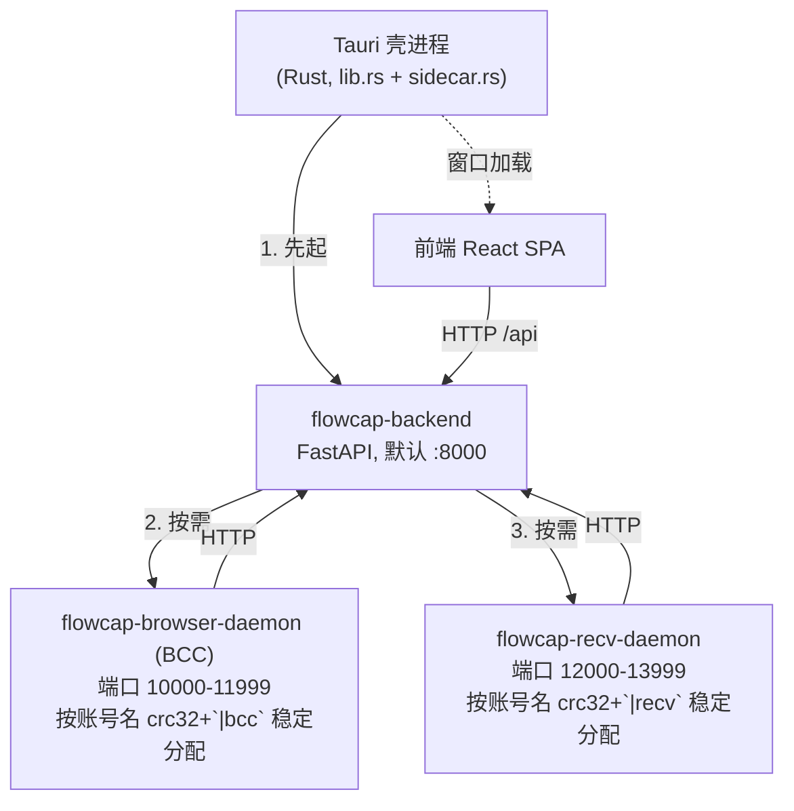

**启动顺序与依赖关系**（实测自 `backend/main.py` L210-260）：

1. **Tauri 壳**先起，创建窗口加载前端。
2. **backend**（`flowcap-backend`）由壳拉起，监听 `:8000`（`--port` 默认 8000）。
3. backend 启动钩子里**按账号顺序**拉起守护：
   - 先算端口（`auto_dm/accounts.py` 的 `browser_daemon_port()` / `recv_daemon_port()`），
   - **若端口已在监听则跳过**（幂等，避免重复拉起），
   - 否则 `_spawn_sidecar()` 拉起，并用 `_wait_for_port(port, timeout=30)` 阻塞等端口就绪。
4. **BCC 是懒加载的**（用户架构决策）：启动不拉 BCC，按需自动拉起。
   模块级锁 `_bcc_lazy_lock` + `_bcc_lazy_spawned` 集合保证并发只拉一次；
   并有**启动冷静期** `DY_BCC_LAZY_DELAY` 秒内禁止懒加载（防启动快闪唤醒）。

### 1.3 端口分配机制（稳定哈希，含 2026-09-06 修复）

```python
_BPORT_BASE = 10000 ; _BPORT_SPAN = 2000   # browser 段 [10000, 11999]
_RPORT_BASE = 12000 ; _RPORT_SPAN = 2000   # recv    段 [12000, 13999]

def _stable_port(name, base, span, salt=""):
    h = zlib.crc32(((name or "") + salt).encode("utf-8")) % span
    return base + h
```

**两个设计要点**：

1. **必须用 `zlib.crc32` 而非内置 `hash()`** —— `hash()` 受 `PYTHONHASHSEED` 影响跨进程随机，
   会导致 web_bridge 算出的端口与 subprocess 拉起的守护进程算出的端口**不一致**。
2. **`salt` 打破 browser/recv 端口同步碰撞**（2026-09-06 修复）：
   原实现对两守护用**同一个 crc32 值**、只是 base 不同 → 两守护端口偏移**完全同步**，
   某账号在 browser 段撞车则 recv 段必然同对撞车，表现为「两账号守护互相串号」。
   加 `salt="|bcc"` / `salt="|recv"` 后哈希输入不同，即使 crc32 相同也能错开偏移。

> ⚠️ **已知固有限制**：每段 2000 槽位（`[10000,11999]` / `[12000,13999]`，2026-09-06 由 500 扩容），20 账号碰撞率约 **9.1%**（生日悖论；50 账号约 46%）。
> 这是 span 的固有限制，`salt` 只解决「同步撞车」，彻底解决需扩大 span（待评估）。

### 1.4 关键环境变量

| 变量 | 作用 |
|---|---|
| `FLOWCAP_APP_ROOT` | **应用根目录**。启动 backend/BCC/recv_daemon **必须携带**；frozen exe 在 `binaries/` 时若缺失会 app_root 错位并报「无 .env」 |
| `DY_BCC_LAZY_DELAY` | BCC 懒加载启动冷静期（秒） |
| `DY_PROXY` | **只进浏览器**。backend 与 recv_daemon 均设 `NO_PROXY=*`，全链路不走代理（规避 Windows 注册表系统代理毒害） |
| `DY_SEND_MIN_INTERVAL` | 发送闸门最小间隔（默认 8.0s） |
| `DY_HISTORY_MAX` | 历史补全会话数（默认 45） |

---

## 2. 目录结构与职责

### 2.1 后端（114 个 `.py` / 34,961 行，不含 `__pycache__`）

| 目录 | 文件数 | 行数 | 职责 | 代表模块 |
|---|---|---|---|---|
| `api/` | 17 | 5,121 | **HTTP 路由层**。16 个路由模块、157 端点 | `ai.py`（54 端点）、`accounts.py`（15） |
| `services/` | 15 | 7,059 | **业务服务层**。回复决策、知识库、配置中心、模型中心、账号标签 | `ai_reply.py`（1,332）、`dm_dispatch.py`（1,127） |
| `dy_apis/` | 5 | 4,672 | **抖音 API 封装**（含死代码，见 §7.4） | `douyin_api.py` |
| `auto_dm/` | 9 | 3,743 | **自动化核心**。账号管理、端口分配、会话捕获 | `conversation_capture.py`、`accounts.py`（1,168） |
| `daemon/` | 4 | 3,307 | **守护进程**。浏览器容器 + 私信接收 | `browser_daemon.py`（1,626）、`recv_daemon.py`（1,317） |
| `notify/` | 7 | 1,840 | **IM 通知网关**（v0.38.5） | `channels.py`（521）、`inbound.py`（384）、`gateway.py`（288） |
| `core/` | 5 | 1,865 | **核心调度**。统一发送调度、自动私信主控 | `auto_dm.py`、`dispatch.py` |
| `utils/` | 11 | 1,159 | 通用工具 | `ab_pure.py` |
| `builder/` | 5 | 388 | protobuf 构建 | `proto.py` |
| `models/` | 6 | 291 | Pydantic 数据模型 | `task.py` |
| `dy_live/` | 2 | 198 | 直播服务 | `server.py` |
| `static/` | 3 | 162 | 静态资源 / protobuf 生成物 | `Live_pb2.py` |
| `scripts/` | 1 | 136 | 迁移脚本 | `migrate_global_to_member.py` |
| `accounts/` | 1 | 1 | 包初始化（游离根，仅 `__init__.py`） | `__init__.py` |
| 根散文件 | 23 | 5,019 | 应用入口与全局设施 | `main.py`（624）、`database.py`（411）、`config.py`（85） |

### 2.2 前端（11 页面 / 8,490 行 + 14 组件）

| 页面 | 行数 | 职责 |
|---|---|---|
| `accounts.tsx` | 1,989 | 账号管理（含查阅模式 overlay） |
| `live.tsx` | 1,891 | 直播监听 + 连麦 |
| `messages.tsx` | 1,220 | 私信会话 |
| `kb.tsx` | 670 | 知识库 |
| `ai.tsx` | 543 | AI 获客 |
| `crawl.tsx` | 505 | 视频采集 |
| `logs.tsx` | 447 | 运行日志 |
| `tasks.tsx` | 409 | 任务 |
| `overview.tsx` | 364 | 总览 |
| `notify.tsx` | 330 | IM 通知 |
| `settings.tsx` | 122 | 设置 |

`frontend/src` 一级结构：`App.tsx` / `main.tsx` / `api/`(2) / `components/`(14) / `pages/`(11) / `styles/`(2) / `theme/`(2) / `utils/`(1)

---

## 3. 五大业务域详解

### 3.1 业务域① 私信收发

**核心职责**：通过 frontier-im WebSocket 长连接接收私信，通过统一限速闸门 + 双通道发送私信。

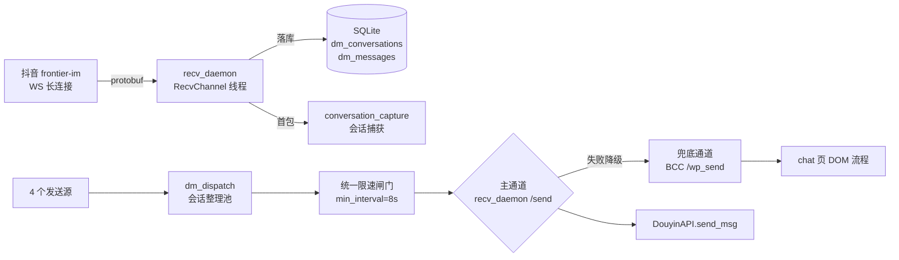

**接收侧**：`daemon/recv_daemon.py`（1,317 行）每账号一个 `RecvChannel` 线程监听 WS，
收到消息存入 `AccountInbox`（持久化 `dm_history.json`），并落 SQLite。
暴露 `/status` `/conversations` `/conversation` `/send` `/quit`。

**发送侧**：主通道 `recv_daemon /send` 走 `DouyinAPI.send_msg` HTTP API
（**有 ACK、落库含 skey、不依赖浏览器**）；兜底 `BCC /wp_send` 在 chat 页上下文走 DOM 流程
（**无 ACK、依赖浏览器常驻**）。

### 3.2 业务域② 直播监听与连麦

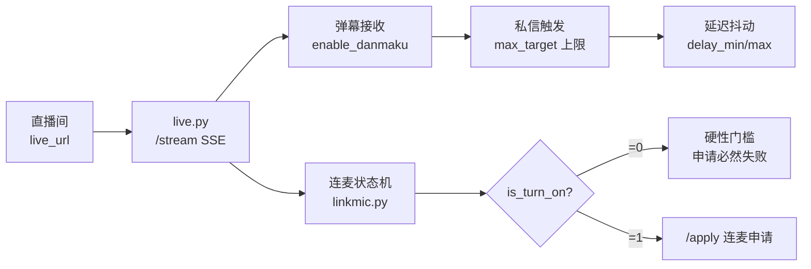

**关键实测结论（来自第四分析源）**：
连麦申请失败的**根因不是登录态，而是 `is_turn_on=0`** —— 这是硬性门槛。
此前曾误判为登录问题。工程实践：①前置状态检查 ②动态等待重试 ③日志告警 ④UI 同步。
另：`silence`（闭麦）接口的签名机制**仍未验证**，存在待办。

### 3.3 业务域③ AI 获客自动回复

嵌入自 `xyc667/douyin-auto-reply-assistant`（2026-09-06）。
**核心目标 = 留资**（联系方式捕获入 `ai_leads` 表），专业性由知识库定义。

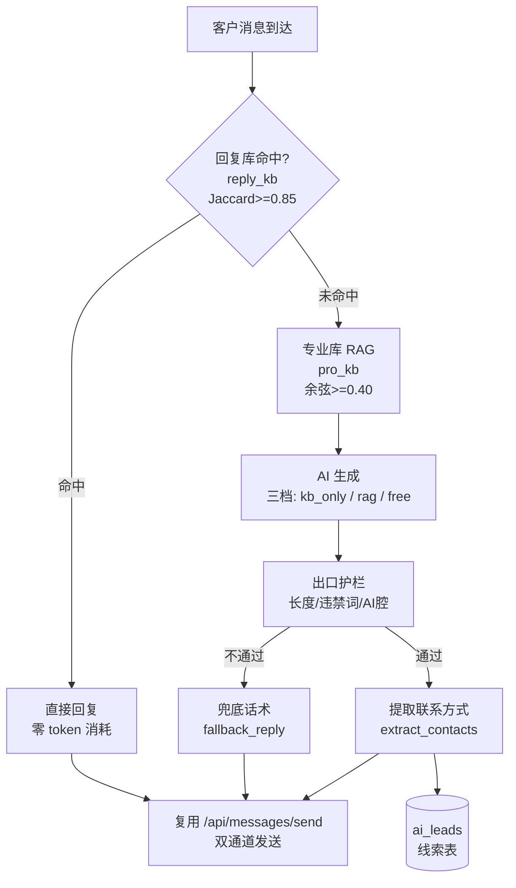

**三档回复档位**：`kb_only`（仅知识库）/ `rag`（AI 只准依据知识库答）/ `free`（自由发挥）。

**图片视觉链路**：`msg_type='27'`（实库证真）图片消息，`extra` 含 skey/origin_url
→ `origin_image_resolver.resolve` 解密落盘 → base64 → 视觉模型（OpenAI 兼容 `/chat/completions`）
→ 描述文本并入主回复流程。视觉未配置时**图片走兜底话术，绝不瞎猜**。

### 3.4 业务域④ IM 通知网关（v0.38.5）

**用户需求原文（2026-09-09）**：「当前的模式很不友好，全让用户手动填写字段有门槛，
应该有一个默认网关来处理，刚建立时接收所有来源的消息，但拦截返回，
在设置中提示收到 XXX 的信息让用户甄别是否授权和授权范围」。

**范式对标**：OpenClaw devices pairing —— 陌生设备发消息 → pending 配对列表 → 管理员 approve → 按 allowlist 放行。

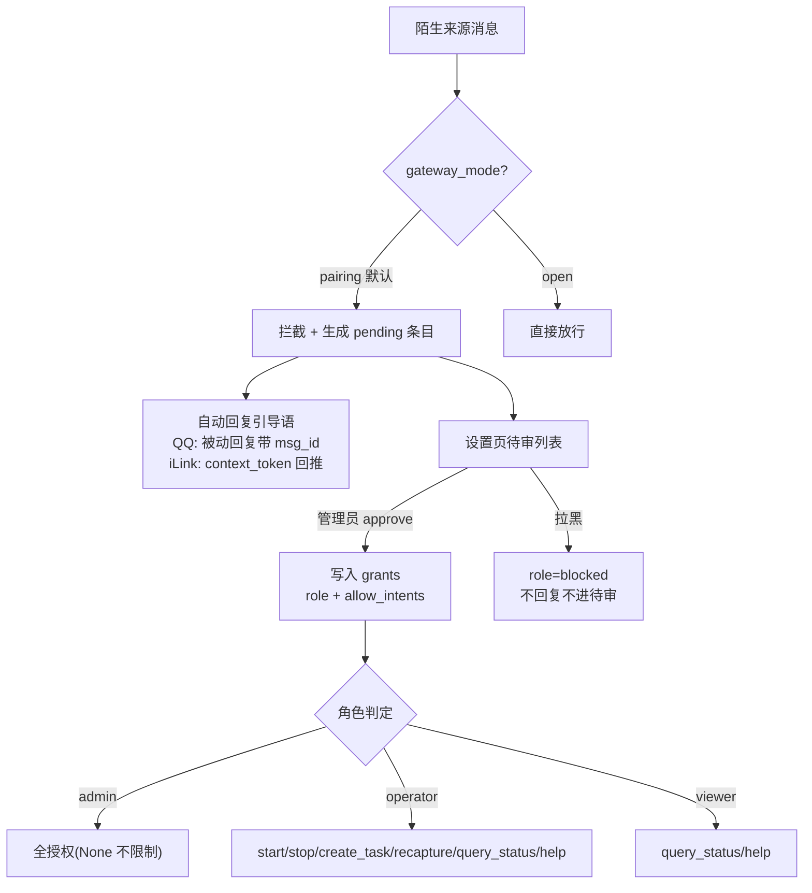

**权限组定义**（`notify/gateway.py` 的 `ROLE_INTENTS`）：

| 角色 | 允许意图 |
|---|---|
| `admin` | `None`（不限制，全部允许） |
| `operator` | `start_task` / `stop_task` / `create_task` / `recapture` / `query_status` / `help` |
| `viewer` | `query_status` / `help` |
| `pending` | `set()` 空集 |
| `blocked` | `set()` 空集 |

**铁律**：`admin` 初始授予**只能在本机 UI 点「设为管理员」**，不自动信任（用户拍板）。
`sender_key = f"{channel_id}:{sender_id}"`（渠道内唯一）。
持久化在 `notify_config.json` 的 `gateway` 节。

### 3.5 业务域⑤ 会员体系与统一配置中心

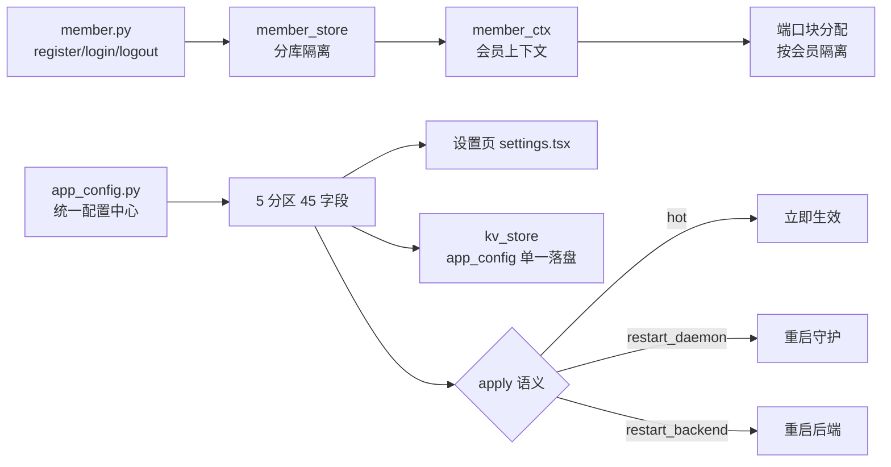

**统一配置中心设计要点**（`services/app_config.py`，574 行）：
把散落在 **7 个承载层**（环境变量 / `config.py` / `kv_store` / `auto_dm/config.py` / 功能页 等）
的配置收敛到一处，供设置页统一管理。**单一落盘**：SQLite `kv_store["app_config"]`。

---

## 4. 核心数据流图

### 4.1 私信接收链路

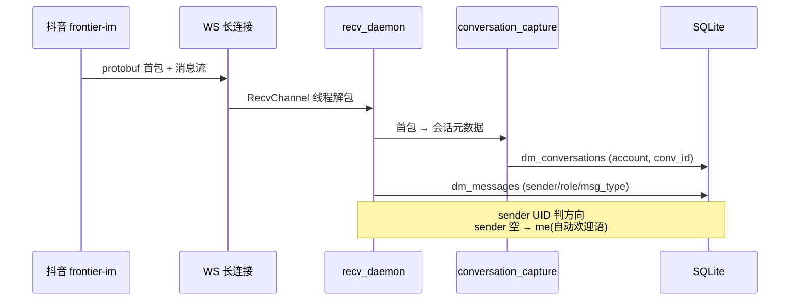

### 4.2 私信发送链路（4 源 → 闸门 → 双通道）

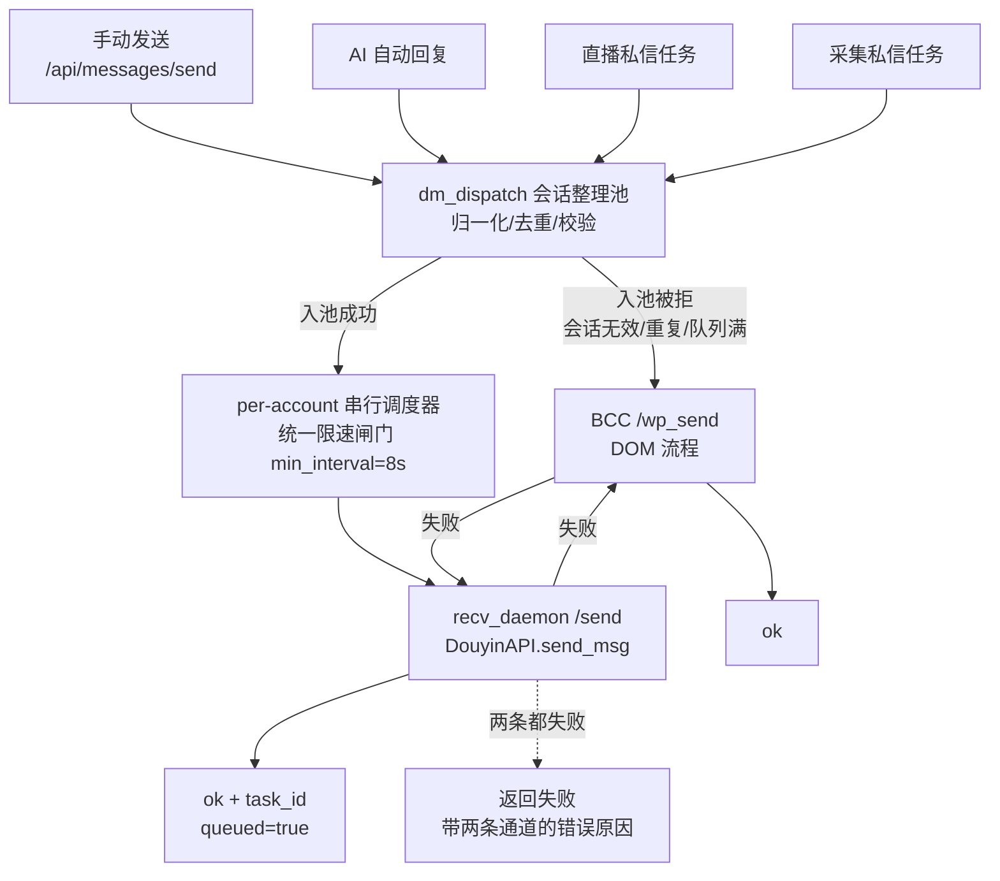

**双通道自动降级**（2026-09-06 全局治理）：
用户明确「**WS 优先级比 WP 高**」。此前两通道是硬分支——选 wp 就只用 wp，BCC 一挂直接失败无回退。
现在：`channel='ws'`（或 `auto`）失败 → 自动回退 wp；`channel='wp'` 失败 → 自动回退 ws；
**两个都失败才返回失败**，并带两条通道的错误原因。前端无需改动即受益。

**同步等待语义**（用户明确要求「验证后才算成功」）：
入池成功 = 已受理但**尚未发出**（异步调度）。`/send` 会同步轮询 `task_status()`，
最多等 **90s**，只有拿到 `status == "done"` 才返回 `ok: True`，避免前端误判「已发送」。

### 4.3 AI 回复决策链

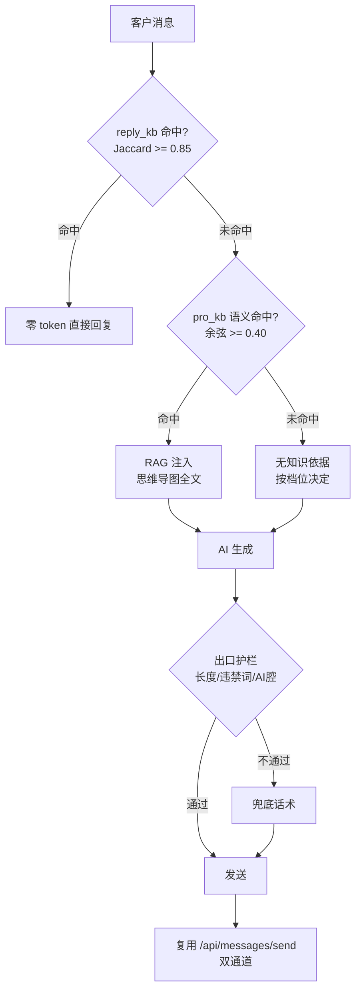

**双知识库分工**：
- `reply_kb`（288 行）：命中即回，**零 token**；Jaccard 相似度 ≥ 0.85。
- `pro_kb`（585 行）：思维导图 RAG，全文注入；余弦阈值 **0.40**。
- 去重：余弦 **≥ 0.90** 转 `occurrence + 1`；时间衰减 **λ = 0.02**。

> ⚠️ **阈值适用边界（第四分析源 §1.2 架构张力）**：余弦 0.40 必须以
> 「**知识库完整问句 vs 客户消息**」为测距对象，**短句对单独比较不可靠（实测 0.24）**。
> 该适用边界目前在 Wiki 中未明确标注，存在后续维护误用风险。

### 4.4 IM 网关入站授权

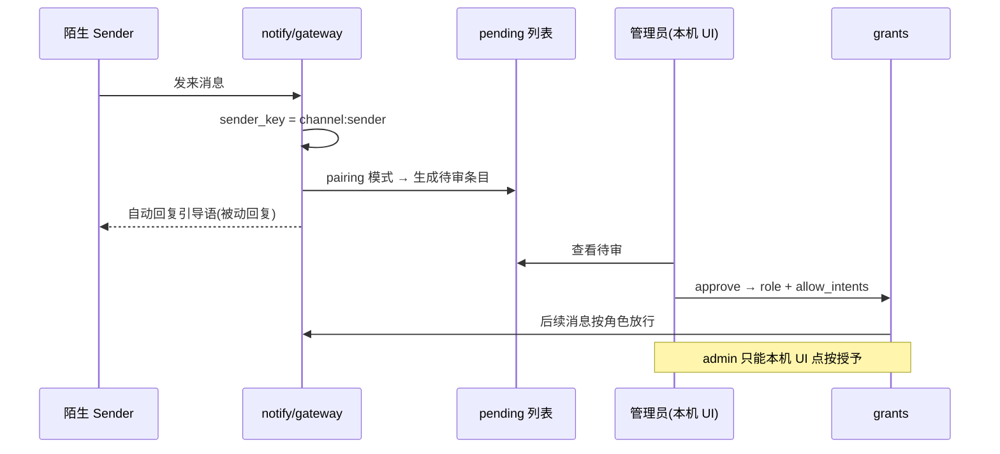

---

## 5. 全量 API 端点清单（157）

> 数据源：AST 静态解析 `backend/api/*.py` 的 `@router.*` 装饰器（2026-09-11 实测）。共 **157** 个端点（156 HTTP + 1 WebSocket），分布于 **16** 个路由模块。

| 模块 | 端点数 | 前缀 | 端点列表 |
|---|---|---|---|
| `api/ai.py` | **54** | `/api/ai` | `/api/ai/replies`、`/api/ai/replies`(POST)、`/api/ai/replies/{item_id}`(DELETE)、`/api/ai/replies/learn`(POST)、`/api/ai/prokb`、`/api/ai/prokb`(POST)、`/api/ai/prokb/{item_id}`(DELETE)、`/api/ai/prokb/import`(POST)、`/api/ai/prokb/import/confirm`(POST)、`/api/ai/prokb/migrate_qa`(POST)、`/api/ai/prokb/{item_id}`(PATCH)、`/api/ai/prokb/topics`、`/api/ai/prokb/rename_topic`(POST)、`/api/ai/prokb/maintain/status`、`/api/ai/prokb/maintain/scan`(POST)、`/api/ai/prokb/maintain/apply`(POST)、`/api/ai/prokb/maintain/merge`(POST)、`/api/ai/prokb/maintain/learn`(POST)、`/api/ai/prokb/maintain/run`(POST)、`/api/ai/prokb/maintain/scheduler`(POST)、`/api/ai/prokb/recycle`、`/api/ai/prokb/recycle/{item_id}/restore`(POST)、`/api/ai/prokb/recycle/purge`(POST)、`/api/ai/agents`、`/api/ai/dispatch_agent`、`/api/ai/dispatch_agent`(POST)、`/api/ai/agents/{agent_id}`、`/api/ai/agents`(POST)、`/api/ai/agents/{agent_id}`(DELETE)、`/api/ai/bind`(POST)、`/api/ai/bind`、`/api/ai/config`、`/api/ai/config`(POST)、`/api/ai/test`(POST)、`/api/ai/test_vision`(POST)、`/api/ai/knowledge`、`/api/ai/knowledge`(POST)、`/api/ai/knowledge/{item_id}`(DELETE)、`/api/ai/knowledge/import`(POST)、`/api/ai/knowledge/import/confirm`(POST)、`/api/ai/semantic/test`(POST)、`/api/ai/semantic/rebuild`(POST)、`/api/ai/semantic/cache_status`、`/api/ai/blacklist`、`/api/ai/blacklist`(POST)、`/api/ai/blacklist`(DELETE)、`/api/ai/providers`、`/api/ai/providers/freellm_models`、`/api/ai/status`、`/api/ai/start`(POST)、`/api/ai/stop`(POST)、`/api/ai/leads`、`/api/ai/leads/status`(POST)、`/api/ai/leads/export` |
| `api/accounts.py` | **15** | `/api/accounts` | `/api/accounts`、`/api/accounts/self-check`、`/api/accounts/{name}/check`(POST)、`/api/accounts/{name}/ensure-bcc`(POST)、`/api/accounts/{name}/ensure-recv`(POST)、`/api/accounts/{name}/open-browser`(POST)、`/api/accounts/{name}/scan`(POST)、`/api/accounts/{name}/scan-status`、`/api/accounts/{name}/role`(POST)、`/api/accounts`(POST)、`/api/accounts/{name}`(DELETE)、`/api/accounts/{name}/stop-browser`(POST)、`/api/accounts/{name}/stop-recv`(POST)、`/api/accounts/{name}/auto-recapture`(POST)、`/api/accounts/{name}/proxy-status` |
| `api/messages.py` | **11** | `/api/messages` | `/api/messages/conversations`、`/api/messages/conversation`、`/api/messages/origin_image/resolve`(POST)、`/api/messages/origin_image/stats`、`/api/messages/origin_image/{filename}`、`/api/messages/origin_image/sweep`(POST)、`/api/messages/request`(POST)、`/api/messages/send`(POST)、`/api/messages/send_image`(POST)、`/api/messages/wp_send`(POST)、`/api/messages/{account}/refresh`(POST) |
| `api/settings.py` | **11** | `/api/settings` | `/api/settings`、`/api/settings/schema`、`/api/settings`(POST)、`/api/settings/tags`、`/api/settings/tags`(POST)、`/api/settings/tags/{tag_id}`(DELETE)、`/api/settings/tags/bind`(POST)、`/api/settings/tags/bind`、`/api/settings/scoped`(POST)、`/api/settings/scoped/{tag_id}`、`/api/settings/reset`(POST) |
| `api/model_hub.py` | **11** | `/api/modelhub` | `/api/modelhub/overview`、`/api/modelhub/providers`(POST)、`/api/modelhub/providers/{pid}`(DELETE)、`/api/modelhub/providers/{pid}/test`(POST)、`/api/modelhub/providers/{pid}/fetch`(POST)、`/api/modelhub/models`(POST)、`/api/modelhub/models/{mid}/caps`(POST)、`/api/modelhub/models/{mid}`(DELETE)、`/api/modelhub/routes/{kind}`(POST)、`/api/modelhub/fallback`(POST)、`/api/modelhub/consumers`(POST) |
| `api/notify.py` | **10** | `/api/notify` | `/api/notify/status`、`/api/notify/config`、`/api/notify/config`(POST)、`/api/notify/gateway`、`/api/notify/gateway/mode`(POST)、`/api/notify/gateway/approve`(POST)、`/api/notify/gateway/revoke`(POST)、`/api/notify/gateway/allow`(POST)、`/api/notify/test`(POST)、`/api/notify/command`(POST) |
| `api/tasks.py` | **7** | `/api/tasks` | `/api/tasks/history`、`/api/tasks/current`、`/api/tasks/history/clear`(POST)、`/api/tasks`、`/api/tasks/config`(POST)、`/api/tasks/dm-pool`(POST)、`/api/tasks/export`(POST) |
| `api/member.py` | **7** | `/api/member` | `/api/member/register`(POST)、`/api/member/login`(POST)、`/api/member/logout`(POST)、`/api/member/state`、`/api/member/change-password`(POST)、`/api/member/list`、`/api/member/delete`(POST) |
| `api/engine.py` | **5** | `/api/engine` | `/api/engine/start`(POST)、`/api/engine/pause`(POST)、`/api/engine/resume`(POST)、`/api/engine/stop`(POST)、`/api/engine/stop-soft`(POST) |
| `api/live.py` | **5** | `/api/live` | `/api/live/stream`、`/api/live/ws`(WEBSOCKET)、`/api/live/danmaku`(POST)、`/api/live/dm-template`(POST)、`/api/live/resolve`(POST) |
| `api/crawl.py` | **5** | `/api/crawl` | `/api/crawl/search`(POST)、`/api/crawl/comments`(POST)、`/api/crawl/dm`(POST)、`/api/crawl/batch`(POST)、`/api/crawl/history` |
| `api/live_config.py` | **5** | `/api/live/room-configs` | `/api/live/room-configs`、`/api/live/room-configs/{room_id}`、`/api/live/room-configs`(POST)、`/api/live/room-configs/{room_id}`(DELETE)、`/api/live/room-configs/{room_id}/apply`(POST) |
| `api/logs.py` | **4** | `/api/logs` | `/api/logs/write`(POST)、`/api/logs/sessions`、`/api/logs`、`/api/logs/sessions`(DELETE) |
| `api/linkmic.py` | **3** | `/api/live/linkmic` | `/api/live/linkmic/apply`(POST)、`/api/live/linkmic/status`、`/api/live/linkmic/leave`(POST) |
| `api/overview.py` | **2** | `/api` | `/api/overview`、`/api/stats` |
| `api/errcodes.py` | **2** | `/api/errcodes` | `/api/errcodes`、`/api/errcodes/{code}` |
| **合计** | **157** | — | 156 HTTP + 1 WebSocket（`/api/live/ws`） |

**守护进程额外端点**（非 157 计数内，独立进程）：`recv_daemon` 暴露 `/status` `/conversations` `/conversation` `/send` `/quit`。

---

## 6. 配置中心（5 分区 45 字段）

> 数据源：`services/app_config.py` 的 `SECTIONS`（AST 解析，45 字段实测）。
> **单一落盘**：SQLite `kv_store["app_config"]`。

### 6.1 apply 语义总览

| apply 值 | 字段数 | 含义 |
|---|---|---|
| `hot` | **36** | 立即生效，无需重启 |
| `restart_daemon` | **6** | 需重启对应守护进程（recv_daemon） |
| `restart_backend` | **3** | 需重启后端 |

### 6.2 `general` 通用 / 启动（4 字段）

| 字段 | 类型 | 默认 | env | apply |
|---|---|---|---|---|
| `force_rescan` | bool | False | — | `hot` |
| `bcc_on_start` | bool | False | `DY_BCC_ON_START` | `restart_backend` |
| `bcc_headless_mode` | select | native | `DY_BCC_HEADLESS_MODE` | `restart_backend` |
| `auto_capture_on_start` | bool | False | `DY_AUTO_CAPTURE_ON_START` | `restart_backend` |

### 6.3 `live` 直播监听（10 字段，全部 `hot`）

| 字段 | 类型 | 默认 |
|---|---|---|
| `live_url` | str | （空） |
| `max_target` | int | 3 |
| `interval` | float | 60.0 |
| `delay_min` | int | 40 |
| `delay_max` | int | 65 |
| `live_poll_interval` | int | 30 |
| `ws_heartbeat_interval` | int | 300 |
| `enable_danmaku` | bool | True |
| `enable_console` | bool | True |
| `enable_send` | bool | True |

### 6.4 `send` 私信发送与风控（13 字段）

| 字段 | 类型 | 默认 | env | apply |
|---|---|---|---|---|
| `min_interval` | float | 8.0 | `DY_SEND_MIN_INTERVAL` | `restart_daemon` |
| `max_wait` | float | 30.0 | `DY_SEND_MAX_WAIT` | `restart_daemon` |
| `stranger_per_minute` | int | 2 | `DY_STRANGER_PER_MINUTE` | `hot` |
| `stranger_per_day` | int | 30 | `DY_STRANGER_PER_DAY` | `hot` |
| `cooldown_freq` | float | 600.0 | `DY_DM_COOLDOWN_FREQ` | `hot` |
| `cooldown_max` | float | 3600.0 | `DY_DM_COOLDOWN_MAX` | `hot` |
| `weight_recover_halflife` | float | 21600.0 | `DY_WEIGHT_RECOVER_HALFLIFE` | `hot` |
| `weight_forgive_after` | float | 86400.0 | `DY_WEIGHT_FORGIVE_AFTER` | `hot` |
| `dedup_window` | float | 5.0 | `DY_DM_DEDUP_WINDOW` | `hot` |
| `queue_max` | int | 200 | `DY_DM_QUEUE_MAX` | `hot` |
| `pool_strict` | bool | True | `DY_DM_POOL_STRICT` | `hot` |
| `uid_sink_cooldown` | float | 604800.0 | `DY_UID_SINK_COOLDOWN` | `hot` |
| `uid_sink_strict` | bool | True | `DY_UID_SINK_STRICT` | `hot` |

### 6.5 `notify` 通知与指令（4 字段，全部 `hot`）

| 字段 | 类型 | 默认 |
|---|---|---|
| `llm_base_url` | str | `http://127.0.0.1:31415` |
| `llm_model` | str | `glm-5.2` |
| `llm_api_key` | str | （空，**不回显**） |
| `llm_enabled` | bool | False |

### 6.6 `capture` 捕获与存储（14 字段）

| 字段 | 类型 | 默认 | env | apply |
|---|---|---|---|---|
| `history_max` | int | 45 | `DY_HISTORY_MAX` | `hot` |
| `history_sleep` | float | 1.5 | `DY_HISTORY_SLEEP` | `hot` |
| `history_workers` | int | 4 | `DY_HISTORY_WORKERS` | `hot` |
| `history_full` | bool | True | `DY_HISTORY_FULL` | `hot` |
| `history_skip_paged` | bool | False | `DY_HISTORY_SKIP_PAGED` | `hot` |
| `userinfo_cache_sec` | int | 600 | `DY_USERINFO_CACHE_SEC` | `restart_daemon` |
| `uid_probe_ttl_ok` | float | 300.0 | `DY_UID_PROBE_TTL_OK` | `restart_daemon` |
| `uid_probe_ttl_fail` | float | 60.0 | `DY_UID_PROBE_TTL_FAIL` | `restart_daemon` |
| `uid_probe_lock_wait` | float | 10.0 | `DY_UID_PROBE_LOCK_WAIT` | `restart_daemon` |
| `image_inline_max_kb` | int | 32 | `IMAGE_INLINE_MAX_KB` | `hot` |
| `origin_image_ttl_days` | int | 30 | `ORIGIN_IMAGE_TTL_DAYS` | `hot` |
| `origin_image_max_mb` | int | 2048 | `ORIGIN_IMAGE_MAX_MB` | `hot` |
| `image_force_hosted` | bool | False | `IMAGE_FORCE_HOSTED` | `hot` |
| `image_host_backend` | select | tucdn | `IMAGE_HOST_BACKEND` | `hot` |

---

## 7. 关键设计决策与铁律

### 7.1 昵称获取风控红线（铁律级）

> 用户原话：「**只要没用到后端去批量查询昵称就行，我就怕风控**」

- **昵称唯一来源 = BCC 被动 hook**：复用账号常驻浏览器，截前端自发 `im/user/info`，**零主动请求**。
- **绝不主动批量查昵称**。以下均为**死代码**，昵称链路**绝不调用**，也不要「优化」成主动批量查：
  - `dy_apis.douyin_api.get_im_user_info`
  - `browser_daemon.bulk_user_info`（`/user_info`）
  - `browser_daemon.bulk_user_info_by_uid`（`/user_info_by_uids`）
  - `login_api.bulk_user_info_via_browser`
- WS 长连接只落库骨架 + 用消息自带 `sender_nickname`，**绝不补全昵称**。

### 7.2 消息方向判定铁律

- **只能用 sender UID 判断方向**，**不可用 `aweType` / 类型推断**。
- `sender` 为空 → **判为 `me`**（自动欢迎语）。
- `recv_daemon` **不可硬编码 them**。
- **系统引导消息**（`msg_type=7` + `msg_id` 为 NULL）/[分享视频]**脏数据需过滤**。

### 7.3 其他消息层铁律（实测教训）

| 规则 | 依据 |
|---|---|
| cmd 301 field 7 与首包（2043）一致 = sender | 曾误判反转，**实机推翻** |
| 表情包走公开 CDN（`tos-cn-i-3jr8j4ixpe`）可直接 `` 渲染（**非加密**） | 实测 |
| 图片（`p*-sign` / `tos-cn-o-00061/`）才是 **AES-256-GCM 加密** | 实测 |
| **数据库删除必须精确逐条确认，禁止 `LIKE` 模糊删** | 曾误删 25 条真实聊天 |
| CSS 改动需**全链路验证** | 曾改废 |
| `DY_HISTORY_MAX=45` | 实测取值 |
| WS 优先级高于 WP | 用户明确拍板 |

### 7.4 双维度隔离（Agent 管「回什么」/ 标签管「怎么发」）

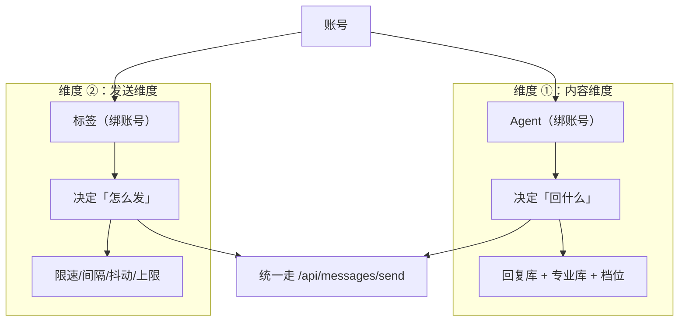

**约束**：**账号 = 1 Agent + 1 标签**（一一绑定）。两个维度各自独立配置、互不干扰，
统一在发送出口汇合。这样「换 Agent 改话术」不影响限速策略，反之亦然。

### 7.5 其他重要铁律

| 铁律 | 说明 |
|---|---|
| **绝不强杀 BCC/浏览器** | `Stop-Process` 会导致 session 降级要求重认证；部署前走 `/quit` graceful close |
| **`FLOWCAP_APP_ROOT` 必带** | 启动 BCC/backend/recv_daemon 必带 `FLOWCAP_APP_ROOT`；frozen exe 在 `binaries/` 时缺它会 app_root 错位报「无 .env」 |
| **系统死代理隔离** | backend 与 recv_daemon 设 `NO_PROXY=*`，全链路不走代理（`DY_PROXY` 只进浏览器） |
| **打包部署四同步** | 四处版本号（`package.json` / `frontend/package.json` / `Cargo.toml` / `tauri.conf.json`）必须一致 |
| **测试阶段不打 NSIS/MSI** | 只打前后端 + 部署（`tauri build --no-bundle`）；仅正式发布才需 bundle |
| **文件名 `_v2` 即 schema 版本化** | LanceDB 表 `wiki_chunks_v2.lance` 向量列 `fixed_size_list:float:2048`；换嵌入模型须**重建整表** |
| **幽灵 uid 门禁** | BCC 保活回写前必须校验探活 uid 在该账号历史 `conv_id` 命中，否则拒绝写入 |
| **`should_use_vb` 返回 `(bool, mode)`** | `VB_MODE="exe"` 勿与 cdp 混用 |

---

## 8. 技术债与风险清单

> 本章结合 **LLM Wiki 第四分析源** 的 §1 架构张力、§2 待裁决问题项（53 条）、§3 Deep Research 报告要点。
> 每条标注来源。**未经实测的推断一律标注为「待验证」**。

### 8.1 架构张力类（第四分析源 §1）

| # | 张力 | 来源 | 影响 |
|---|---|---|---|
| T1 | **页面自治设计哲学 vs App 级常驻轮询** | §1.1 | Wiki 的「隔离测试路径铁律」强调页面/模块独立性，但「App 级常驻轮询」要求跨页共享数据提升至全局层。两者存在**架构哲学冲突**。需建立决策矩阵：跨页共享 + 高频 + 实时性要求高 → 全局；否则页面级 |
| T2 | **语义检索阈值适用场景冲突** | §1.2 | 余弦 0.40 必须以「**知识库完整问句 vs 客户消息**」为测距对象，**短句对单独比较不可靠（实测 0.24）**。Wiki 的 `findings/语义检索阈值-0-40-nemotron-实测` 未标注此边界，后续维护易误用短句对校准阈值 |

### 8.2 未决问题清单（第四分析源 §2，53 条去重归类）

#### A. `dispatch.py` 消费方接线状态（**矛盾未决**）

| # | 问题 | 类型 | 影响页 |
|---|---|---|---|
| 1 | `dispatch.py` 如何消费 Agent scopes 的追踪页面缺失 | missing-page | `entities/dispatch-py.md` |
| 8/12 | **直接矛盾**：一处称「消费方接线 live/crawl 尚未完成」，另一处（待办#4）称「直播/采集已统一走 dispatch（2026-09-07 改），接一处即可覆盖两场景」 | **contradiction** | `queries/dispatch-接线-scopes-消费方完成状态.md` |
| 14/16 | `dispatch.py` 发送时 AI 接入点（`pick_dm_message()` 抽词库处回调，按账号绑定 Agent + scopes 判定，纯 AI 生成失败回落词库）**无 dedicated 页面** | missing-page | `concepts/dispatch-发送接线-scopes-ai接入点.md` |

> **§3 报告要点佐证**：`Research: dispatch 发送接线 scopes 的 AI 接入点` 明确记录了「已知问题与冲突记录」。

#### B. 调度 Agent 权限矩阵与设置页 UI（**多处重复/矛盾**）

| # | 问题 | 类型 |
|---|---|---|
| 4/7/10 | 调度 Agent 设置页 UI 卡（权限开关矩阵）**尚未做**，无页面跟踪 | missing-page |
| 6/9/13 | **权限默认值冲突**：来源称后三项（`create_crawl_task` / `create_live_task` / `update_kb`）「默认开（需确认）」，但测试记录称「perms 默认值正确 ✅」 | **contradiction** |
| 18 | 需裁决：(1) query 是否已得用户裁决 (2) 若已裁决是否建 finding (3) 若未裁决是否升级优先级（**影响 IM Bot 安全边界**） | **contradiction** |
| 5 | **`save_agent` 合并语义契约**：事故根因是「前端只传表单键 vs 后端全量覆盖」，修复改合并语义，但**前后端契约未文档化**（哪些键必传？哪些允许 None？） | **contradiction** |
| — | **既有事故**：`save_agent` 覆盖 config 导致人格 KB 清空 | finding |

#### C. FreeLLM `auto` 路由（**已可裁决但 Wiki 未标 settled**）

| # | 问题 | 类型 |
|---|---|---|
| 19/22 | 源文档明确 `auto` 在 **chat/vision/embeddings 三端点生产环境均不可用**（乱码/限流/报错），但多个 Query 仍待裁决 | **contradiction** |
| 31 | **重复页面**：`freellm-auto-路由结论冲突` / `-可靠性矛盾` / `-结论冲突需裁决` / `-是否可靠` 四个页面 | duplicate |

> **本次会话实测佐证（强证据）**：`embeddingConfig.model = "auto"` 实测**直接 502** ——
> `auto` 解析到的 family（`gemini-embedding-001`）恰恰是无 key 的。**确认 auto 不可用于持久向量库。**

#### D. `max_lead_ask` 会话级计数（**已实现 vs 设计的差距**）

| # | 问题 | 类型 |
|---|---|---|
| 26/29/33/35 | `max_lead_ask`（会话级索要次数统计）**仅靠 Prompt 约束，代码未真正落地**（kv key `_KV_ASK_COUNT` 预留未用）。需决定：实现硬约束计数 vs 维持现状；计数维度（会话级/账号级/全局） | suggestion / debt |
| — | §3 报告三重佐证：`max_lead_ask 会话级计数技术债务`、`计数机制实现方案`、`设计意图与实现差距的运营风险` | — |

**运营风险**（§3 报告）：①上限过低截断获客漏斗 ②上限过高触发平台风控
③配置变更无法热生效 ④与「思考过程泄漏防护」的联动。

**根因**（§3 报告）：参数未在配置中心统一管理；与三级漏斗交互边界未明确；多账号场景计数隔离未定义。

#### E. 真实风控环境验证（**关键上线前风险点**）

| # | 问题 | 类型 |
|---|---|---|
| 20/23/27/36 | **「真实风控环境未测」** —— 留资确认/回复对真实客户的实际发送（**WS 通道真实 ACK**）未验证，需真实客户发消息触发 | suggestion |
| — | 建议：首测用 `kb_only` 档 + 短延迟；#27 要求制定测试计划（实测方案/验收标准/回滚策略） | — |

**§3 报告补充的三重挑战**：①StrictMode 在测试与生产的冲突 ②语义检索的风控阈值校准
③配置中心「静默回落」与用户感知的边界。

#### F. 图片视觉链路（**代码已写好但未实测**）

| # | 问题 | 类型 |
|---|---|---|
| 28/30/37 | 「图片视觉链路未实测」——解密 → base64 → 视觉模型的代码路径已写好，但**无 Key 没跑过真图** | suggestion |

**§3 报告**：`真实风控环境与图片视觉链路端到端验证待跟踪` 记录了端到端验证现状与已知缺口。

#### G. 知识库回写与 `raw/sources` 同步（**待办未启动**）

| # | 问题 | 类型 |
|---|---|---|
| 11/15/17 | 待办#5「知识库回写 + 同步 raw/sources」**无对应 tracking 页面**，进度未知。缺：回写触发条件（用户编辑/自动学习/外部导入）、raw 与 sources 存储格式、同步冲突解决策略 | suggestion |
| — | 风险（§3 报告）：**ID 碰撞**、配置与状态冲突、类型与契约问题 | — |

#### H. Frontend / 前端技术债

| # | 问题 | 类型 |
|---|---|---|
| 40/50 | `React.StrictMode` 双挂载是「切页冗余拉取」三股根因之一，但是否应在生产禁用未裁决。source 记录「通过 App 级轮询规避副作用而非禁用」→ 建议更新为「已解决」 | **contradiction** |
| 41 | `accounts.tsx` 查阅模式 overlay 内仍有 `<header className="nav">` 与旧 App 顶栏同名（新顶栏已改 `.topnav*`）。**待清理技术债** | suggestion |
| 42 | `[data-glass-frost]` 统一磨砂开关机制**未实现**，无 dedicated 页面 | missing-page |
| 49 | **CSS 变量逗号分隔语法陷阱**：氛围光整段失效根因（`rgb(var(--x) / a)` 与逗号分隔变量混用 → 整条 background 被浏览器丢弃）。建议提炼验证方法（`getComputedStyle` 回读确认非 `none`） | suggestion |
| 43 | `vite build` 与 `npx tauri build --no-bundle` **必须拆成两条独立命令**（合并会在 tauri 阶段间歇性静默中断），无 dedicated finding | suggestion |
| 45/47 | 设计风格来源项目 `github.com/zn0wii/satelite-proxy`（style3「macOS glass + mission console」）无 entity 页面 | suggestion |

#### I. 进程生命周期与运维

| # | 问题 | 类型 |
|---|---|---|
| 48/51 | **`recv_daemon` 进程残留**：主程序退出后可能残留（本次残留 4 个，2 个仍占 12687/12726 端口），需对每个监听端口 `POST /quit` 收尾 | suggestion |
| — | §3 报告佐证：`recv_daemon 进程残留问题根治方案` —— 建议信号处理优雅退出 + 进程组管理 + 跨平台一致性 | — |
| 53 | **CDP 定位生产包崩溃手法**（dev server 加载未压缩源码 + CDP 注入 token 在真实 Tauri 窗口调试）未沉淀到 methodology | suggestion |

#### J. 连麦 / 直播

| # | 问题 | 类型 |
|---|---|---|
| — | §3 报告：连麦申请失败**根因不是登录态，而是 `is_turn_on=0`**（硬性门槛，曾误判） | finding |
| 32 | **重复页面**：`isturnon-决定性冲突仍未裁决` / `-相关发现页面存在直接冲突需用户裁决` / `is-turn-on-0-是否意味着主播关闭连麦` | duplicate |
| — | §3 报告：`silence` 闭麦接口**签名机制未验证**，`连麦审批自动化可行性（是否存在隐藏 permit 接口调用路径）` 待研究 | query |
| — | §3 报告：`虚拟麦克风输出正弦音与「静音」需求的技术张力` —— WebRTC 保活约束 vs 静音语义约束 | synthesis |

#### K. 知识库与文档资产缺口

| # | 问题 | 类型 |
|---|---|---|
| 2 | `reply_kb` Jaccard 阈值 **0.85 的选型依据**（实验数据、误命中/漏命中权衡、与其他算法对比）缺失 | suggestion |
| 3 | 自动学习链路的 **LLM 提纯 Prompt 与话术质量标准**（13 条自动话术的筛选标准/质量评估）未记录 | missing-page |
| 34 | 知识维护三档扫描（冷数据 180 天 / 低价值 90 天 / 重复阈值 0.95）是「照搬 MalogBot」，但**无 MalogBot 项目说明页**，阈值 rationale 未记录 | missing-page |
| 21/24 | **`model_hub` v1→v2 迁移 `NameError` 静默吞异常事故**：`_migrate_v1` 内 `NameError` 被 `except` 静默吞掉。教训 → **迁移函数必须配合测试用例真实触发** | missing-page |
| 39 | `api/logs.py` 与 `logs.tsx` **实体页缺失**（日志合并策略、守护进程 log sink、会话管理 API）影响后续 bug 追溯 | missing-page |
| 44/46 | `docs/frontend-style-port.md` 是否应归档为 source 页面待确认 | missing-page |
| 52 | **重复条目**：`语义检索阈值-0-40-nemotron-实测` 与 `语义检索阈值 0.40（nemotron-3-embed-1b 实测）` 疑为重复（空格差异）；`重复条目余弦阈值-0-95-校准` 亦重复 | duplicate |
| 25 | 视觉模型长期成本对比（`nemotron-3-nano-omni-reasoning` vs `glm-4.6v-flash`）未详述 | suggestion |

#### L. 多会员架构（§3 报告）

`Research: 多会员同时在线架构设计` / `会话级上下文隔离设计` / `多会员并发运行的端口冲突治理` / `端口碰撞概率模型与扩容评估` 系列。

**核心风险**（与 §1.3 端口机制直接相关）：
- **噪声邻居问题**：多会员共享资源时的相互干扰。
- **端口碰撞**：每段 2000 槽位下 20 账号碰撞率约 **9.1%**（生日悖论；扩容前 500 槽位时为 32%）。
- 建议演进：Phase 1 强化单租户隔离与观测（1-2 周）→ Phase 2 资源配额与噪声邻居治理（2-3 周）→ Phase 3 混合部署与企业级交付。

### 8.3 模型链路中心（§3 报告专项）

`model_hub`（734 行）v2 的消费方绑定语义、动态优先级、性能瓶颈、热更新与回滚、
**高可用与故障转移机制缺失** 均有专项研究报告。主要结论：

- **静态绑定**（Schema-Driven Config）语义已明确，但**动态优先级策略**待研究。
- **高可用缺失**：现状无故障转移；建议分阶段演进
  Phase 0 可观测性先行（1 周）→ Phase 1 单模型韧性模式（2 周）→ Phase 2 多模型调度器重构（3-4 周）→ Phase 3 高级流量治理。
- **性能**：多消费方场景存在瓶颈，建议引入消费方分级与配额系统、分层架构。

### 8.4 无效报告黑名单（**不得引用**）

第四分析源 §4 列出 **26 份判为无效的 Deep Research 报告**（检索扑空，误检到 NRJ 法广电台、
GeeksforGeeks 等无关来源）。**引用第四分析源时必须排除这 26 份。**

---

## 9. 与旧架构（v0.37 及以前）的差异对照

> 基线：`工作记忆/00_架构与版本.md` 原记录止于 **0.37.1**，已于 2026-09-11 **补齐 0.38.x～0.41.1 四代版本史**；代码实际 **0.41.1**。
> 差异依据：源码注释中的日期标注、version 字段、第四分析源报告。

| 维度 | v0.37 及以前 | v0.41.1（当前） | 证据来源 |
|---|---|---|---|
| **版本号** | 0.37.1 | **0.41.1** | 四处版本文件实测 |
| **私信发送通道** | **单通道**（WS 或 WP 硬分支） | **双通道 + 自动降级**：`ws` 失败自动回退 `wp`，反之亦然；两条都失败才失败 | `messages.py` `/send` 注释「2026-09-05 新增双通道」「2026-09-06 全局治理（2.4 自动降级）」 |
| **发送调度** | 直接发送 | **会话整理池 + per-account 串行调度器**：归一路径/去重/校验，解决多板块并发同会话乱序/重复、peer_id 污染致「发给自己」 | `messages.py` 注释「2026-09-07 私信发送统一调度（架构重构）」 |
| **发送验收语义** | 受理即返回 | **同步等待 90s** 直到 `task_status == done` 才返回成功（用户要求「验证后才算成功」） | `messages.py` `/send` |
| **BCC 启动** | 启动时拉起 | **懒加载**：启动不拉，按需自动拉起；并发去重锁 + 启动冷静期 | `accounts.py` 注释「2026-09-06 BCC 懒加载（用户架构决策）」 |
| **端口分配** | browser/recv 用**同一 crc32 值**，端口偏移完全同步 → 同对账号互撞 | **加 salt**（`\|bcc` / `\|recv`）打破同步性 | `accounts.py` `_stable_port` 注释「2026-09-06 全局治理（端口碰撞修复）」 |
| **代理处理** | 继承系统代理（Windows 注册表） | **系统死代理隔离**：backend 与 recv_daemon 设 `NO_PROXY=*`；`DY_PROXY` 只进浏览器 | `main.py` / `recv_daemon.py` 注释「2026-09-06 全局治理（D：系统死代理隔离）」 |
| **IM 通知网关** | **不存在** | **v0.38.5 新增**：pairing 模式 + 权限组（admin/operator/viewer/blocked）+ 本机 UI 审批 | `notify/gateway.py` 头部「IM 网关：入站消息授权 / 权限组（v0.38.5）」 |
| **入站渠道** | 无 | **QQ 官方机器人 + iLink 个人微信**（第一版，其余三渠道待后续） | `notify/inbound.py`「v0.38.5：iLink 个人微信 + QQ 官方机器人」 |
| **回复库** | 无独立回复库 | **`reply_kb`（v0.39.0）**：命中即回零 token，Jaccard ≥ 0.85 | `services/reply_kb.py`「对话回复库（命中库，v0.39.0）」 |
| **AI 获客** | 无 | **嵌入 `xyc667/douyin-auto-reply-assistant`**（2026-09-06）：三档 kb_only/rag/free + 留资 `ai_leads` 表 + 出口护栏 | `services/ai_reply.py` 头部 |
| **配置管理** | 散落 7 个承载层 | **统一配置中心** `app_config.py`（5 分区 45 字段，hot/restart_daemon/restart_backend 三档 apply） | `services/app_config.py` |
| **模型链路** | v1 | **v2 模型中心**（`model_hub.py` 734 行）+ 消费者绑定 + 回落规则；迁移曾出 `NameError` 静默异常事故 | `_架构测绘原始数据.md` §5 + 第四分析源 §2 #21/#24 |
| **前端规模** | 较小 | **11 页面 8,490 行**；风格对标 `satelite-proxy`（macOS glass + mission console） | `_架构测绘原始数据.md` §4 |
| **会员体系** | 单租户 | **会员分库 + 端口块隔离**（`member_store` / `member_ctx`） | `services/member_store.py`(309) / `member_ctx.py`(475) |
| **后端规模** | 较小 | **114 个 `.py` / 34,961 行 / 157 端点** | `_架构测绘原始数据.md` §2/§3 |

### 9.1 版本断档：已补齐（2026-09-11 更新）

| 项 | 状态 |
|---|---|
| `工作记忆/00_架构与版本.md` | ✅ **已补齐**：78 行 → **413 行**（`git diff --numstat` = **335 新增 / 0 删除**，原有内容一字未改，纯追加） |
| 补齐范围 | **v0.38.0～0.38.6 / v0.39.0～0.39.1 / v0.40.0 / v0.41.0～v0.41.1** 四代版本，逐版写明变更主题、涉及模块/文件、关键实现要点、技术债 |
| 交叉引用 | 各版本下标注第四分析源 §2 的 **53 条待裁决项**（按 #N 编号标来源）+ §3 报告要点 |
| 证据强度 | 引用 **9 个 git SHA**（`f1fd83b` / `b4bb970` / `fbe17af` / `7b1341d` / `936bf98` / `46c12df` / `4a0150a` / `2a65c54` / `e4ad366`）经核验**全部真实存在**；抽查 **6 个文件行数 6/6 吻合** |
| 末尾附 | 「本文件与代码实际状态的差异说明」——14 行差异对照表 + 7 条待确认项 |
| vault 同步 | 8 份工作记忆已 copy 至 `raw/sources/工作记忆/`（**未直写 `wiki/`**），sha256 一致；rescan 后 8 份全部被 ingest 吸收 |

---

## 附录 A：分析源与证据链

| 分析源 | 路径 | 用途 |
|---|---|---|
| ① 项目源码 | `C:\Users\LOX\Desktop\DYchajian\FlowCap\` | 一手证据（所有代码引用直接读源） |
| ② 架构测绘原始数据 | `docs/_架构测绘原始数据.md` | 版本号 / 目录行数 / 前端结构 |
| ③ 未提交改动核查 | `docs/未提交改动核查.md`（529 行 / 36,800B） | 58 项未提交改动、10 主题、`git status --porcelain` 证据 |
| ④ LLM Wiki 深度研究语料 | `docs/_第四分析源_LLMWiki深度研究汇要.md`（3,579 行 / 127,720 字符） | §1 架构张力、§2 待裁决 53 条、§3 ≥78 份可用报告要点、§4 26 份无效报告黑名单 |

## 附录 B：本文档生成方式说明

- **只读**：全程仅读源码 / 查 DB / 看文档，未修改任何项目文件。
- **无推断**：所有数字均来自实测（AST 解析配置、正则统计端点、`git status --porcelain`、直读源码）。
- **待验证项显式标注**：凡第四分析源标注「未测」「待裁决」「冲突」的，本文档均**如实标注**，未做主观裁决。
- **已知本文档未覆盖**：`docs/_第四分析源_LLMWiki深度研究汇要.md` §3 的 ≥78 份报告仅有要点抽取，
  完整实验数据需回查各 `wiki/queries/research-*.md` 原文。
